> **This article/tutorial is still under construction. Feel free to bookmark this post to come back later, as there may be new information by then!**
{: .prompt-info }

With a little bit of tinkering, it's possible to run both macOS (i.e. native) AND Windows games on a MacBook Pro (M3 Max, in my case). Playable Windows games include Skyrim, Mass Effect series, Palworld, Schedule I, and many more!

**Demo / Examples**

	src="https://pbs.twimg.com/media/GzXyWyTXsAQ4frX?format=jpg&name=4096x4096" alt=""
	src="https://pbs.twimg.com/media/GzXym7OWQAASR0z?format=jpg&name=4096x4096" alt=""
	src="https://pbs.twimg.com/media/GzXyvskXsAMhtV8?format=jpg&name=4096x4096" alt=""
	src="https://pbs.twimg.com/media/GzYH2T_WoAABG0A?format=jpg&name=4096x4096" alt=""
	src="https://pbs.twimg.com/media/GzYHC4dW0AAqGGH?format=jpg&name=4096x4096" alt=""
	src="https://pbs.twimg.com/media/GzYHC3fWgAAbpj7?format=jpg&name=large" alt=""
	src="https://pbs.twimg.com/media/GzPg6r8XAAAc6lk?format=jpg&name=medium" alt=""
	src="https://pbs.twimg.com/media/GzPhoaKWoAA16uA?format=jpg&name=medium" alt=""
	src="https://pbs.twimg.com/media/GzPhoZPWAAA4DqG?format=jpg&name=medium" alt=""


This entire process can be quite daunting and confusing, and it is assumed that the reader:
- Has good terminal commands skills and is comfortable with using terminal/CLI
- Understands Wine concepts (e.g. `WINEPREFIX`, dll overrides, etc.)
- Knows how to launch Windows executables through Wine from terminal
- Knows how to use Vim

> **If you're _not_ tech savvy I _don't_ recommend following this highly technical tutorial.**
> 
> Instead, try GUI wrappers like [Crossover](https://www.codeweavers.com/crossover) (paid) or [Sikarugir](https://github.com/Sikarugir-App/Sikarugir) (free).
{: .prompt-important }

## Background
Key concepts that will continue to show up throughout this writeup:

- Wine
- Bottles aka Wine Prefixes (`$WINEPREFIX`)
- Wine builds
- Graphics APIs (i.e. D3DMetal, DXMT, DXVK, etc.)

### Bottles
I store my Wine prefixes, i.e. bottles, in `$HOME/Bottles`{: .filepath}. Each bottle is virtual Windows environment (e.g. Windows 10) with its own C: drive and all its standard folders (e.g. Windows and Program Files), as well as:
- Windows registry
- System settings
- One or more Windows applications/software
- Saved user data
- Fonts
- And more

You can install multiple programs into a bottle, but it's sometimes better to create a new bottle for each application. Keeping applications in separate bottles prevents them from interacting with or damaging each other. E.g. You can test out a new version of a particular program in one bottle while keeping the original in another. Multiple bottles are also helpful whenever a specific application requires otherwise undesirable settings.

The default Wine bottle, `.wine`{: .filepath}, is located in your home directory (i.e. `$HOME/.wine`{: .filepath}). However, I never use the default Wine bottle/prefix since I always use a specific Wine prefix (i.e. `$WINEPREFIX`).

I've specifically made bottles for each Graphics API: `DXMT`, `DXVK`, `GPTk`, and `CrossOver` (note: I only use the 1st 3 bottles, i.e. I *don't* use CrossOver for gaming).

### Builds
`wine`{: .filepath} command loads and runs the given program, which can be a DOS, Windows 3.x, Win32, or Win64 executable (on 64-bit systems).[^wine]

> Wine is **not isolated** from your system: if _you_ can access a file or resource with your user account, programs running in Wine _can too_—see [#Running Wine under a separate user account](https://wiki.archlinux.org/title/Wine#Running_Wine_under_a_separate_user_account) for possible precautions
> 
> Wine can also run malware—see [Wine FAQ on Malware compatibility](https://gitlab.winehq.org/wine/wine/-/wikis/FAQ#is-wine-malware-compatible)
{: .prompt-warning }

The program name may be specified in DOS format (e.g. `C:\\WINDOWS\\SOL.EXE`{: .filepath}) or in Unix format (e.g. `/msdos/windows/sol.exe`{: .filepath}). You may pass arguments to the program being executed by adding them to the end of the command line invoking `wine`{: .filepath}. E.g.

```sh
wine notepad "C:\\Temp\\README.txt"
wine notepad 'C:\Temp\README.txt'
wine notepad "$HOME/Temp/README.txt"
```
{: .nolineno }

It can also be one of the Windows executables shipped with Wine, in which case specifying the full path is not mandatory, e.g. `wine explorer` or `wine notepad`.

I store all my different versions of Wine (i.e. builds) in `$HOME/Wine`.

### Files
Basic Wine files[^winefiles]

<ul>
	<li><code>wine</code>: Wine program loader</li>
	<li><code>wineconsole</code>: Wine program loader for CUI (console) applications</li>
	<li><code>wineserver</code>: Wine server</li>
	<li><code>winedbg</code>: Wine debugger</li>
	<li><code>$WINEPREFIX/dosdevices</code>: Directory containing the DOS device mappings. Each file in that directory is a symlink to the Unix device file implementing a given device. E.g. if <code>COM1</code> is mapped to <code>/dev/ttyS0</code> you'd have a symlink of the form <code>$WINEPREFIX/dosdevices/com1</code> -> <code>/dev/ttyS0</code>.<br>DOS drives are also specified with symlinks; e.g. if drive <code>D:</code> corresponds to the CDROM mounted at <code>/mnt/cdrom</code>, you'd have a symlink <code>$WINEPREFIX/dosdevices/d:</code> -> <code>/mnt/cdrom</code>. The Unix device corresponding to a DOS drive can be specified the same way, except with <code>::</code> instead of <code>:</code>. So for the previous example, if the CDROM device is mounted from <code>/dev/hdc</code>, the corresponding symlink would be <code>$WINEPREFIX/dosdevices/d::</code> -> <code>/dev/hdc</code>.</li>
</ul>

## Requirements
- Apple Silicon Mac (i.e. M series)
- macOS 15 Sequoia or higher
- At least 16 GB of RAM or more (recommended since translated games require more resources)
- [Command Line Tools for Xcode 15+](https://developer.apple.com/xcode/resources) ([downloaded via the App Store](https://apps.apple.com/us/app/xcode/id497799835?mt=12))
-  [Game Porting Toolkit](https://developer.apple.com/downloads?q=porting%20toolkit) (from [Apple Developers](https://developer.apple.com/games/game-porting-toolkit))
- [Steam (Windows Version)](https://cdn.cloudflare.steamstatic.com/client/installer/SteamSetup.exe)
- **Optional** Game Controller

## Setup
Go to <a target="_blank" title="Link to Apple's Game Porting Toolkit site" href="https://developer.apple.com/games/game-porting-toolkit">the official page for Game Porting Toolkit</a>, scroll down to "**Evaluate your Windows executable on Apple silicon**", and click **Download the evaluation environment for Windows games**


> You can also download Game Porting Toolkit in its entirety since it includes the evaluation environment, but it'll also include a bunch of stuff that you most likely won't use, such as example code, human interface guidelines, etc.
{: .prompt-info }

You'll be prompted to sign into your Apple account and create an Apple Developer account if you don't have one already (don't worry, it's free)


Once redirected to the downloads page, click **Evaluation environment for Windows games 2.1.dmg** to download the evaluation environment

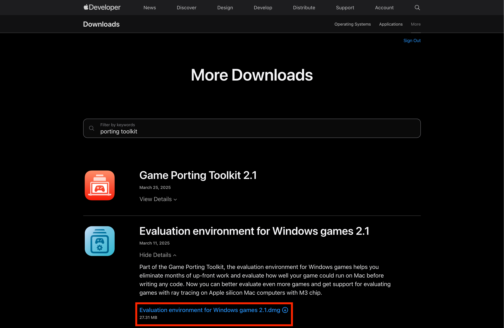


Double-click the `.dmg` after it's downloaded to open/mount it


Click **Agree** to the license agreement

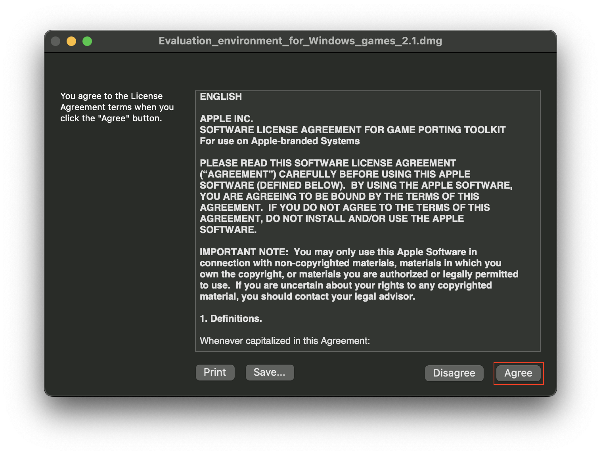

Once mounted, it'll open a window that should look similar to this

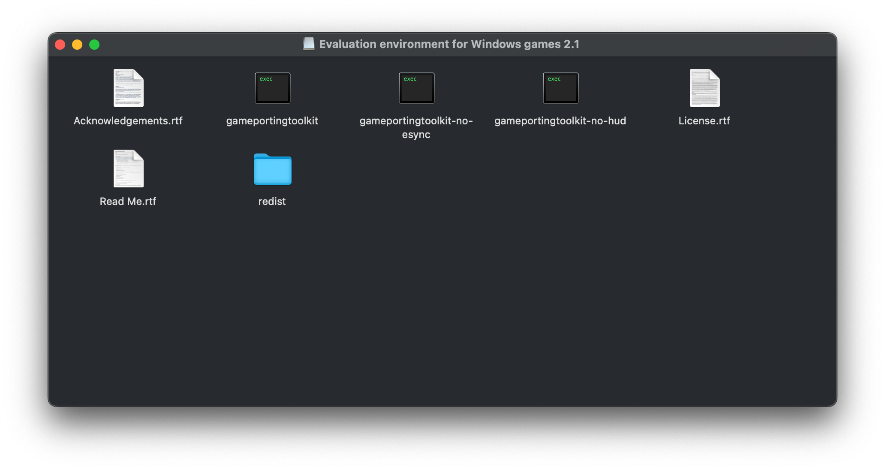

You should also be able to see it in "Finder"


Download <a target="_blank" title="Link to Xcode on Apple Developer site" href="https://developer.apple.com/xcode/resources">Command Line Tools for Xcode</a>, which you will need to <a target="_blank" title="Link to Xcode in the App Store" href="https://apps.apple.com/us/app/xcode/id497799835?mt=12">download via the App Store</a>


Run the `.pkg` file
	- **Manually**: Double-click the `.pkg` file
	- Via command line (where `PKG_PATH` is the path to the `.pkg` file): `installer -pkg PKG_PATH -target <target_path>`

Open your terminal, then install Rosetta

```sh
softwareupdate --install-rosetta
```
{: .nolineno }

> If you want to automatically agree to license, add `--agree-to-license` to command
> ```sh
> softwareupdate --install-rosetta --agree-to-license
> ```
> {: .nolineno }
{: .prompt-tip }

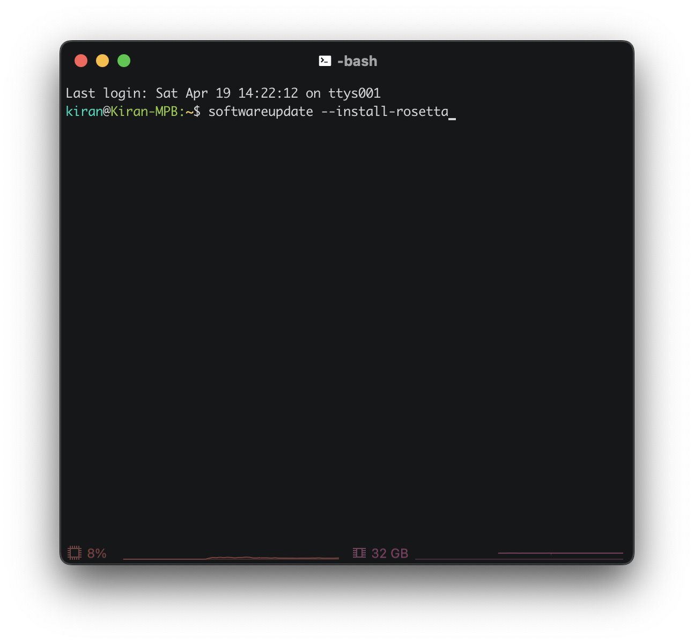

Enter x86_64 shell; all subsequent commands **must** be run in this shell

```sh
arch -x86_64 /bin/bash
```
{: .nolineno }

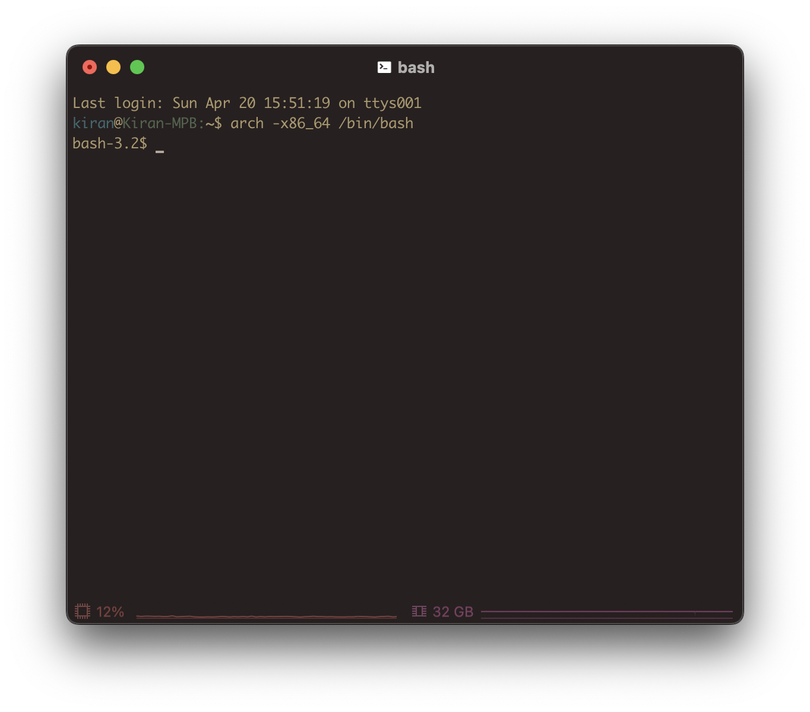

Install x86 version of Homebrew

```sh
/bin/bash -c "$(curl -fsSL https://raw.githubusercontent.com/Homebrew/install/HEAD/install.sh)"
```
{: .nolineno }

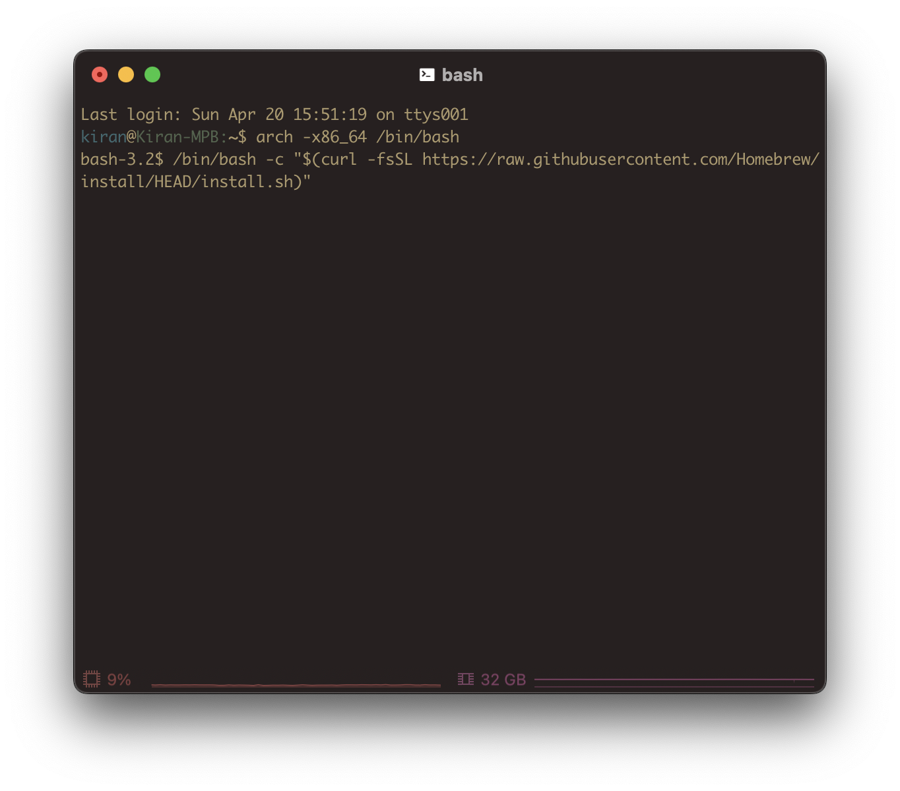

Set the path, depending on the number of Homebrew versions you have


    ---TAB: x86 AND ARM64
        If you use **both x86 _and_ ARM64** versions of Homebrew, you can add the following to `.bashrc` (or your preferred shell config file) so it automatically switches based off architecture type
        ```sh
		if [ "$(arch)" = "arm64" ]; then
			eval "$(/opt/homebrew/bin/brew shellenv)"
		else
			eval "$(/usr/local/bin/brew shellenv)"
			export PATH="/usr/local/bin:${PATH}"
		fi
		```
		{: file="$HOME/.bashrc" }
        {: .nolineno }
    ---TAB: x86 ONLY
        If you **only have x86** version of Homebrew (which was installed in the previous step), execute this command to append the path (`eval "$(/usr/local/bin/brew shellenv)"`) to `.bash_profile`
		```sh
		(echo; echo 'eval "$(/usr/local/bin/brew shellenv)"') >> $HOME/.bash_profile
		eval "$(/usr/local/bin/brew shellenv)"
		```
        {: .nolineno }
        


Since your shell config file has been updated, restart the terminal and return to x86_64 shell

```sh
arch -x86_64 /bin/bash
```
{: .nolineno }

Confirm path

```sh
which brew
```
{: .nolineno }

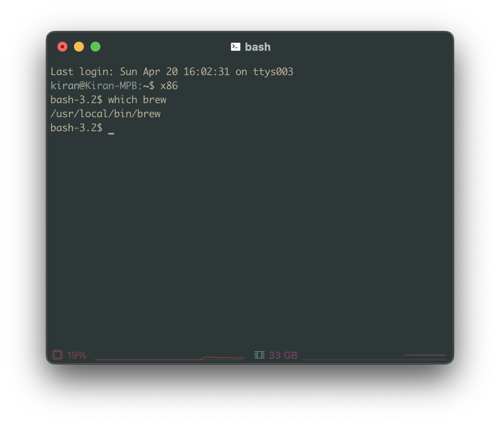

> Update `PATH` environment variable (in your shell config file) if the previous command doesn't print `/usr/local/bin/brew`{: .filepath}; alternatively, you can fully specify the path to brew in the subsequent commands
{: .prompt-info }

## Installation
I have different versions of Wine on my system which I use for different purposes.
- **Game Porting Toolkit.app**: This is a translation layer that combines Wine with D3DMetal (which supports DirectX 11 and 12). I use this if I want to use D3DMetal graphics API. Only downside is that this build uses an old version of Wine (7.7), so there are some bugs (e.g. window sizing, unable to download games, etc.). Don't use it to install Steam games.
- **Wine Devel.app**: I use this if I want to use DXMT or DXVK graphics API. This build uses a recent version of Wine (10.18).
- **CrossOver.app**: I don't use this, but it contains some useful files that I can use with other Wine builds. See [Install CrossOver](2025-03-19-play-windows-games.md#install-crossover) for more details.

| Prefix                    | Build Name       | Wine Version | Graphics API(s)                | Description                   |
| :------------------------ | :--------------- | :----------- | :----------------------------- | :---------------------------- |
| `$HOME/Bottles/GPTk`      | gptk/3.0b2       | 7.7          | D3DMetal                       | Game Porting Toolkit 3 Beta 2 |
| `$HOME/Bottles/DXMT`      | dxmt/10.18       | 10.18        | DXMT                           | DirectX to Metal              |
| `$HOME/Bottles/DXVK`      | dxvk/10.18       | 10.18        | DXVK                           | DirectX to Vulkan             |
| `$HOME/Bottles/CrossOver` | crossover/23.7.1 | 8.0.1        | D3DMetal, DXMT, DXVK, MoltenVK | CrossOver by CodeWeavers      |

Since we'll be working with several different Wine builds, we should create a directory containing each of these Wine builds to keep it organized.

```sh
mkdir -p $HOME/Wine && cd $HOME/Wine
mkdir dxmt dxvk gptk crossover
```
{: .nolineno }

Your `$HOME` directory should now look similar to this (where `...` denotes all other directories and files, which are currently irrelevant for this tutorial)

```plaintext
$HOME/ 
├── ... 
├── Bottles/ 
│   ├── DXMT/
│   ├── DXVK/
│   ├── GPTk/
│   └── CrossOver/
├── ...
└── Wine/
    ├── dxmt/
    ├── dxvk/
    ├── gptk/
    └── crossover/
```
{: file="$HOME" }

> Ensure you're in an x86_64 shell. If not, run:
> ```sh
> arch -x86_64 /bin/bash
> ```
> {: .nolineno }
{: .prompt-info }

To set version of Wine depending on type, add to `PATH`. This way, `which wine` outputs `$HOME/Wine/10.12/bin/wine`. E.g.

```sh
export PATH="$HOME/Wine/DXMT/bin:$PATH"
```
{: .nolineno }

Create a new Wine prefix; e.g. if you have bottle `$HOME/Games`, set `WINEPREFIX` like so:

```sh
WINEPREFIX="$HOME/Games" wine winecfg
```
{: .nolineno }

Once a "Wine configuration" shows up, change the version to **Windows 10**, then click **Apply** and **OK** to save and exit

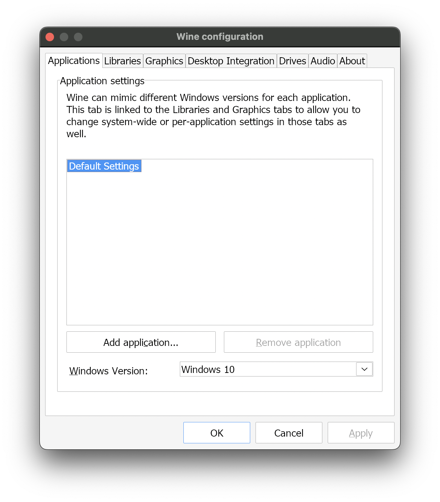

> If the "Wine configuration" window does not appear and no new icon appears in the Dock, make sure you've correctly installed:
> - `x86_64` version of Homebrew
> - `game-porting-toolkit` formula
{: .prompt-tip }

### Install Game Porting Toolkit
Apple's Game Porting Toolkit (GPTk) is a translation layer that combines a patched version of an old version of Wine with D3DMetal (which supports DirectX 11 and 12).

> Make sure that GPTk's `.dmg` (downloaded from Apple's website) is already mounted; it should be located in `/Volumes` directory
> 
{: .prompt-info }

Path: `/Applications/Game Porting Toolkit.app/Contents/Resources/wine/bin/wine64`{: .filepath}

Create symlink in Wine dir for GPTk that points to homebrew-installed GPTk cask

```sh
ln -sf "/Applications/Game Porting Toolkit.app/Contents/Resources/wine" "$HOME/Wine/3.0b2-gptk"
```
{: .nolineno }

While the Homebrew-wine and Apple's GPTK lib is in `/Applications/Game\ Porting\ Toolkit.app/Contents/Resources/wine/lib/external/`

#### Version 3.0
 Install Dean Greer's `game-porting-toolkit` via `x86` version of Homebrew (`/usr/local/bin/brew`{: .filepath})

```sh
brew install --cask --no-quarantine gcenx/wine/game-porting-toolkit
```
{: .nolineno }

> Early in the macOS 16 Tahoe beta period these pre-built tools may still be carrying the prior version of D3DMetal. You can temporarily update these tools to use the latest version as follows.
{: .prompt-info }

Enter GPTk's library directory

```sh
cd /Applications/Game\ Porting\ Toolkit.app/Contents/Resources/wine/lib
```
{: .nolineno }

Rename current libraries (to keep a copy)

`-v3` suffix denotes that the copy's version is from GPTk 3.0

```sh
mv external external-v3
```
{: .nolineno }

Move `external` from drive to directory

```sh
mv "/Volumes/Evaluation environment for Windows games 3.0 beta 3/redist/lib/external" "/Applications/Game Porting Toolkit.app/Contents/Resources/wine/lib/external"
```
{: .nolineno }

`nvngx-on-metalfx.so`{: .filepath} alias missing in wine (old); only see `nvngx.so`{: .filepath}

```sh
mv wine wine-old
```
{: .nolineno }

```sh
/bin/ls "/Volumes/Evaluation environment for Windows games 3.0 beta 3/redist/lib/wine/x86_64-unix"
```
{: .nolineno }

```plaintext
atidxx64.so         d3d11.so            dxgi.so             nvngx-on-metalfx.so
d3d10.so            d3d12.so            nvapi64.so
```

```sh
/bin/ls "/Volumes/Evaluation environment for Windows games 3.0 beta 3/redist/lib/wine/x86_64-windows"
```
{: .nolineno }

```plaintext
atidxx64.dll         d3d12.dll            nvngx-on-metalfx.dll
d3d10.dll            dxgi.dll
d3d11.dll            nvapi64.dll
```

Update GPTk's library directory with new library from `.dmg` 

```sh
ditto "/Volumes/Evaluation environment for Windows games 3.0 beta 3/redist/lib/" .
```
{: .nolineno }

```sh
ln -s "/Applications/Game Porting Toolkit.app/Contents/Resources/wine" "$HOME/Wine/gptk/3_0b5"
```
{: .nolineno }

To enable experimental MetalFX integration, perform the following steps:
- Rename `wine/x86_64-unix/nvngx-on-metalfx.so`{: .filepath} to `wine/x86_64-unix/nvngx.so`{: .filepath} (if this hasn’t already been done) **DONE**
- Rename `wine/x86_64-windows/nvngx-on-metalfx.dll`{: .filepath} to `wine/x86_64-windows/nvngx.dll`{: .filepath} (if this hasn’t already been done) **DONE**
- Copy both `nvngx.dll`{: .filepath} and `nvapi64.dll`{: .filepath} to the `windows\system32` directory your Wine prefix’s virtual C: drive (open `$WINEPREFIX/drive_c/windows/system32`). Rename old versions in `system32` to `nvngx_orig.dll`{: .filepath} and `nvapi64_orig.dll`{: .filepath} **DONE**

#### Version 2.1 (OUTDATED)
Download Apple tap

```sh
brew tap apple/apple http://github.com/apple/homebrew-apple
```
{: .nolineno }

Install the `game-porting-toolkit` formula. The 1st time you run this command, you'll get an error. We'll fix it in the next step, but we're running this step 1st so we have the formulas (i.e. `game-porting-toolkit` and `game-porting-toolkit-compiler`). We need the formulas since that's what we'll be editing.

```sh
brew install apple/apple/game-porting-toolkit
```
{: .nolineno }

> If during installation you see an error such as “Error: game-porting-toolkit: unknown or unsupported macOS version: :dunno”, your version of Homebrew doesn’t have macOS Sonoma support. Update to the latest version of Homebrew and try again.
> ```sh
> brew update ; brew install apple/apple/game-porting-toolkit
> ```
> {: .nolineno }
{: .prompt-tip }

Edit `game-porting-toolkit` formula (location `/usr/local/Homebrew/Library/Taps/apple/homebrew-apple/Formula/game-porting-toolkit.rb`)

```sh
brew edit game-porting-toolkit
```
{: .nolineno }

Rename `"openssl@1.1"` to `"openssl@3"`

Then, edit `game-porting-toolkit-compiler` formula (location `/usr/local/Homebrew/Library/Taps/apple/homebrew-apple/Formula/game-porting-toolkit-compiler.rb`)

```sh
brew edit game-porting-toolkit-compiler
```
{: .nolineno }

Add the following after Line 42[^gptk-cmake]

```plaintext
"-DCMAKE_POLICY_VERSION_MINIMUM=3.5",
```

Reinstall the `game-porting-toolkit` formula

```sh
brew install apple/apple/game-porting-toolkit
```
{: .nolineno }

Copy the Game Porting Toolkit library directory into Wine’s library directory

```sh
ditto /Volumes/Evaluation\ environment\ for\ Windows\ games\ 2.1/redist/lib/ $(brew --prefix game-porting-toolkit)/lib/
```
{: .nolineno }

Link directory

```sh
ln -s "$(brew --prefix game-porting-toolkit)" "$HOME/Wine/gptk/2_1"
```
{: .nolineno }

### Install Wine
This version of Wine can be used with DXMT and DXVK.

[Download the latest macOS Wine build](https://github.com/Gcenx/macOS_Wine_builds/releases)

Extract compressed download (v10.18 is named `wine-devel-10.18-osx64.tar.xz`{: .filepath})

```sh
tar -xvzf $HOME/Downloads/wine-devel-10.18-osx64.tar.xz
```
{: .nolineno }

Copy the `wine` directory into DXMT and DXVK

```sh
cp -r "$HOME/Downloads/Wine Devel.app/Contents/Resources/wine" "$HOME/Wine/dxmt"
cp -r "$HOME/Downloads/Wine Devel.app/Contents/Resources/wine" "$HOME/Wine/dxvk"
```
{: .nolineno }

Rename `wine` to its version number (aka [release version of macOS Wine builds](https://github.com/Gcenx/macOS_Wine_builds/releases)), which is `10.18` in this case

```sh
mv "$HOME/Wine/dxmt/wine" "$HOME/Wine/dxmt/10.18"
mv "$HOME/Wine/dxvk/wine" "$HOME/Wine/dxvk/10.18"
```
{: .nolineno }

Continue to [Install DXMT](2025-03-19-play-windows-games.md#install-dxmt) and [Install DXVK](2025-03-19-play-windows-games.md#install-dxvk), since we will need our Wine build(s) for those steps.

// TODO: Instead of creating separate Wine copies for each graphics API, why not just use the same Wine build with all graphics API files (dlls, so, etc.), e.g. `winemetal_dxmt.dll`{: .filepath} vs `winemetal_dxvk.dll`{: .filepath}, `winemetal_orig.dll`{: .filepath}, etc. When setting a specific build (e.g. DXMT, DXVK, etc.), the relevant file(s) will be renamed (e.g. current `winemetal.dll`{: .filepath} is renamed to `winemetal_xyz.dll`{: .filepath}, then `winemetal_dxmt.dll`{: .filepath} is renamed to `winemetal.dll`{: .filepath} in order to enable DXMT).

#### Install DXMT
> Make sure to download Wine before continuing; see [Install Wine](2025-03-19-play-windows-games.md#install-wine) for instructions.
{: .prompt-important }

[DXMT](https://github.com/3Shain/dxmt) is a Metal-based translation layer for Direct3D 11 (`d3d11`) and Direct3D 10 (`d3d10`), which allows running 3D applications on macOS using Wine.

> If you want to build DXMT yourself, skip steps 1 – 4 and refer to the ["Build" section in DXMT repository's `README.md`](https://github.com/3Shain/dxmt?tab=readme-ov-file#build).
> 
> Refer to [DXMT installer](2025-03-19-play-windows-games.md#dxmt-installer) for a Bash script to automatically install DXMT into your Wine build.
{: .prompt-tip }

Go to [DXMT repository's releases](https://github.com/3Shain/dxmt/releases)

Find the most recent release (which, as of this writing, is [Version 0.70](https://github.com/3Shain/dxmt/releases/tag/v0.70))

Under **Assets**, download the attached GitHub Actions artifact (built with `-Dwine_builtin_dll=true`) named similarly to `dxmt-v0.70-builtin.tar.gz`{: .filepath} (do not download the Source code!)

Unzip the downloaded artifact by double-clicking it or running the following command (change path/filename if needed)

```sh
tar -xvzf $HOME/Downloads/dxmt-v0.70-builtin.tar.gz
```
{: .nolineno }

You should now have a directory containing `i386-windows`, `x86_64-unix`, and `x86_64-windows` subdirectories, each of which contains various files

Before proceeding, make sure you have the right path of the libraries for the version of Wine you're using! We'll set that path to environment variable `WINELIB` to make the following commands easier to follow; be sure to change the actual path if needed. If correctly set, the commands `echo $WINELIB` and `echo $DXMT_PATH` should print their respective specified path.

```sh
export WINEPATH="$HOME/Wine/dxmt/10.18"
export WINELIB="$WINEPATH/lib/wine"
export DXMT_PATH="$HOME/Downloads/v0.70"
export WINEPREFIX="$HOME/Bottles/DXMT"
```
{: .nolineno }

Move `$DXMT_PATH/x86_64-unix/winemetal.so`{: .filepath} into `x86_64-unix` directory in your Wine library

```sh
mv -i $DXMT_PATH/x86_64-unix/winemetal.so $WINELIB/x86_64-unix/
```
{: .nolineno }

Copy `$DXMT_PATH/x86_64-windows/winemetal.dll`{: .filepath} into `x86_64-windows` directory in your Wine library **AND** `system32` directory in your `WINEPREFIX`

```sh
cp -i $DXMT_PATH/x86_64-windows/winemetal.dll $WINELIB/x86_64-windows/winemetal.dll
mv -i $DXMT_PATH/x86_64-windows/winemetal.dll $WINEPREFIX/drive_c/windows/system32/
```
{: .nolineno }

> Using `cp` (copy) command instead of `mv` (move) since `winemetal.dll`{: .filepath} will be used in 2 separate locations. `mv` requires a destination directory, while `cp` should be destination file.
{: .prompt-info }

Move `$DXMT_PATH/x86_64-windows/d3d11.dll`{: .filepath} into `x86_64-windows` directory in your Wine library
```sh
mv -i $DXMT_PATH/x86_64-windows/d3d11.dll $WINELIB/x86_64-windows/
```
{: .nolineno }

Move `$DXMT_PATH/x86_64-windows/dxgi.dll`{: .filepath} into `x86_64-windows` directory in your Wine library
```sh
mv -i $DXMT_PATH/x86_64-windows/dxgi.dll $WINELIB/x86_64-windows/
```
{: .nolineno }

Optionally move `$DXMT_PATH/x86_64-windows/d3d10core.dll`{: .filepath} into `x86_64-windows` directory in your Wine library
```sh
mv -i $DXMT_PATH/x86_64-windows/d3d10core.dll $WINELIB/x86_64-windows/
```
{: .nolineno }

Ensure **NONE** of these dlls are set overrides `native,builtin`

> If you use CrossOver 25+, you can replace the files in `/Applications/CrossOver.app/Contents/SharedSupport/CrossOver/lib/dxmt/` with files from the Github Actions artifact.
> 
> However, **DO NOT** open a support ticket to CodeWeavers if you have replaced these files.
{: .prompt-tip }

Execute the command in [Allow Wine to run](2025-03-19-play-windows-games.md#allow-wine-to-run), otherwise you'll run into issues when trying to use `wine` command.

If all steps are successfully completed, you should be able to run your Wine commands as normal, e.g.

```sh
MTL_HUD_ENABLED=1 D3DM_SUPPORT_DXR=1 ROSETTA_ADVERTISE_AVX=1 WINEESYNC=1 WINEDLLOVERRIDES="dinput8=n,b" DXMT_LOG_LEVEL=error DXMT_LOG_PATH=$HOME/Wine/dxmt/10.18/logs WINEPREFIX=$HOME/Bottles/DXMT $HOME/Wine/dxmt/10.18/bin/wine "C:\Program Files (x86)\Steam\Steam.exe"
```
{: .nolineno }

Steam options:
`--no-sandbox --in-process-gpu --disable-gpu`

```sh
steam.exe -noverifyfiles -nobootstrapupdate -skipinitialbootstrap -norepairfiles -overridepackageurl
```
{: .nolineno }

I.e.

```sh
MTL_HUD_ENABLED=0 D3DM_SUPPORT_DXR=1 ROSETTA_ADVERTISE_AVX=1 WINEESYNC=1 WINEDLLOVERRIDES="dinput8=n,b;d3d11,d3d10,d3d12,dxgi=b" wine "C:\windows\system32\cmd.exe"
cd "Games\drive_c\Program Files (x86)\Steam"
steam.exe -noverifyfiles -nobootstrapupdate -skipinitialbootstrap -norepairfiles -overridepackageurl
```
{: .nolineno }

#### Install DXVK
> Make sure to download Wine before continuing; see [Install Wine](2025-03-19-play-windows-games.md#install-wine) for instructions.
{: .prompt-important }

DXVK is a Vulkan-based translation layer for Direct3D 8/9/10/11 (Linux) // Direct3D 10/11 (macOS), which allows running 3D applications with Wine.

MoltenVK doesn't provide the required Vulkan extensions to use upstream DXVK so use modified fork [DXVK-macOS](https://github.com/Gcenx/DXVK-macOS).

> DXVK/Vulkan use the following env: `export MVK_CONFIG_RESUME_LOST_DEVICE=1`
> (wine doesn't handle `VK_ERROR_DEVICE_LOST` correctly)
{: .prompt-info }

Download and unpack [the latest DXVK package for macOS](https://github.com/Gcenx/DXVK-macOS/releases)

Install the downloaded DXVK package into a given wine prefix (i.e. copy or symlink the DLLs into the following directories as follows)

```sh
export WINEPREFIX=$HOME/Bottles/DXVK
cd $HOME/Downloads/dxvk-macOS-async
mv -i x64/*.dll $WINEPREFIX/drive_c/windows/system32
mv -i x32/*.dll $WINEPREFIX/drive_c/windows/syswow64
```
{: .nolineno }

Execute the command in [Allow Wine to run](2025-03-19-play-windows-games.md#allow-wine-to-run), otherwise you'll run into issues when trying to use `wine` command.

Open `winecfg` and manually add DLL overrides for `d3d11` and `d3d10core`

```sh
WINEPREFIX=$HOME/Bottles/DXVK $HOME/Wine/dxvk/10.18/bin/wine winecfg
```
{: .nolineno }

Verify that your application uses DXVK instead of WineD3D by enabling the HUD

```sh
DXVK_CONFIG_FILE=$HOME/Wine/dxvk/10.18/dxvk.conf DXVK_HUD=full
```
{: .nolineno }

To remove DXVK from a prefix, remove the DLLs and DLL overrides, then run the command in [Restore original DLL files](2025-03-19-play-windows-games.md#restore-original-dll-files).

There shouldn't be (i.e. I shouldn't add, b/c it didn't originally come w/) a `winemetal.dll`{: .filepath} in DXVK'S `$WINEPREFIX`

#### Install CrossOver
Install pre-built version of CrossOver v23.7.1 (Wine 8.0.1) via `x86` version of Homebrew (`/usr/local/bin/brew`{: .filepath})

```sh
brew install --cask --no-quarantine gcenx/wine/wine-crossover
```
{: .nolineno }

Create symlink

```sh
ln -s "/Applications/Wine Crossover.app/Contents/Resources/wine" "$HOME/Wine/23.7.1-crossover"
```
{: .nolineno }

This is the most compatible option, as it has all the aforementioned graphics APIs.

`WINEPREFIX=$HOME/Bottles/Test "/Applications/CrossOver.app/Contents/SharedSupport/CrossOver/CrossOver-Hosted Application/wine" winecfg`

CrossOver's game porting toolkit lib is in `/Applications/CrossOver.app/Contents/SharedSupport/CrossOver/lib64/apple_gptk/external/`

### Update MoltenVK
[Download latest MoltenVK release](https://github.com/KhronosGroup/MoltenVK/releases)

Open terminal and set variables. E.g. for DXMT Wine 10.18:

```sh
WINE_LIB="$HOME/Wine/dxmt/10.18/lib"
MVK_DYLIB="$HOME/Downloads/MoltenVK/MoltenVK/dylib/macOS/libMoltenVK.dylib"
```
{: .nolineno }

Backup original copy by renaming `libMoltenVK.dylib`{: .filepath} in Wine build's lib to `libMoltenVK_orig.dylib`{: .filepath}

```sh
mv -i "$WINE_LIB/libMoltenVK.dylib" "$WINE_LIB/libMoltenVK_orig.dylib"
```
{: .nolineno }

Move new MoltenVK dylib into Wine build's lib

```sh
mv -i "$MVK_DYLIB" "$WINE_LIB"
```
{: .nolineno }

Execute the command in [Allow Wine to run](2025-03-19-play-windows-games.md#allow-wine-to-run) so it runs properly.

### Install Steam
> Make sure the Windows version of Steam is located in your `Downloads` folder before installing
{: .prompt-info }

You can use the installer script in [Steam Installer](2025-03-19-play-windows-games.md#steam-installer), or complete the following steps.

Install the Windows version of Steam

```sh
wine "$HOME/Downloads/SteamSetup.exe"
```
{: .nolineno }

Run the Windows version of Steam to make sure it works

```sh
wine "C:\Program Files (x86)\Steam\steam.exe"
```
{: .nolineno }

If it works, continue to [Usage](2025-03-19-play-windows-games.md#usage) section. Otherwise, follow the steps in [[#`steamwebhelper` not responding]] section before moving onto the [Usage](2025-03-19-play-windows-games.md#usage) section.

### Install Winetricks
According to the Winetricks GitHub repository[^winetricksrepo], "Winetricks is an easy way to work around problems in Wine. It has a menu of supported applications for which it can do all the workarounds automatically. It also allows the installation of missing DLLs and tweaking of various Wine settings."

The installation process is straightforward and relatively simple:


    ---TAB: Homebrew
        ```sh
        brew install winetricks
        ```
        {: .nolineno }
    ---TAB: MacPorts
        ```sh
        sudo port install winetricks
        ```
        {: .nolineno }


I recommend using Homebrew, since the MacPorts version is out-of-date.

Alternatively, you can manually install it by downloading the [latest version directly](https://raw.githubusercontent.com/Winetricks/winetricks/master/src/winetricks). For previous versions, check out [their releases](https://github.com/Winetricks/winetricks/releases).

If you choose to manually install, make sure to uninstall any previous versions of Winetricks (if applicable). Then extract the archive, `cd` into the extracted folder, and run `sudo make install`. There's also an installer script provided by Winetricks that you can find in [Winetricks Installer](2025-03-19-play-windows-games.md#winetricks-installer).

## Configuration
Configuring Wine is typically accomplished using:
- [control](https://gitlab.winehq.org/wine/wine/-/wikis/Commands/control) — Wine's implementation of the [Windows Control Panel](https://en.wikipedia.org/wiki/Control_Panel_\(Windows\) "wikipedia:Control Panel (Windows)"), which can be started by running `wine control`
- [regedit](https://gitlab.winehq.org/wine/wine/-/wikis/Commands/regedit) — Wine's [registry](https://en.wikipedia.org/wiki/Windows_Registry "wikipedia:Windows Registry") editing tool, which can be started by running `regedit`—see also [Useful Registry Keys](https://gitlab.winehq.org/wine/wine/-/wikis/Useful-Registry-Keys)
- [winecfg](https://gitlab.winehq.org/wine/wine/-/wikis/Commands/winecfg) — a [GUI](https://en.wikipedia.org/wiki/Graphical_user_interface "wikipedia:Graphical user interface") configuration tool for Wine, which can be started by running `winecfg`

See [Programs](https://gitlab.winehq.org/wine/wine/-/wikis/Commands#programs) for the full list.

## Usage
> Ensure you're in an x86_64 shell. If not, run:
> ```sh
> arch -x86_64 /bin/bash
> ```
> {: .nolineno }
{: .prompt-info }

- **Steam**: `"C:\Program Files (x86)\Steam\steam.exe"`{: .filepath}
- **Game**: `"C:\Program Files (x86)\Steam\steamapps\common\MyGame\MyGame.exe"`{: .filepath}

### Launch Steam
If you want to play the game via Steam. This is the basic command; it runs Steam with Wine. You can add additional environment variables. Refer to [Environment Variables](2025-03-19-play-windows-games.md#environment-variables) section for a list of compatible environment variables.
```sh
wine "C:\Program Files (x86)\Steam\steam.exe"
```
{: .nolineno }


_Steam example_


_Steam menubar_


_Comparison between native Steam app for macOS and Windows Steam running on macOS via DXMT_


_Logging output when running Windows version of Steam via GPTk_

### Launch Directly
You can launch the game directly to avoid Steam's extra processes. This may improve performance, but you won't be able to use certain Steam features (e.g. Steam Cloud, online, etc.).

```sh
wine "C:\Program Files (x86)\Steam\steamapps\common\MyGame\MyGame.exe"
```
{: .nolineno }

> Replace `MyGame` with the name of your game; if it isn't in Steam or its path is different, update the command path accordingly.
{: .prompt-info }

For example, if you want to enable e-sync and disable the Metal Performance HUD when running `MyGame.exe`.

```sh
MTL_HUD_ENABLED=0 WINEESYNC=1 wine "C:\Program Files (x86)\Steam\steamapps\common\MyGame\MyGame.exe"
```
{: .nolineno }

Feel free to add and remove environment variables as you like; you're not constrained to the aforementioned ones. Refer to [Environment Variables](2025-03-19-play-windows-games.md#environment-variables) section for a list of compatible environment variables.


_Screenshot of Palworld running via DXMT_


_Screenshot of Far Cry 3 running via DXMT_

### Stop Running Wine
All running `wine` and `wineconsole` processes are stopped at once using the [`wineserver -k`](https://gitlab.winehq.org/wine/wine/-/wikis/Wine-User's-Guide#-k-n) command.

```sh
wineserver -k 15
```
{: .nolineno }

This command is `WINEPREFIX`-dependent, so when using a custom Wine prefix, run i.e.

```sh
WINEPREFIX="$HOME/Games" wineserver -k
```
{: .nolineno }

Alternatively, try this command:

```sh
killall -9 wineserver && killall -9 wine64-preloader
```
{: .nolineno }

## Appendix
### Environment Variables
#### Wine

<table>
    <thead>
        <tr>
            <th>Name</th>
            <th>Description</th>
            <th>Options</th>
            <th>Example</th>
        </tr>
    </thead>
    <tbody>
         <tr>
            <td><code>WINE</code></td>
            <td>Specify which version of Wine to use, if you have multiple different versions.</td>
            <td>Wine path (i.e. <code>/path/to/your/wine</code>)</td>
            <td><code>WINE="/usr/local/bin/wine64"</code></td>
        </tr>
        <tr>
            <td><code>WINEPREFIX</code></td>
            <td>Directory where Wine stores its data (default is <code>$HOME/.wine</code>). This directory is also used to identify the socket which is used to communicate with the <strong>wineserver</strong>. All <strong>wine</strong> processes using the same <strong>wineserver</strong> (i.e. same user) share certain things like registry, shared memory, and config file. By setting <code>WINEPREFIX</code> to different values for different <strong>wine</strong> processes, it is possible to run a number of truly independent <strong>wine</strong> processes.</td>
            <td></td>
            <td><code>WINEPREFIX="$HOME/Bottles/DXMT"</code></td>
        </tr>
        <tr>
            <td><code>WINESERVER</code></td>
            <td>Specifies the path and name of the <strong>wineserver</strong> binary. If not set, Wine will look for a file named "wineserver" in the path and in a few other likely locations.</td>
            <td></td>
            <td><code>WINESERVER=$HOME/Wine/dxmt/10.18/bin/wineserver</code></td>
        </tr>
        <tr>
            <td><code>WINEDEBUG</code></td>
            <td>Turns debugging messages on or off; can be used to silence logs, enable detailed logging for components, or filter specific messages. The syntax of the variable is of the form <code>[<em>class</em>][<strong>+</strong>|<strong>-</strong>]<em>channel</em>[,[<em>class2</em>][<strong>+</strong>|<strong>-</strong>]<em>channel2</em>]</code><br><br><em>class</em> is optional and can be one of the following: <strong>err</strong>, <strong>warn</strong>, <strong>fixme</strong>, or <strong>trace</strong>. If <em>class</em> is not specified, all debugging messages for the specified channel are turned on. Each channel will print messages about a particular component of Wine. The following character can be either <strong>+</strong> or <strong>-</strong> to switch the specified channel on or off respectively. If there is no <em>class</em> part before it, a leading <strong>+</strong> can be omitted. Note that spaces are not allowed anywhere in the string.</td>
            <td></td>
            <td>
	            <ul>
		            <li><code>WINEDEBUG=warn+all</code><br>will turn on all warning messages (recommended for debugging).</li>
		            <li><code>WINEDEBUG=warn+dll,+heap</code><br>will turn on DLL warning messages and all heap messages.</li>
		            <li><code>WINEDEBUG=fixme-all,warn+cursor,+relay</code><br>will turn off all FIXME messages, turn on cursor warning messages, and turn on all relay messages (API calls).</li>
		    		<li><code>WINEDEBUG=relay</code><br>will turn on all relay messages. For more control on including or excluding functions and dlls from the relay trace, look into the <code>HKEY_CURRENT_USER\Software\Wine\Debug</code> registry key.</li>
	            </ul>
            </td>
        </tr>
        <tr>
            <td><code>WINEDLLPATH</code></td>
            <td>Specifies the path(s) in which to search for builtin dlls and Winelib applications. This is a list of directories separated by <code>:</code>. In addition to any directory specified in <code>WINEDLLPATH</code>, Wine will also look in the installation directory.</td>
            <td></td>
            <td><code>WINEDLLPATH=</code></td>
        </tr>
        <tr>
            <td><code>WINEDLLOVERRIDES</code></td>
            <td>Defines the override type and load order of dlls used in the loading process for any dll. There are currently two types of libraries that can be loaded into a process address space: native windows dlls (<code>native</code>) and Wine internal dlls (<code>builtin</code>). The type may be abbreviated with the first letter of the type (<code>n</code> or <code>b</code>). The library may also be disabled (<code>''</code>). Each sequence of orders must be separated by commas.<br><br>Each dll may have its own specific load order. The load order determines which version of the dll is attempted to be loaded into the address space. If the first fails, then the next is tried and so on. Multiple libraries with the same load order can be separated with commas. It is also possible to use specify different loadorders for different libraries by separating the entries by <code>;</code>.<br><br>The load order for a 16-bit dll is always defined by the load order of the 32-bit dll that contains it (which can be identified by looking at the symbolic link of the 16-bit <code>.dll.so</code> file). For instance if <code>ole32.dll</code> is configured as <code>builtin</code>, <code>storage.dll</code> will be loaded as <code>builtin</code> too, since the 32-bit <code>ole32.dll</code> contains the 16-bit <code>storage.dll</code>.</td>
            <td></td>
            <td>
            	<ul>
		            <li><code>WINEDLLOVERRIDES="comdlg32,shell32=n,b"</code><br>Try to load <code>comdlg32</code> and <code>shell32</code> as <code>native</code> windows dll first and try the <code>builtin</code> version if the <code>native</code> load fails.</li>
		            <li><code>WINEDLLOVERRIDES="comdlg32,shell32=n;c:\\foo\\bar\\baz=b"</code><br>Try to load the libraries <code>comdlg32</code> and <code>shell32</code> as <code>native</code> windows dlls. Furthermore, if an application request to load <code>c:\foo\bar\baz.dll</code> load the <code>builtin</code> library <code>baz</code>.</li>
		            <li><code>WINEDLLOVERRIDES="comdlg32=b,n;shell32=b;comctl32=n;oleaut32="</code><br>Try to load <code>comdlg32</code> as <code>builtin</code> first and try the <code>native</code> version if the <code>builtin</code> load fails; load <code>shell32</code> always as <code>builtin</code> and <code>comctl32</code> always as <code>native</code>; <code>oleaut32</code> will be disabled.</li>
		            <li><code>WINEDLLOVERRIDES="mscoree=d;mshtml=d"</code><br>Disable dialog prompting you to download Gecko and/or Mono.</li>
	            </ul>
            </td>
        </tr>
        <tr>
            <td><code>WINEPATH</code></td>
            <td>Specifies additional path(s) to be prepended to the default Windows <code>PATH</code> environment variable. This is a list of Windows-style directories separated by <code>;</code>.<br><br>For a permanent alternative, edit (create if needed) the <code>PATH</code> value under the <code>HKEY_CURRENT_USER\Environment</code> registry key.</td>
            <td></td>
            <td><code>WINEPATH=</code></td>
        </tr>
        <tr>
            <td><code>WINEARCH</code></td>
            <td>Specifies the Windows architecture to support. The architecture supported by a given Wine prefix is set at prefix creation time and cannot be changed afterwards. When running with an existing prefix, Wine will refuse to start if <code>WINEARCH</code> doesn't match the prefix architecture. It is possible however to switch freely between <code>win64</code> and <code>wow64</code> with an existing 64-bit prefix.</td>
            <td>
	            <ul>
		            <li><code>win32</code><br>Support only 32-bit applications</li>
		            <li><code>win64</code><br>Support both 64-bit applications and 32-bit ones.</li>
		            <li><code>wow64</code><br>Support 64-bit applications and 32-bit ones, using a 64-bit host process in all cases.</li>
	            </ul>
            </td>
            <td><code>WINEARCH=win64</code></td>
        </tr>
        <tr>
            <td><code>WINE_LARGE_ADDRESS_AWARE</code></td>
            <td>Prevents 32bit games from crashing after reaching 4GB of RAM.</td>
            <td><code>0</code> (OFF), <code>1</code> (ON)</td>
            <td><code>WINE_LARGE_ADDRESS_AWARE=1</code></td>
        </tr>
        <tr>
            <td><code>WINE_D3D_CONFIG</code></td>
            <td>Specifies Direct3D configuration options. It can be used instead of modifying the <code>HKEY_CURRENT_USER\Software\Wine\Direct3D</code> registry key. The value is a comma- or semicolon-separated list of key-value pairs. If an individual setting is specified in both the environment variable and the registry, the former takes precedence.</td>
            <td></td>
            <td><code>WINE_D3D_CONFIG="renderer=vulkan;VideoPciVendorID=0xc0de"</code></td>
        </tr>
         <tr>
            <td><code>WINEESYNC</code></td>
            <td>Enables <em>Eventfd Synchronization (ESync)</em>, which reduces overhead from thread synchronization by replacing Windows synchronization objects with <code>eventfd</code> objects. Improves multithreaded application and game performance. Available on Linux and macOS.</td>
            <td><code>0</code> (OFF), <code>1</code> (ON)</td>
            <td><code>WINEESYNC=1</code></td>
        </tr>
        <tr>
            <td><code>WINEMSYNC</code></td>
            <td>Intended for <em>Mac Synchronization (MSync)</em>, adapting synchronization improvements like ESync/FSync for macOS systems using Mach ports. Aims to reduce overhead on macOS similarly to how FSync helps Linux. Experimental, still relatively new, and less mature than ESync/FSync.</td>
            <td><code>0</code> (OFF), <code>1</code> (ON)</td>
            <td><code>WINEMSYNC=0</code></td>
        </tr>
        <tr>
            <td><code>WINE_FULLSCREEN_FSR</code></td>
            <td>Enables FidelityFX Super Resolution (FSR) upscaling when Wine runs fullscreen apps. Good for boosting low-res games on Mac displays.</td>
            <td><code>0</code> (OFF), <code>1</code> (ON)</td>
            <td><code>WINE_FULLSCREEN_FSR=1</code></td>
        </tr>
        <tr>
            <td><code>WINE_FULLSCREEN_FSR_STRENGTH</code></td>
            <td>Controls image sharpness when FidelityFX Super Resolution (FSR) upscaling (i.e. <code>WINE_FULLSCREEN_FSR</code>) is enabled. Defaults to <code>5</code>.</td>
            <td>A number from <code>5</code> (minimum) to <code>0</code> (maximum)</td>
            <td><code>WINE_FULLSCREEN_FSR_STRENGTH=3</code></td>
        </tr>
        <tr>
            <td><code>WINE_NO_FULLSCREEN</code></td>
            <td>Forces Wine apps to run in a window even if they want fullscreen. Useful for compatibility.</td>
            <td><code>0</code> (OFF), <code>1</code> (ON)</td>
            <td><code>WINE_NO_FULLSCREEN=0</code></td>
        </tr>
        export =
        <tr>
            <td><code>VKD3D_FEATURE_LEVEL</code></td>
            <td></td>
            <td><code>12_2</code>, <code>4</code>, etc.</td>
            <td><code>VKD3D_FEATURE_LEVEL=12_2</code></td>
        </tr>
        <tr>
            <td><code>GST_DEBUG</code></td>
            <td>Controls logging level for GStreamer (used by Wine for media playback). Useful if games/apps involve video/audio playback issues.</td>
            <td><code>3</code> (info level), <code>4</code> (debug level)</td>
            <td>Example</td>
        </tr>
        <tr>
            <td><code>LC_ALL</code></td>
            <td>Sets the system-wide locale for Wine and its programs. Important for avoiding weird character encoding issues (especially in older games).</td>
            <td><code>en_US</code> or <code>en_US.UTF-8</code> (forces US English encoding</td>
            <td><code>LC_ALL=en_US.UTF-8</code></td>
        </tr>
        <tr>
            <td><code>DISPLAY</code></td>
            <td>Specifies the X11 display to use.</td>
            <td></td>
            <td><code>DISPLAY=</code></td>
        </tr>
          <tr>
            <td><code>AUDIODEV</code></td>
            <td>Set the device for audio input / output. Default <code>/dev/dsp</code>.</td>
            <td></td>
            <td><code>AUDIODEV=/dev/dsp</code></td>
        </tr>
         <tr>
            <td><code>MIXERDEV</code></td>
            <td>Set the device for mixer controls. Default <code>/dev/mixer</code>.</td>
            <td></td>
            <td><code>MIXERDEV=/dev/mixer</code></td>
        </tr>
        <tr>
            <td><code>MIDIDEV</code></td>
            <td>Set the MIDI (sequencer) device. Default <code>/dev/sequencer</code>.</td>
            <td></td>
            <td><code>MIDIDEV=/dev/sequencer</code></td>
        </tr>
    </tbody>
</table>

#### D3DMetal
Environment variables can be used to control some aspects of translation and emulation in the evaluation environment.

<table>
    <thead>
        <tr>
            <th>Name</th>
            <th>Description</th>
            <th>Options</th>
            <th>Example</th>
        </tr>
    </thead>
    <tbody>
        <tr>
            <td><code>D3DM_SUPPORT_DXR</code></td>
            <td>Defaults to <code>0</code> (OFF) on M1 & M2 Macs, and to <code>1</code> (ON) for M3 & later Macs. Setting this environment variable to <code>1</code> (ON) enables DirectX Raytracing (aka DXR) features in D3DMetal’s DirectX 12 translation layer, so games querying for DXR support will find the support level and expected interfaces of DXR.</td>
            <td><code>0</code> (OFF), <code>1</code> (ON)</td>
            <td><code>D3DM_SUPPORT_DXR=1</code></td>
        </tr>
        <tr>
            <td><code>ROSETTA_ADVERTISE_AVX</code></td>
            <td>Defaults to <code>0</code> (OFF). On macOS 15 Sequoia, setting this environment variable to <code>1</code> (ON) causes the CPU instruction translation layer to publish cpuid information to translated applications when running in the evaluation environment, so games querying instruction set extension capabilities before utilizing them can conditionally control their use of instruction extensions. This setting does not modify the availability of the instruction set in Rosetta; it only controls whether the processor advertises its support for these extensions.</td>
            <td><code>0</code> (OFF), <code>1</code> (ON)</td>
            <td><code>ROSETTA_ADVERTISE_AVX=1</code></td>
        </tr>
        <tr>
            <td><code>D3DM_ENABLE_METALFX</code></td>
            <td>On macOS 16, setting this environment variable to <code>1</code> (ON) causes DLSS functions to be converted to MetalFX where possible. Setting this environment variable to <code>0</code> (OFF) causes DLSS functions to be not be available.</td>
            <td><code>0</code> (OFF), <code>1</code> (ON)</td>
            <td><code>D3DM_ENABLE_METALFX=1</code></td>
        </tr>
    </tbody>
</table>

#### DXMT
Rename `winemetal_i386-windows.dll` in `e` to `winemetal.dll` for 32 bit. 64 bit is default; so if switching to 32bit, rename current `winemetal.dll` to `winemetal_x86_64-windows.dll` before renaming the 32bit one.

<table>
    <thead>
        <tr>
            <th>Name</th>
            <th>Description</th>
            <th>Options</th>
            <th>Example</th>
        </tr>
    </thead>
    <tbody>
        <tr>
            <td><code>DXMT_ENABLE_NVEXT</code></td>
            <td>Enable [implemented subset of] NVIDIA vendor extensions and load <code>nvapi64.dll</code> and <code>nvngx.dll</code>. It is <strong>NOT</strong> recommended to always enable this extension, because the game may use certain techniques that is only fast on NVIDIA hardware but extremely slow on others. Use it when it's actually beneficial.<br><br>Current implemented features: HDR *, DLSS SuperResolution (translated to MetalFX Temporal Scaler)<br><br>*: NOT ALL GAMES REQUIRE vendor extension to enable HDR, especially if it's released recently and/or targets Windows 11.</td>
            <td><code>0</code> (OFF), <code>1</code> (ON)</td>
            <td><code>DXMT_ENABLE_NVEXT=1</code></td>
        </tr>
        <tr>
            <td><code>MTL_SHADER_VALIDATION</code></td>
            <td>Enable Metal shader validation layer for DXMT.</td>
            <td><code>0</code> (OFF), <code>1</code> (ON)</td>
            <td><code>MTL_SHADER_VALIDATION=0</code></td>
        </tr>
        <tr>
            <td><code>MTL_DEBUG_LAYER</code></td>
            <td>Enable Metal API validation layer for DXMT.</td>
            <td><code>0</code> (OFF), <code>1</code> (ON)</td>
            <td><code>MTL_DEBUG_LAYER=0</code></td>
        </tr>
        <tr>
            <td><code>MTL_CAPTURE_ENABLED</code></td>
            <td>Enable Metal frame capture for DXMT.</td>
            <td><code>0</code> (OFF), <code>1</code> (ON)</td>
            <td><code>MTL_CAPTURE_ENABLED=0</code></td>
        </tr>
        <tr>
            <td><code>DXMT_LOG_LEVEL</code></td>
            <td>Controls message logging for DXMT.</td>
            <td><code>none</code>, <code>error</code>, <code>warn</code>, <code>info</code>, <code>debug</code></td>
            <td><code>DXMT_LOG_LEVEL=warn</code></td>
        </tr>
        <tr>
            <td><code>DXMT_LOG_PATH</code></td>
            <td>Changes path where DXMT log files are stored. Log files in the given directory will be called <code>app_d3d11.log</code>, <code>app_dxgi.log</code>, etc., where <code>app</code> is the name of the game executable. Set to <code>none</code> to disable log file creation entirely without disabling logging (i.e. log messages will still be printed to <code>stderr</code>).</td>
            <td><code>/some/directory</code>, <code>none</code></td>
            <td><code>DXMT_LOG_PATH=$HOME/dxmt/logs</code></td>
        </tr>
        <tr>
            <td><code>DXMT_CAPTURE_FRAME</code></td>
            <td>Automatically captures n-th frame. Useful for debugging a replay.</td>
            <td><code>n</code> (i.e. any positive integer)</td>
            <td><code>DXMT_CAPTURE_FRAME=3</code></td>
        </tr>
        <tr>
            <td><code>DXMT_CAPTURE_EXECUTABLE</code></td>
            <td>Must be set to enable Metal frame capture. Press <kbd>F10</kbd> to generate a capture. The captured result will be stored in the same directory as the executable.</td>
            <td><code>"executable name without extension"</code></td>
            <td><code>DXMT_CAPTURE_EXECUTABLE="Palworld"</code></td>
        </tr>
        <tr>
            <td><code>DXMT_METALFX_SPATIAL_SWAPCHAIN</code></td>
            <td>Enable MetalFX spatial upscaler on output swapchain. By default it will double the output resolution. Set <code>d3d11.metalSpatialUpscaleFactor</code> to a value between <code>1.0</code> and <code>2.0</code> to change the scale factor.</td>
            <td><code>0</code> (OFF), <code>1</code> (ON)</td>
            <td><code>DXMT_METALFX_SPATIAL_SWAPCHAIN=1</code></td>
        </tr>
        <tr>
            <td><code>DXMT_CONFIG_FILE</code></td>
            <td>Sets path to the DXMT configuration file. Check <a target="_blank" href="https://github.com/3Shain/dxmt/blob/main/dxmt.conf" title="Example DXMT configuration file"><code>dxmt.conf</code></a> in <a target="_blank" href="https://github.com/3Shain/dxmt" title="Link to DXMT GitHub repository">DXMT GitHub repository</a> for reference.</td>
            <td><code>/path/to/dxmt.conf</code></td>
            <td><code>DXMT_CONFIG_FILE=/Users/lynkos/dxmt/dxmt.conf</code></td>
        </tr>
        <tr>
            <td><code>DXMT_CONFIG</code></td>
            <td>Can be used to set config variables through the environment instead of a configuration file using the same syntax. <code>;</code> is used as a separator. Set <code>d3d11.preferredMaxFrameRate</code> to enforce the application's frame pacing being controlled by Metal. The value must be a factor of your display's refresh rate (e.g. <code>15</code>, <code>30</code>, <code>40</code>, <code>60</code>, <code>120</code> are valid for a 120hz display).</td>
            <td><code>"DXMT config variables separated with ;"</code></td>
            <td><code>DXMT_CONFIG="d3d11.preferredMaxFrameRate=30;d3d11.metalSpatialUpscaleFactor=1.5;"</code></td>
        </tr>
    </tbody>
</table>

#### DXVK
<table>
    <thead>
        <tr>
            <th>Name</th>
            <th>Description</th>
            <th>Options</th>
            <th>Example</th>
        </tr>
    </thead>
    <tbody>
          <tr>
            <td><code>DXVK_ASYNC</code></td>
            <td>Enables async shader compilation in DXVK. Reduces stutter by allowing shaders to compile in the background, but may cause visual glitches. Needs a patched version of DXVK to work.</td>
            <td><code>0</code> (OFF), <code>1</code> (ON)</td>
            <td><code>DXVK_ASYNC=1</code></td>
        </tr>
        <tr>
            <td><code>DXVK_HUD</code></td>
            <td>Controls a HUD which can display FPS and some stat counters.</td>
            <td>
		        <ul>
			        <li><code>1</code> (has the same effect as <code>devinfo,fps</code>)</li>
			        <li><code>full</code> (enables all available HUD elements)</li>
			        <li><code>devinfo</code> (displays the name of the GPU and the driver version)</li>
			        <li><code>fps</code> (shows the current frame rate)</li>
			        <li><code>frametimes</code> (shows a frame time graph)</li>
			        <li><code>submissions</code> (shows the number of command buffers submitted per frame)</li>
			        <li><code>drawcalls</code> (shows the number of draw calls and render passes per frame)</li>
			        <li><code>pipelines</code> (shows the total number of graphics and compute pipelines)</li>
			        <li><code>memory</code> (shows the amount of device memory allocated and used)</li>
			        <li><code>gpuload</code> (shows estimated GPU load; may be inaccurate)</li>
			        <li><code>version</code> (shows DXVK version)</li>
			        <li><code>api</code> (shows the D3D feature level used by the application)</li>
			        <li><code>compiler</code> (shows shader compiler activity)</li>
			        <li><code>samplers</code> (shows the current number of sampler pairs used; <em>D3D9 Only</em>)</li>
			        <li><code>scale=x</code> (scales the HUD by a factor of <code>x</code>)</li>
		        </ul>
            </td>
            <td><code>DXVK_HUD=1</code></td>
        </tr>
          <tr>
            <td><code>DXVK_FRAME_RATE</code></td>
            <td>Can be used to limit the frame rate. Alternatively, the configuration file can be used.</td>
            <td><code>0</code> uncaps the frame rate, while any positive value will limit rendering to the given number of frames per second</td>
            <td><code>DXVK_FRAME_RATE=15</code></td>
        </tr>
          <tr>
            <td><code>DXVK_FILTER_DEVICE_NAME</code></td>
            <td>Some applications do not provide a method to select a different GPU. In that case, DXVK can be forced to use a given device. Selects devices with a matching Vulkan device name, which can be retrieved with tools such as <code>vulkaninfo</code>. Matches on substrings, so "VEGA" or "AMD RADV VEGA10" is supported if the full device name is "AMD RADV VEGA10 (LLVM 9.0.0)", for example. If the substring matches more than one device, the first device matched will be used. <strong>Note</strong>: If the device filter is configured incorrectly, it may filter out all devices and applications will be unable to create a D3D device.</td>
            <td></td>
            <td><code>DXVK_FILTER_DEVICE_NAME="Device Name"</code></td>
        </tr>
          <tr>
            <td><code>DXVK_STATE_CACHE</code></td>
            <td>Enables state cache in DXVK.</td>
            <td><code>0</code> (OFF), <code>1</code> (ON)</td>
            <td><code>DXVK_STATE_CACHE=0</code></td>
        </tr>
        <tr>
            <td><code>DXVK_STATE_CACHE_PATH</code></td>
            <td>Specifies a directory where to put the cache files. Defaults to the current working directory of the application.</td>
            <td></td>
            <td><code>DXVK_STATE_CACHE_PATH=/some/directory</code></td>
        </tr>
    </tbody>
</table>

#### MoltenVK
> This section is still under construction. Please refer to [MoltenVK's configuration parameters file](https://github.com/KhronosGroup/MoltenVK/blob/main/Docs/MoltenVK_Configuration_Parameters.md) for the full list.
{: .prompt-info }

<table>
    <thead>
        <tr>
            <th>Name</th>
            <th>Type</th>
            <th>Description</th>
            <th>Options</th>
            <th>Default</th>
            <th>Example</th>
        </tr>
    </thead>
    <tbody>
          <tr>
            <td><code>MVK_CONFIG_ACTIVITY_PERFORMANCE_LOGGING_STYLE</code></td>
            <td>Enumeration</td>
            <td>If the <code>MVK_CONFIG_PERFORMANCE_TRACKING</code> parameter is enabled, this parameter controls when MoltenVK should log activity performance events.</td>
            <td>
	            <ul>
		            <li><code>0</code>: Log repeatedly every number of frames configured by the <code>MVK_CONFIG_PERFORMANCE_LOGGING_FRAME_COUNT</code> parameter.</li>
		            <li><code>1</code>: Log immediately after each performance measurement.</li>
		            <li><code>2</code>: Log at the end of the VkDevice lifetime. This is useful for one-shot apps such as testing frameworks.</li>
		            <li><code>3</code>: Log at the end of the VkDevice lifetime, but continue to accumulate across multiple VkDevices throughout the app process. This is useful for testing frameworks that create many VkDevices serially.</li>
	            </ul>
            </td>
            <td><code>0</code></td>
            <td><code>MVK_CONFIG_ACTIVITY_PERFORMANCE_LOGGING_STYLE=1</code></td>
        </tr>
         <tr>
            <td><code>MVK_CONFIG_ADVERTISE_EXTENSIONS</code></td>
            <td>UInt32</td>
            <td>Controls which extensions MoltenVK should advertise it supports in <code>vkEnumerateInstanceExtensionProperties()</code> and <code>vkEnumerateDeviceExtensionProperties()</code>. This can be useful when testing MoltenVK against specific limited functionality. Any prerequisite extensions are also advertised. If bit <code>1</code> is included, all supported extensions will be advertised. A value of zero means no extensions will be advertised.</td>
            <td>The value of this parameter is a <code>Bitwise-OR</code> of the following values:
	            <ul>
		            <li><code>1</code>: All supported extensions.</li>
		            <li><code>2</code>: WSI extensions supported on the platform.</li>
		            <li><code>4</code>: Vulkan Portability Subset extensions.</li>
	            </ul>
	        </td>
            <td><code>1</code></td>
            <td><code>MVK_CONFIG_ADVERTISE_EXTENSIONS=2</code></td>
        </tr>
          <tr>
            <td><code>MVK_CONFIG_API_VERSION_TO_ADVERTISE</code></td>
            <td>UInt32</td>
            <td>Controls the Vulkan API version that MoltenVK should advertise in <code>vkEnumerateInstanceVersion()</code>, after MoltenVK adds the <code>VK_HEADER_VERSION</code> component.</td>
            <td>
            	<ul>
		            <li><code>4210688</code>: Decimal number for <code>VK_API_VERSION_1_4</code>.</li>
		            <li><code>4206592</code>: Decimal number for <code>VK_API_VERSION_1_3</code>.</li>
		            <li><code>4202496</code>: Decimal number for <code>VK_API_VERSION_1_2</code>.</li>
		            <li><code>4198400</code>: Decimal number for <code>VK_API_VERSION_1_1</code>.</li>
		            <li><code>4194304</code>: Decimal number for <code>VK_API_VERSION_1_0</code>.</li>
		            <li><code>14</code>: Shorthand for <code>VK_API_VERSION_1_4</code>.</li>
		            <li><code>13</code>: Shorthand for <code>VK_API_VERSION_1_3</code>.</li>
		            <li><code>12</code>: Shorthand for <code>VK_API_VERSION_1_2</code>.</li>
		            <li><code>11</code>: Shorthand for <code>VK_API_VERSION_1_1</code>.</li>
		            <li><code>10</code>: Shorthand for <code>VK_API_VERSION_1_0</code>.</li>
	            </ul>
	        </td>
            <td><code>4210688</code> (Decimal number for <code>VK_API_VERSION_1_4</code>)</td>
            <td><code>MVK_CONFIG_API_VERSION_TO_ADVERTISE=12</code></td>
        </tr>
          <tr>
            <td><code>MVK_CONFIG_AUTO_GPU_CAPTURE_OUTPUT_FILE</code></td>
            <td>String</td>
            <td>If <code>MVK_CONFIG_AUTO_GPU_CAPTURE_SCOPE</code> is any value other than <code>0</code>, this is the path to a file where the automatic GPU capture will be saved. If this parameter is an empty string (the default), automatic GPU capture will be handled by the Xcode user interface.<br><br>If this parameter is set to a valid file path, the Xcode scheme need not have Metal GPU capture enabled, and in fact the app need not be run under Xcode's control at all. This is useful in case the app cannot be run under Xcode's control. A path starting with <code>~</code> can be used to place it in a user's home directory.</td>
            <td>Some string value</td>
            <td><code>""</code> (i.e. empty string)</td>
            <td><code>MVK_CONFIG_AUTO_GPU_CAPTURE_OUTPUT_FILE="~/save/path/here"</code></td>
        </tr>
          <tr>
            <td><code>NAME</code></td>
            <td>TYPE</td>
            <td>DESC</td>
            <td>
            	<ul>
		            <li><code>NUM</code>: DESC.</li>
	            </ul>
            </td>
            <td><code>DEFAULT</code></td>
            <td><code>EXAMPLE</code></td>
        </tr>
	</tbody>
</table>

### Troubleshooting
#### Game Porting Toolkit
This section is taken directly from different Game Porting Toolkit's `README.md` files, hence the blockquotes.

##### Game won't run and crashes with an invalid instruction or complains about lack of certain instruction extensions
> Invalid instruction crashes are sometimes caused when the Rosetta 2 instruction translation layer is unable to translate CPU instructions. You may be able to recompile a version of your game without certain instructions in order to evaluate its potential on Apple Silicon with the Game Porting Toolkit when you hit this error. You may also be able to use the `ROSETTA_ADVERTISE_AVX` environment variable to ensure your game recognizes available translation instruction extensions. When porting your code natively to Apple Silicon there are a variety or NEON and ARM instructions which offer high-performance replacements for AVX / AVX2, BMI, F16c and other less common instruction set extensions.

##### Game won't run because its anti-cheat or DRM software is incompatible with Wine translation
> You may be able to rebuild a custom version of your game in your Windows development environment with anti-cheat or DRM disabled for your own evaluation purposes. When porting your code natively to Apple Silicon and macOS, contact your anti-cheat or DRM provider—most have native Apple Silicon solutions for your native build, or you may find that existing macOS solutions like Hardened Runtime, Application Sandbox, and Application Attestation prevent forms of cheating or tampering that concern you.

##### Game won’t run because it thinks the version of Windows is too old
> First, make sure you have selected an appropriate Windows version in `winecfg`. This affects the major and minor Windows versions that are reported to your game.
>
> If your game checks for a specific minimum or an exact build version, you can alter this value by changing the `CurrentBuild` and `CurrentBuildNumber` values of the `HKEY_LOCAL_MACHINE\Software\Microsoft\Windows NT` registry key. You must perform this step _after_ selecting a Windows version in `winecfg`. Run the following commands, replacing `«BUILD_NUMBER»` with the specific build number your game checks for; if you're unsure, build `19042` should work for most games:
>
> ```sh
> wine reg add 'HKEY_LOCAL_MACHINE\Software\Microsoft\Windows NT\CurrentVersion' /v CurrentBuild /t REG_SZ /d «BUILD_NUMBER» /f
> wine reg add 'HKEY_LOCAL_MACHINE\Software\Microsoft\Windows NT\CurrentVersion' /v CurrentBuildNumber /t REG_SZ /d «BUILD_NUMBER» /f
> /usr/local/bin/wineserver -k
> ```
> {: .nolineno }
>
> The last command will shut down the virtual Windows environment to ensure that all components agree on the Windows version the next time you launch your game.

##### Game won’t run because it requires Mono, .NET, or the MSVCRT runtime
> The evaluation environment for Windows games does not pre-install these runtime support packages. If your game makes use of one of these packages, consider searching for and downloading appropriate installers (`.exe` or `.msi`) and installing them to your evaluation environment. Additional runtime installers can be run on your environment by just launching the installer and following its installation instructions:
>
> ```sh
> wine <some-installer.exe>
> ```
> {: .nolineno }
>
> `.MSI` packages can be installed by launching the Windows uninstaller application and choosing to install a downloaded `.msi` package:
>
> ```sh
> wine uninstaller
> ```
> {: .nolineno }

##### Game won’t boot anymore despite no changes
Try clearing the shader cache

```sh
cd $(getconf DARWIN_USER_CACHE_DIR)/d3dm
cd «GAME_NAME»
rm -r shaders.cache
```
{: .nolineno }

##### Enable experimental MetalFX integration
> This **ONLY** works for **macOS 16 AND Game Porting Toolkit 3.0**!
> 
> See [Boost performance with MetalFX Upscaling](https://developer.apple.com/videos/play/wwdc2022/10103) video from [Apple Developer](https://developer.apple.com) for more information.
{: .prompt-info }

1. Rename `wine/x86_64-unix/nvngx-on-metalfx.so`{: .filepath} to `wine/x86_64-unix/nvngx.so`{: .filepath} if this hasn’t already been done
2. Rename `wine/x86_64-windows/nvngx-on-metalfx.dll`{: .filepath} to `wine/x86_64-windows/nvngx.dll`{: .filepath} if this hasn’t already been done
3. Copy both `nvngx.dll`{: .filepath} and `nvapi64.dll`{: .filepath} to the `windows\system32` directory in your Wine prefix’s virtual C: drive (open `$HOME/Games/drive_c/windows/system32`)
4. Set `D3DM_ENABLE_METALFX=1` to convert DLSS functions to MetalFX (where possible)

Refer to [MetalFX Integration](2025-03-19-play-windows-games.md#metalfx-integration) for Bash script.

#### Steam
##### `steamwebhelper` not responding
> Complete the following steps if you updated Steam to the latest version and/or get an error along the lines of **steamwebhelper, a critical Steam component, is not responding. The Steam UI will not be usable.**
>
> This error is common when using an outdated version of Wine with a new version of Steam.
{: .prompt-info }

If you haven't already, set your `WINEPREFIX` (aka bottle), otherwise it'll default to `$HOME/.wine`

```sh
export WINEPREFIX="$HOME/Games"
```
{: .nolineno }

Enter your `WINEPREFIX` (aka bottle)

```sh
cd "$WINEPREFIX"
```
{: .nolineno }

Run `cmd.exe`

```sh
wine "C:\windows\system32\cmd.exe"
```
{: .nolineno }

Enter your Steam directory

```sh
cd "drive_c\Program Files (x86)\Steam"
```
{: .nolineno }

> Try `"Z:\Users\<YOUR_USERNAME>\<YOUR_BOTTLE_NAME>\drive_c\Program Files (x86)\Steam"`{: .filepath} if the previous command doesn't work, where `<YOUR_USERNAME>` is your Mac username and `<YOUR_BOTTLE_NAME>` is `$WINEPREFIX` without `$HOME`
{: .prompt-tip }

Downgrade your Steam version

> Running an outdated version of Steam is not recommended by Valve due to possible security risks. Proceed at your own risk.
{: .prompt-warning }


    ---TAB: 3/6/2025
        This will restore an older Steam version from 3/6/2025
        ```sh
        steam.exe -forcesteamupdate -forcepackagedownload -overridepackageurl http://web.archive.org/web/20250306194830if_/media.steampowered.com/client -exitsteam
        ```
        {: .nolineno }
    ---TAB: 1/28/2025
        If that doesn't work, try this Steam version from 1/28/2025
        ```sh
        steam.exe -forcesteamupdate -forcepackagedownload -overridepackageurl http://web.archive.org/web/20250128if_/media.steampowered.com/client -exitsteam
        ```
        {: .nolineno }
    ---TAB: 5/20/2024
        If that doesn't work, try this Steam version from 5/20/2024
        ```sh
        steam.exe -forcesteamupdate -forcepackagedownload -overridepackageurl http://web.archive.org/web/20240520if_/media.steampowered.com/client -exitsteam
        ```
        {: .nolineno }


> The link will not open in a browser, however, it is still active
{: .prompt-info }

Exit

```sh
exit
```
{: .nolineno }

Create/update `steam.cfg`

```sh
cat <<EOF > $WINEPREFIX/drive_c/Program\ Files\ \(x86\)/Steam/steam.cfg
```
{: .nolineno }

Enter the following (to disable auto-update)

```plaintext
BootStrapperInhibitAll=enable
BootStrapperForceSelfUpdate=disable
EOF
```
{: file="$WINEPREFIX/drive_c/Program Files (x86)/Steam/steam.cfg" }

Restart Steam

```sh
wine "C:\Program Files (x86)\Steam\steam.exe"
```
{: .nolineno }

Optional args for `steam.exe` (tho including them caused some issues):

```sh
-noverifyfiles -nobootstrapupdate -skipinitialbootstrap -norepairfiles -overridepackageurl
```
{: .nolineno }

##### Steam download freezes
This is if you're unable to download a game via Steam (GUI/app). Usually it'll go up to a certain percentage (often 80%) and then immediately drops (i.e. stops downloading, graph goes flat to 0), giving an error like "content servers unreachable", "corrupt download", "content unavailable", etc.

###### Solution 1: Steam Console
Source[^steamconsole]

> Make sure you have the native Steam app for macOS
{: .prompt-important }

> Use `~` instead of `$HOME` for any paths!
{: .prompt-warning }

Open your web browser (e.g. Firefox, Chrome, Safari, etc.) and enter [`steam://open/console`](steam://open/console) in the URL bar

Once Steam (for macOS) opens, click the <kbd>Console</kbd> tab

Enter the following in the bottom prompt to enable downloading Windows games via macOS Steam

```plaintext
@sSteamCmdForcePlatformType windows
```

Either through [SteamDB.info](https://steamdb.info) or via the store page's link, find and copy the app ID (e.g. `3527290`) of the game you want to download

Enter the following in the console, where `<APP_ID>` is the app ID (e.g. `3164500`) of the game you want to download

```plaintext
app_install <APP_ID>
```

> If you need a beta access, include the following flag, where `<CHANNEL_NAME>` is the channel name
> ```plaintext
> -beta <CHANNEL_NAME>
> ```
{: .prompt-tip }

Once the app is done downloading, which you can see in your Steam's Download Manager, right click it and go to **Manage** > **Browse Local Files** to open Finder's window with the game files inside; this should be in path  `$HOME/Library/Application Support/Steam/steamapps/common/<YOUR_GAMES_NAME>`, where `<YOUR_GAMES_NAME>` is the name of the game you want to download

Move all of the aforementioned game files to the same location (i.e. `$WINEPREFIX/drive_c/Program Files (x86)/Steam/steamapps/common/<YOUR_GAMES_NAME>`) inside your Windows Steam installation

Two folders up (i.e. path `$HOME/Library/Application Support/Steam/steamapps/`), move the file `appmanifest_<APP_ID>.acf`{: .filepath}, where `<APP_ID>` is your game's Steam app ID, to the same location (i.e. `$WINEPREFIX/drive_c/Program Files (x86)/Steam/steamapps/`) inside your Windows Steam installation. E.g. `appmanifest_3164500.acf`{: .filepath}

Run your Windows Steam installation as normal and the game should appear as downloaded in your Steam library

###### Solution 2: SteamCMD
> If you already have [SteamCMD](https://developer.valvesoftware.com/wiki/SteamCMD) installed, go straight to Step #3.
{: .prompt-info }

Open terminal and create `SteamCMD` directory

```sh
mkdir $HOME/SteamCMD && cd $HOME/SteamCMD
```
{: .nolineno }

Download and extract SteamCMD

```sh
curl -sqL "https://steamcdn-a.akamaihd.net/client/installer/steamcmd_osx.tar.gz" | tar zxvf -
```
{: .nolineno }

Run SteamCMD

```sh
./steamcmd.sh
```
{: .nolineno }

Set your app directory, where `<APP_PATH>` is where you want to save the game. In this case, it'll be in your Wine prefix's (`$WINEPREFIX`) `steamapps` directory (i.e. `$WINEPREFIX/drive_c/Program Files (x86)/Steam/steamapps/common/`)

```sh
force_install_dir <APP_PATH>
```
{: .nolineno }

> If you are running SteamCMD from your path env or installed it as a package, it will return an error if you try to use `.` as a directory. A workaround for this is to use the absolute path to the current directory.
{: .prompt-warning }

When downloading/downloaded via SteamCMD:
Downloaded `appmanifest` is in `<APP_PATH>/steamapps/` directory.
Downloaded `appmanifest` should be [moved] in `$WINEPREFIX/drive_c/Program Files (x86)/Steam/steamapps/` directory.
`<APP_PATH>/steamapps/` can be deleted AFTER its `appmanifest` has been moved to `$WINEPREFIX/drive_c/Program Files (x86)/Steam/steamapps/` directory.
`<APP_PATH>/!steamapps/` contains everything [that should be] in the game's source folder (i.e. `$WINEPREFIX/drive_c/Program Files (x86)/Steam/steamapps/common/<GAME_NAME>/`)

Login to your Steam account, where `<STEAM_USERNAME>` is your Steam username (or `anonymous` if you don't want to login, though you won't be able to download your purchased games)

```sh
login <STEAM_USERNAME>
```
{: .nolineno }

> Valve recommends setting the install directory **BEFORE** logging in
{: .prompt-tip }

Install or update the app using the `app_update` command, where `<APP_ID>` is the app's [Steam Application ID](https://developer.valvesoftware.com/wiki/Steam_Application_IDs "Steam Application IDs"). If you don't know the Steam Application ID for the server, tool, or game you want to download, use [steamdb.info](https://steamdb.info) to locate it.

```sh
app_update <APP_ID> [-beta <BETA_NAME>] [-betapassword <BETA_PASSWORD>] [validate]
```
{: .nolineno }

> - [Dedicated server list](https://developer.valvesoftware.com/wiki/Dedicated_Servers_List "Dedicated Servers List")
> - Use the `-beta <BETA_NAME>` option to download a beta branch
> - For beta branches protected by a password, include the `-betapassword <BETA_PASSWORD>` option to be able to download from them
> - Add `validate` to the command to check all the server files to make sure they match SteamCMD files; this command is useful if you think files may be missing or corrupted. However, this will overwrite any changed files to the server default; any files that aren't part of the default installation will not be affected. Therefore, it is recommended you use this command only on initial installation and if there are server issues.
{: .prompt-tip }

Log off Steam servers once finished

```sh
quit
```
{: .nolineno }

If you want to use a script

```plaintext
@ShutdownOnFailedCommand 1
@NoPromptForPassword 1
@sSteamCmdForcePlatformType windows

force_install_dir <APP_PATH>
login <STEAM_USERNAME> <STEAM_PASSWORD>

// Use this instead if you don't want to login
// login anonymous

app_update <APP_ID> validate
quit
```
{: file="install_game.txt" }

Run script with the `+runscript` option, where `<SCRIPT_NAME>` is your script's filename (e.g. `install_game.txt`)

```sh
./steamcmd.sh +runscript <SCRIPT_NAME>
```
{: .nolineno }

> - If you get an error like `Failed to load script file '<SCRIPT_NAME>'`, try providing an absolute path, e.g. `/absolute/path/to/<SCRIPT_NAME>`
> - If you get an error like `Failed to install app '<APP_ID>' (No subscription)`, the game/server you are trying to download either requires a login or that you have purchased the game. You will therefore have to log in with a Steam username and password (i.e. use `login <STEAM_USERNAME> <STEAM_PASSWORD>` instead of `login anonymous`).
{: .prompt-info }

The aforementioned script is functionally the same as:

```sh
./steamcmd.sh +@sSteamCmdForcePlatformType windows +force_install_dir <APP_PATH> +login <STEAM_USERNAME> +app_update <APP_ID> validate +quit
```
{: .nolineno }

For the sake of convenience, I've written a bash function to download a Steam app into a given `WINEPREFIX`'s Steam directory. You can find this function at [Automate Steam Downloads](2025-03-19-play-windows-games.md#automate-steam-downloads).

#### Game Controller
> Make sure your game controller is compatible with macOS. While Xbox and PlayStation are the most popular game controllers, I think other Bluetooth game controllers are compatible too (so you're not limited to those two).[^controller]
{: .prompt-info }

List of currently supported Xbox[^xbox] and PlayStation[^ps] controllers as of this writing:
- Xbox Wireless Controller with Bluetooth (Model 1708)
- Xbox Wireless Controller Series S
- Xbox Wireless Controller Series X
- Xbox Elite Wireless Controller Series 2
- Xbox Adaptive Controller
- PlayStation DualShock 4 Wireless Controller
- PlayStation 5 DualSense Wireless Controller
- PlayStation 5 DualSense Edge Wireless Controller

##### Prevent "Home" button from opening Launchpad
> This is particularly useful when using Steam's Big Picture mode
{: .prompt-tip }

Disable "Home" button

```sh
defaults write com.apple.GameController bluetoothPrefsMenuLongPressAction -integer 0
```
{: .nolineno }

Restart the Dock process to apply changes

```sh
killall Dock
```
{: .nolineno }

> Alternatively, you can logout and log back in again (though this is likely more time-consuming than executing the aforementioned command)
{: .prompt-tip }

##### Disable "Share" button
Disable "Share" button

```sh
defaults write com.apple.GameController bluetoothPrefsShareLongPressSystemGestureMode -integer -1
```
{: .nolineno }

Restart the Dock process to apply changes

```sh
killall Dock
```
{: .nolineno }

> Alternatively, you can logout and log back in again (though this is likely more time-consuming than executing the aforementioned command)
{: .prompt-tip }

#### Memory
##### Dynamically allocate VRAM
Allocate memory for VRAM, where `DESIRED_VRAM_MB` is an integer number of how many MB of VRAM you want to allocate.[^vram]

```sh
sudo sysctl iogpu.wired_limit_mb=DESIRED_VRAM_MB
```
{: .nolineno }

To set it permanently:

```sh
sudo touch /etc/sysctl.conf
sudo chown root:wheel /etc/sysctl.conf
sudo chmod 0644 /etc/sysctl.conf
echo "iogpu.wired_limit_mb=DESIRED_VRAM_MB" >> /etc/sysctl.conf
```

##### Set video memory size
Sometimes Game Porting Toolkit and your game not properly communicating with each other about how much Video RAM your system has (more than likely, GPTk is not getting the correct value from your system).[^vidmem]

You may need this setting if you have the following symptoms:
- Strange rendering
- Crash/Freeze on launch
- A log file that says something like:  
```plaintext
fixme:d3d_texture:texture_init Failed to create surface 0x35c4fc68, hr 0x8876017c
err:d3d:resource_init Out of adapter memory
```

Click the Apple icon in the upper-left corner and select **About This Mac**


Note the value next to `Memory` (e.g. `64 GB`), multiply it by either `2` or `3`, then divide by either `3`  or `4`

`64 * 2 / 3 = 128 / 3 ≈ 42`

Round the result down if it's not a whole number.

Your final answer is the approximate amount of VRAM you have. This is an approximation since MacBook Pro M-series uses unified memory (i.e. memory is shared between CPU and GPU), so there's only RAM, not VRAM. Technically the amount of VRAM you have is equal to the amount of RAM, but in practice it's less since some of that RAM is reserved by the system to prevent instability.

Switch architecture

```sh
arch -x86_64 /bin/bash
```
{: .nolineno }

Open `regedit`

```sh
wine regedit
```
{: .nolineno }

Navigate to `HKEY_LOCAL_MACHINE\Software\Wine`

If `Direct3D` isn't already there, right-click `Wine`and navigate to <kbd>New</kbd>

Click **Key**

Input `Direct3D`, then press <kbd>Enter</kbd> to save its name

> To rename a key, right-click it and click **Rename**
{: .prompt-tip }

Double-click `Direct3D` to open

Right-click anywhere that isn't a key (i.e. right-click anywhere in the white space)

Navigate to **New** and click **String Value**

Input `VideoMemorySize`, then press <kbd>Enter</kbd> to save its name

> To rename a key, right-click it and click **Rename**
{: .prompt-tip }

Double-click `VideoMemorySize` to set its value


Under `Value data:`, enter `16384` (i.e. 16.384 GB), click **OK**, then close `regedit`

Experiment with the value (in MB) of `VideoMemorySize`. Some users say `4096` is better, etc. Might need to do some trial and error.

##### 32bit games crash after 4GB RAM
```sh
export WINE_LARGE_ADDRESS_AWARE=1
```
{: .nolineno }

#### Wine
`HKEY_CURRENT_USER\Software\Wine\Mac Driver`[^wine2]

##### Disable vertical sync (vsync)
```sh
wine reg add 'HKEY_CURRENT_USER\Software\Wine\Mac Driver' /v 'AllowVerticalSync' /t REG_SZ /d 'N' /f
```
{: .nolineno }

##### Prevent Wine from creating filetype associations
This method prevents the creation of filetype associations but retains the creation of XDG .desktop files (that you might see e.g. in menus).

```sh
wine reg add "HKEY_CURRENT_USER\Software\Wine\FileOpenAssociations" /v 'Enable' /d 'N'
```
{: .nolineno }

##### Allow Wine to run
After downloading binary files online (e.g. Wine builds, etc.), you won't be able to run it immediately since macOS's blocks it as a safety feature. You need to allow it to run. I'd do this by going to **System Settings** > **Privacy & Security**, then scrolling down to **Security** section, and manually clicking **Allow** for each Wine-related file after running some `wine` command.

This can get pretty tedious since you'd need to manually allow every single file. So, instead, you can run a one-liner, where `PATH_TO_WINE_DIRECTORY` is the path to your Wine directory:

```sh
xattr -dr com.apple.quarantine PATH_TO_WINE_DIRECTORY
```
{: .nolineno }

So, for example, if you want to do it for your DXMT Wine 10.18 build in `"$HOME/Wine/dxmt/10.18"`, it'd look like:

```sh
xattr -dr com.apple.quarantine "$HOME/Wine/dxmt/10.18"
```
{: .nolineno }

##### Restore original DLL files
```sh
wineboot -u
```
{: .nolineno }

#### Pixelated and limited display resolution
Enable Retina aka High Resolution mode

```sh
wine reg add 'HKEY_CURRENT_USER\Software\Wine\Mac Driver' /v 'RetinaMode' /t REG_SZ /d 'Y' /f
```
{: .nolineno }

> Some games will not run with Retina mode enabled; to disable:
> ```sh
> wine reg add 'HKEY_CURRENT_USER\Software\Wine\Mac Driver' /v 'RetinaMode' /t REG_SZ /d 'N' /f
> ```
> {: .nolineno }
{: .prompt-tip }

Check setting

```sh
wine reg query 'HKEY_CURRENT_USER\Software\Wine\Mac Driver' /v 'RetinaMode'
```
{: .nolineno }

#### Audio
TODO: REWRITE THIS SECTION.
https://www.reddit.com/r/farcry3/comments/2plbu5/can_someone_help_me_with_this_in_game_no_sound

##### Some games have messed up and/or crackling audio
**part 1: audio crackling (far cry 3) -- sounds like it's coming out a Geiger counter**
Press CMD+Space to open Spotlight Search and type in „MIDI“, you should see the app Audio MIDI Setup.

In this app you select your speaker on the left and change the Output with a click on the drop down menu at the right side. Change it to 96,000Hz (default should be set to 44,000hz I think)
https://www.reddit.com/r/macgaming/comments/1jcw1w7/comment/mi81abl

##### Some games don't have sound
Some games stopped having any sound at some point while others had no issue. Games that I tried that had this problem include Cities Skylines, Starcraft 2 and Heroes of the Storm.

The solution: It seems that the problem was caused from the extra audio drivers installed as plugin by Microsoft Teams. After removing the MSTeams audio driver folder and restarted the problem disappeared.

macOS often restricts Terminal access to certain system-related directories, which can cause the "Operation not permitted" error when trying to delete certain files (like this driver). To grant Terminal full disk access:
    Go to System Preferences > Privacy & Security > Full Disk Access
    Enable iTerm/Terminal (if it's not already listed, click the plus (+) button to add an application and choose Terminal / iTerm).

```sh
sudo rm -rf /Library/Audio/Plug-Ins/HAL/MSTeamsAudioDevice.driver
```
{: .nolineno }

I've seen similar reports for other games that also had sound problems and after users removed any extra audio drivers, sound started working again. Looking into this problem I saw similar reports about Zoom audio drivers as well.

By the way removing the Teams audio drivers does not prevent Teams from working normally, So I have no idea what these drivers do. They are an optional module during Teams setup. 

https://www.reddit.com/r/macgaming/comments/vrzuvl/mac_mini_m1_some_games_dont_have_sound_solved

**Alternative**
Wine DLL Override: `export WINEDLLOVERRIDES="xaudio2_7=n,b"`

https://www.reddit.com/r/macgaming/comments/1ltcbcw/far_cry_4_crossover_2501_macbook_pro_m4_pro

#### Fonts
##### Unreadable or missing fonts
You may not have any fonts installed. To easily link all of the system fonts so they are accessible from wine:

```sh
cd "$WINEPREFIX/drive_c/windows/Fonts" && for i in /usr/share/fonts/**/*.{ttf,otf}; do ln -s "$i"; done
```
{: .nolineno }

Wine uses FreeType to render fonts, and FreeType's defaults changed a few releases ago. Try using the following environment variable when running programs in Wine:

```sh
FREETYPE_PROPERTIES="truetype:interpreter-version=35"
```
{: .nolineno }

Another possibility is to [install Microsoft's TrueType fonts](https://wiki.archlinux.org/title/Microsoft_fonts#Installation "Microsoft fonts") into your wine prefix. If this does not help, try running `winetricks corefonts` first, then `winetricks allfonts` as a last resort.

After running such programs, kill all Wine servers and run `winecfg`. Fonts should be legible now.

##### Smeared fonts
If the fonts look somehow smeared, run the following command to change a setting in the Wine registry.

```sh
wine reg add 'HKEY_CURRENT_USER\Software\Wine\X11 Driver' /v 'ClientSideWithRender' /t REG_SZ /d 'N'
```
{: .nolineno }

#### Keyboard
##### Fix keyboard shortcuts
Wine by default maps the keys differently than native macOS applications. It's possible to change some of the keyboard mappings.

Map <kbd>Option</kbd> as <kbd>Alt</kbd>:

```sh
wine reg add 'HKEY_CURRENT_USER\Software\Wine\Mac Driver' /v 'LeftOptionIsAlt' /t REG_SZ /d 'Y'
wine reg add 'HKEY_CURRENT_USER\Software\Wine\Mac Driver' /v 'RightOptionIsAlt' /t REG_SZ /d 'Y'
```
{: .nolineno }

Map <kbd>Command</kbd> as <kbd>CTRL</kbd>:

```sh
wine reg add 'HKEY_CURRENT_USER\Software\Wine\Mac Driver' /v 'LeftCommandIsCtrl' /t REG_SZ /d 'Y'
wine reg add 'HKEY_CURRENT_USER\Software\Wine\Mac Driver' /v 'RightCommandIsCtrl' /t REG_SZ /d 'Y'
```
{: .nolineno }

##### Keyboard input not working
This could be caused by the window manager not switching focus.

###### Solution 1: Winetricks
```sh
winetricks usetakefocus=n
```
{: .nolineno }

###### Solution 2: Regedit
Toggle all the **Window settings**, click **Apply**, then change them back.

If that does not work, go to the **Graphics** tab of `winecfg`, disable the **Allow the window manager...** options, or set windowed mode with **Emulate a virtual desktop**.

If the keyboard still does not work after unfocusing the application, try editing the registry

```sh
wine reg add 'HKEY_CURRENT_USER\Software\Wine\X11 Driver' /t REG_SZ /v 'UseTakeFocus' /d 'N' /f
```
{: .nolineno }

#### Miscellaneous
##### "Symbol not found" when setting game mode
You may get this error if setting `game-mode` (e.g. `/Applications/Xcode.app/Contents/Developer/usr/bin/gamepolicyctl game-mode set auto`)

```plaintext
dyld[52755]: Symbol not found: _$s2os6LoggerV10GamePolicyE4toolACvau
  Referenced from: <EF9CA6F2-E5BD-35B1-ACC3-E45E7CBB0AD4> /Applications/Xcode.app/Contents/Developer/usr/bin/gamepolicyctl
  Expected in:     <7962FD29-508F-3668-87F7-68AC93844B60> /System/Library/PrivateFrameworks/GamePolicy.framework/Versions/A/GamePolicy
Abort trap: 6
```

This may be due to a version mismatch (especially if you recently updated your OS without updating XCode). To fix, update XCode and then try running `game-mode` again.

> `gamepolicyctl` tool may have been compiled against an older version of `GamePolicy.framework` than the one installed on your system. This often happens when you have mismatched Xcode and macOS versions.

##### DXVK runs out of memory and crashes
With the following repeated in the terminal

```plaintext
[mvk-warn] VK_ERROR_OUT_OF_POOL_MEMORY: VkDescriptorPool exhausted pool of (x) descriptors. Allocating descriptor dynamically.
```

You should allocate enough memory [in the pool] by creating multiple pools.

`VK_ERROR_OUT_OF_POOL_MEMORY`:
- Used to determine when to allocate a new descriptor pool.
- Returned if allocation fails due to no more space in the descriptor pool (and not because of system or device memory exhaustion).

##### Applications fail to start
Some older games and applications assume that the current working directory is the same as that which the executable is in. Launching these executables from other locations will prevent them from starting correctly. Use `cd path_containing_exe` before invoking Wine to rule this possibility out.

### Tips + Tricks
#### Launch games as an app
##### Method 0: App Bundle
TODO: How to make custom Wine as app bundle so that I can set game mode. (since `game-mode` cmd is currently broken so I can't set it that way.) this is bc macbook pro automatically enables game mode if it detects a game running. i think it determines it from `plist` in app bundle or sumn related. since i'm running via wine, i have to make one from scratch so mac recognizes it as a game and auto enables game mode for me. use bookmarked tut.

##### Method 1: Automator
You can use the Automator app to create a new Application that will run Steam when you click on its icon (similar to how Applications work)

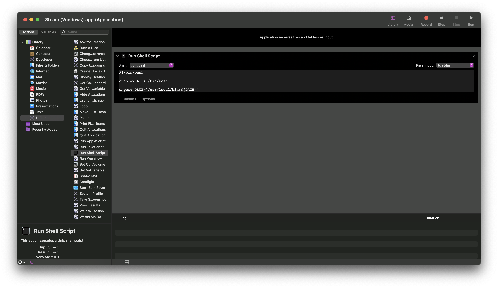

Open Automator

Select  **Application** and click **Choose**

In the sidebar on the left, click  **Utilities**, then double-click  **Run Shell Script**

Select` /bin/bash` as the shell and pass input **to stdin**, then paste the following in the textbox:

```sh
#!/bin/bash

arch -x86_64 /bin/bash

export PATH="/usr/local/bin:${PATH}"
export D3DM_SUPPORT_DXR=1
export ROSETTA_ADVERTISE_AVX=1
export WINEDLLOVERRIDES="dinput8=n,b;d3d11,d3d10,d3d12,dxgi=b"
export WINEESYNC=1
export WINEDEBUG=-all
export WINEPREFIX="$HOME/Games"

wine "C:\Program Files (x86)\Steam\steam.exe" > /dev/null 2>&1 &
```

Once you save this automated application (file format  **Application**, I have it saved as `Steam (Windows)`, though you can name it anything), you'll want to set a custom icon to make it discernable

Copy (i.e. right-click, then press **Copy Image**) the image you want to use as your icon (preferably `.icns` file format)

This is the app icon I use for Steam (Windows); click on the image to download it

 ([source](https://www.reddit.com/r/blender/comments/shk9dr/some_app_icons_ive_made_over_the_last_couple_of))

I've also converted it to Apple's `.icns` file format (it isn't displaying due to the file format), so you won't have to manually convert from `.webp` to `.icns`


Find the application you saved earlier, right-click it, then click **Get Info**

Click the default icon at the top (it'll be outlined when you do), right above the **Add Tags...** textbox

Press <kbd>⌘</kbd> + <kbd>V</kbd> (i.e. <kbd>CMD</kbd> + <kbd>V</kbd>) to paste the image you just copied, and you'll see the icon update accordingly

You can now run the Windows version of Steam anytime you click the app icon! This is much more user-friendly than running commands in the terminal each time.

##### Method 2: Shortcuts
// TODO

##### Method 3: AppleScript
> Taken from [David Baumgold's tutorial on installing Wine on Mac](https://www.davidbaumgold.com/tutorials/wine-mac). I haven't used this tutorial myself (I prefer my Bash scripts and Automator application), but I'm including this in case it's helpful to anyone else.
{: .prompt-info }

Open `Script Editor` (in the `/Applications/Utilities` directory)

You should see a window with a large area you can type in near the top: this is where you write your AppleScript. In that area, type the following text:

```plaintext
tell application "Terminal"
    do script "WINEPREFIX=~/Games wine $PATH_TO_PROGRAM.exe"
end tell
```

Replace `$PATH_TO_PROGRAM` with the path from the Program Files directory to your program executable.

Press **Compile** button at the top of the window. The text should become colored to indicate that Script Editor understands what you wrote. You can also try pressing the Run button to run your script: it should open the Windows program successfully.

Save your script; Select **File Format: Application** in the save options, and leave **Startup Screen** unchecked.

Open up the Finder, go to where you saved your script, and drag that file to your Dock. It should stay there, just like a real application!

#### Folder shortcut
Continue reading if you want easy, quick, and convenient access to both your Mac **AND** Windows versions of Steam

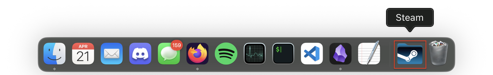


Complete all steps in [Method 1 Automator](2025-03-19-play-windows-games.md#method-1-automator); this is necessary to create a clickable `.app` for the Windows version of Steam (i.e. `Windows (Steam).app`)

Change directory to `Applications`

```sh
cd /Applications
```
{: .nolineno }

Create a new folder in `Applications` titled `Steam`, either manually (right-click, press **New Folder**, then enter `Steam` as its name) or via terminal

```sh
mkdir -p Steam
```
{: .nolineno }

> Including `-p` flag means that it'll create the new Steam folder **if and only if** it doesn't already exist
> This is to avoid accidentally overwriting it, in case you already have a folder titled `Steam` in that location (i.e. `/Applications/Steam`)
{: .prompt-tip }

Move `Steam.app` and `Steam (Windows).app` (or whatever you named it in [Method 1 Automator](2025-03-19-play-windows-games.md#method-1-automator) section) into your new `Steam` folder (assuming you have both `.app`s in your `/Applications` directory), either manually (drag each `.app` into `Steam` folder) **OR** via terminal
 
```sh
mv -i Steam.app Steam && mv -i "Steam (Windows).app" Steam
```
{: .nolineno }

> Including `-i` (interactive) flag means that you will be asked a confirmation if you already have a file with the same name in the same location
> This is to avoid overwriting in case you already have `Steam.app` and/or `Steam (Windows).app` in that location (i.e. `/Applications/Steam`)
{: .prompt-tip }

Find and download a folder icon you like (preferably `.icns` file format)

> This is the folder icon I use
> <a target="_blank" href="https://macosicons.com/#/?icon=1QWV8oirpJ"></a>
> 
> Alternatively, you can download it directly here
> 
{: .prompt-tip }

Once downloaded, select the folder icon and copy it
	- <kbd>⌘</kbd> + <kbd>C</kbd> (i.e. <kbd>CMD</kbd> + <kbd>C</kbd>)
	- Right-click the icon and click **Copy**

Back in `/Applications`, right-click `Steam` folder and click **Get Info**


Click on the icon in the upper-left corner (it should be outlined in your system's accent color; in my case it's purple)

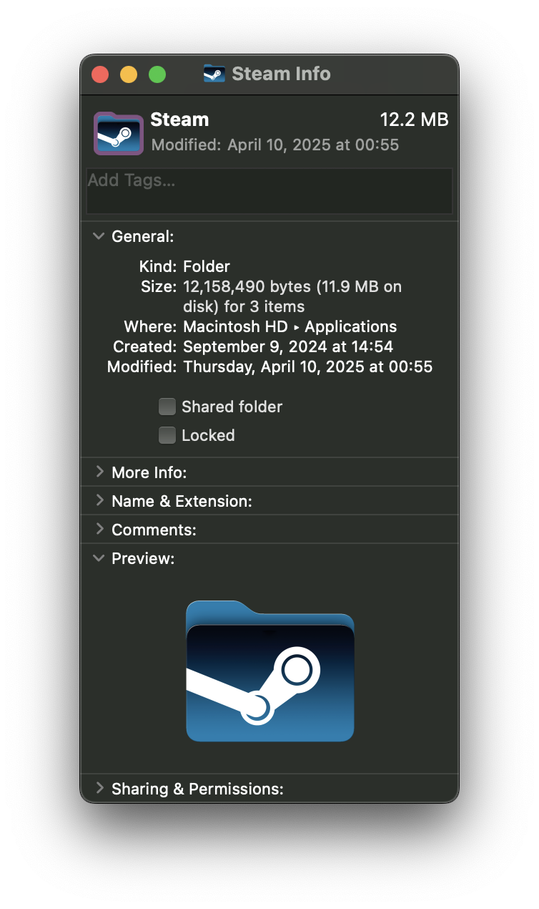

Paste the folder icon with <kbd>⌘</kbd> + <kbd>V</kbd> (i.e. <kbd>CMD</kbd> + <kbd>V</kbd>) to update `Steam` folder's icon accordingly

Now that you have a custom `Steam` folder with both Mac and Windows versions of Steam (i.e. `Steam.app` and `Steam (Windows).app`), drag the folder into the dock

To adjust the appearance, right-click the `Steam` folder icon in the dock (that you just dragged)

Make the following selections
	- Under **Display as**, select **Folder**
	- Under **View content as**, select **Grid**


You now have a convenient way to access both versions of Steam via your dock! If you open the `Steam` folder and click on either of the `.app`s, it should launch as expected

> `Steam (Windows).app` takes longer to launch than the native Steam app due to the additional processes it has to run in the background
{: .prompt-info }

#### Set game mode
> **THIS NO LONGER WORKS WITH macOS 16!**
> 
> See ["Symbol not found" when setting game mode](2025-03-19-play-windows-games.md#symbol-not-found-when-setting-game-mode) for more details.
{: .prompt-important }

This requires XCode, which is one of the [Requirements](2025-03-19-play-windows-games.md#requirements) (you should already have it by now).


    ---TAB: Enable
        Enable game mode
        ```sh
        /Applications/Xcode.app/Contents/Developer/usr/bin/gamepolicyctl game-mode set on
        ```
        {: .nolineno }
    ---TAB: Disable
        Disable game mode
        ```sh
        /Applications/Xcode.app/Contents/Developer/usr/bin/gamepolicyctl game-mode set off
        ```
        {: .nolineno }
    ---TAB: Auto
        Automatically set game mode
        ```sh
        /Applications/Xcode.app/Contents/Developer/usr/bin/gamepolicyctl game-mode set auto
        ```
        {: .nolineno }


#### Adjust DPI scaling level
Launch Steam with DPI scaling forced to 100%

```sh
wine reg add 'HKEY_CURRENT_USER\Control Panel\Desktop' /v 'LogPixels' /t REG_DWORD /d 96 /f
```
{: .nolineno }

> 96 DPI = 100% scaling
{: .prompt-info }

#### Check prefix architecture
##### Method 1: Environment Variable
Prints the value of `$WINEARCH`, which should be either `win64` or `win32`

```sh
echo "$WINEARCH"
```
{: .nolineno }

##### Method 2: System Registry
The command below reads the system registry of `$WINEPREFIX` and returns `#arch=win32` or `#arch=win64` depending on the architecture type.

```sh
reg_arch="$(grep '#arch' $WINEPREFIX/system.reg)" && echo "${reg_arch#'#arch='}" || echo "Unknown"
```
{: .nolineno }

Prints value after `#arch=` (i.e. `win32` or `win64`) or "Unknown" if `#arch` is not in `system.reg`

```plaintext
prefix="#arch="
reg_val="#arch=win64"
wine_arch=${reg_val#"$prefix"}
echo "${wine_arch}"
win64
```

#### Enable font smoothing
Font smoothing improves the font's display resolution and font rendering.

##### Method 1: Winetricks
```sh
winetricks fontsmooth=rgb
```
{: .nolineno }

##### Method 2: Regedit
```sh
wine reg add 'HKEY_CURRENT_USER\Software\Wine\X11 Driver' /v 'ClientSideAntiAliasWithCore' /t REG_SZ /d 'Y' /f
wine reg add 'HKEY_CURRENT_USER\Software\Wine\X11 Driver' /v 'ClientSideAntiAliasWithRender' /t REG_SZ /d 'Y' /f
wine reg add 'HKEY_CURRENT_USER\Software\Wine\X11 Driver' /v 'ClientSideWithRender' /t REG_SZ /d 'Y' /f
```
{: .nolineno }

`HKEY_CURRENT_USER\Control Panel\Desktop` keys:

- `FontSmoothing`
	- Value `0`: Disable font smoothing
	- ~~Value `1`: Enable standard font smoothing~~
	- Value `2`: Enable ClearType font smoothing
- `FontSmoothingType`
	- ~~Value `0`: Switch to gray (i.e. basic) font smoothing~~
	- Value `1`: Regular; switch to gray (i.e. basic) font smoothing
	- Value `2`: Subpixel; switch to colored (i.e. ClearType) font smoothing
- `FontSmoothingGamma`
	- Value between `0` (dark/heavier) to `2200` (light/finer) decimal: Intensity of color and darkness of the smoothing.
- `FontSmoothingOrientation`
	- Value `0`: ~~None~~ BGR (?)
	- Value `1`: RGB format (red, green, blue) for LCD, normal
	- ~~Value `2`: BGR format (blue, green, red) for LCD~~

Enable subpixel smoothing/rendering/anti-aliasing (ClearType) RGB[^fontsmooth]:

```sh
wine reg add 'HKEY_CURRENT_USER\Control Panel\Desktop' /v 'FontSmoothing' /t REG_SZ /d '2' /f
wine reg add 'HKEY_CURRENT_USER\Control Panel\Desktop' /v 'FontSmoothingOrientation' /t REG_DWORD /d 00000001 /f
wine reg add 'HKEY_CURRENT_USER\Control Panel\Desktop' /v 'FontSmoothingType' /t REG_DWORD /d 00000002 /f
wine reg add 'HKEY_CURRENT_USER\Control Panel\Desktop' /v 'FontSmoothingGamma' /t REG_DWORD /d 00000578 /f
```
{: .nolineno }

Enable standard font smoothing[^improvegui]:

```sh
wine reg add 'HKEY_CURRENT_USER\Control Panel\Desktop' /v 'FontSmoothing' /t REG_SZ /d '2' /f
wine reg add 'HKEY_CURRENT_USER\Control Panel\Desktop' /v 'FontSmoothingOrientation' /t REG_DWORD /d 00000001 /f
wine reg add 'HKEY_CURRENT_USER\Control Panel\Desktop' /v 'FontSmoothingType' /t REG_DWORD /d 00000001 /f
wine reg add 'HKEY_CURRENT_USER\Control Panel\Desktop' /v 'FontSmoothingGamma' /t REG_DWORD /d 00000578 /f
```
{: .nolineno }

Disable subpixel smoothing/rendering/anti-aliasing:

```sh
wine reg add 'HKEY_CURRENT_USER\Control Panel\Desktop' /v 'FontSmoothing' /t REG_SZ /d '0' /f
wine reg add 'HKEY_CURRENT_USER\Control Panel\Desktop' /v 'FontSmoothingOrientation' /t REG_DWORD /d 00000001 /f
wine reg add 'HKEY_CURRENT_USER\Control Panel\Desktop' /v 'FontSmoothingType' /t REG_DWORD /d 00000000 /f
wine reg add 'HKEY_CURRENT_USER\Control Panel\Desktop' /v 'FontSmoothingGamma' /t REG_DWORD /d 00000578 /f
```
{: .nolineno }

#### Disable anti-aliased fonts
Disable anti-aliased fonts[^disableantialias]

```sh
wine reg add 'HKEY_CURRENT_USER\Software\Wine\X11 Driver' /v 'ClientSideAntiAliasWithCore' /t REG_SZ /d 'N' /f
wine reg add 'HKEY_CURRENT_USER\Software\Wine\X11 Driver' /v 'ClientSideAntiAliasWithRender' /t REG_SZ /d 'N' /f
wine reg add 'HKEY_CURRENT_USER\Software\Wine\X11 Driver' /v 'ClientSideWithRender' /t REG_SZ /d 'N' /f
```
{: .nolineno }

#### Set drivers
```sh
wine reg add 'HKEY_CURRENT_USER\Software\Wine\Drivers' /v 'Graphics' /t REG_SZ /d 'mac,x11' /f
```
{: .nolineno }

#### Enable noflicker
```sh
wine reg add 'HKEY_CURRENT_USER\Software\Wine\Mac Driver' /t REG_SZ /v 'ForceOpenGLBackingStore' /d 'Y' /f
```
{: .nolineno }

#### Disable window decorations
The heuristics that Wine uses to decide whether or not to trim off the edges of windows and replace them with the platform-native window decorations are imperfect. The Mac driver, like the X11 driver, has a registry setting to turn off window decorations for situations like this.[^disabledecorations]

```sh
wine reg add 'HKEY_CURRENT_USER\Software\Wine\Mac Driver' /v 'Decorated' /t REG_SZ /d 'N' /f
```
{: .nolineno }

> To re-enable window decorations:
> ```sh
> wine reg add 'HKEY_CURRENT_USER\Software\Wine\Mac Driver' /v 'Decorated' /t REG_SZ /d 'Y' /f
> ```
> {: .nolineno }
{: .prompt-tip }

#### Shader caching
You can view and/or delete the shader caches if you run into any issues, like [Game won’t boot anymore despite no changes](2025-03-19-play-windows-games.md#game-wont-boot-anymore-despite-no-changes)

##### D3DM shader caching
```sh
$(getconf DARWIN_USER_CACHE_DIR)/d3dm
```
{: .nolineno }

Example contents

```plaintext
CrashReportClient.exe                 MassEffectLauncher.exe
EADesktop.exe                         MCC-Win64-Shipping.exe
EALaunchHelper.exe                    OblivionRemastered-Win64-Shipping.exe
EpicWebHelper.exe                     Palworld-Win64-Shipping.exe
GhostOfTsushima.exe                   Schedule I.exe
GoW.exe                               SkyrimSE.exe
IGOProxy64.exe                        steamwebhelper.exe
```

The shaders for each game are in the `shaders.cache` subdirectory in each game directory. E.g. cached shaders for *Schedule I* would be in `$(getconf DARWIN_USER_CACHE_DIR)/d3dm/Schedule I.exe/shaders.cache`

##### DXMT shader caching
```sh
$(getconf DARWIN_USER_CACHE_DIR)/dxmt
```
{: .nolineno }

Example contents

```plaintext
EpicWebHelper.exe           steamwebhelper.exe
Palworld-Win64-Shipping.exe
```

#### Restrict Wine processes to subset of available cores
Here's a hack that allows you to restrict Wine processes to a subset of the available cores.[^restrictwine]

You can pass a CPU mask through the `WINECPUMASK` environment variable:

`WINECPUMASK=0xff wine ... `

This will tie Wine processes (including `wineserver`) to the first 8 cores. It will also limit the number of reported cores to 8.

To get a performance gain on Ryzen the mask should specify the cores of one core complex (CCX). Here's little bash script that computes the mask for the first CCX:

```bash
#!/usr/bin/env bash
local model_name="$(sysctl -n machdep.cpu.brand_string)"

NUM_CPUS=$(sysctl -n hw.logicalcpu)
echo "$NUM_CPUS-core CPU"

CCX_MASK=$(((1 << $NUM_CPUS / 2) - 1))
echo -n "first CCX mask: "
printf "0x%x\n" $CCX_MASK
```

With this patch The Forest goes from 23 to 40 fps on a 16 core Ryzen CPU. It would be interesting to see if this also makes difference for the games mentioned here and in duplicate reports.

#### Update MoltenVK
> [MoltenVK](https://github.com/KhronosGroup/MoltenVK) is a layered implementation of [Vulkan](https://www.khronos.org/vulkan) graphics and compute functionality, built on Apple's [Metal](https://developer.apple.com/metal) graphics and compute framework...
> 
> Refer to 
[MoltenVK's `README.md`](https://github.com/KhronosGroup/MoltenVK?tab=readme-ov-file#command_line_build) for steps on how to install MoltenVK from source

MoltenVK is a software library which allows Vulkan applications to run on top of Metal on Apple's macOS, iOS, and tvOS operating systems.

Assuming you already have CrossOver, it is possible to add its support for Windows Vulkan games (atop MoltenVK) to GPTk[^gptkvulk]. I also used this method to update MoltenVK for DXVK Wine build.

> `$(brew --prefix game-porting-toolkit)` is equivalent to `/usr/local/opt/game-porting-toolkit`, which redirects to `/usr/local/Cellar/game-porting-toolkit/1.1`
{: .prompt-info }

Copy `x86_64-windows/vulkan-1.dll`{: .filepath} to GPTk

```sh
cp -i /Applications/CrossOver.app/Contents/SharedSupport/CrossOver/lib/wine/x86_64-windows/vulkan-1.dll $(brew --prefix game-porting-toolkit)/lib/wine/x86_64-windows
```
{: .nolineno }

Optionally copy `i386-windows/vulkan-1.dll`{: .filepath} to GPTk for 32-bit support

```sh
cp -i /Applications/CrossOver.app/Contents/SharedSupport/CrossOver/lib/wine/i386-windows/vulkan-1.dll $(brew --prefix game-porting-toolkit)/lib/wine/i386-windows
```
{: .nolineno }

Copy `libMoltenVK.dylib`{: .filepath} to GPTk

```sh
cp -i /Applications/CrossOver.app/Contents/SharedSupport/CrossOver/lib64/libMoltenVK.dylib $(brew --prefix game-porting-toolkit)/lib/external
```
{: .nolineno }

Set these environment variables

```sh
CX_APPLEGPTK_LIBD3DSHARED_PATH="$(brew --prefix game-porting-toolkit)/lib/external/libd3dshared.dylib"
WINEDLLPATH_PREPEND="$(brew --prefix game-porting-toolkit)/lib/wine"
WINEDLLOVERRIDES="dxgi,d3d9,d3d10core,d3d11=b;mf,mfplat,mfreadwrite=n"
```
{: .nolineno }

> It should be possible to source these files from other sources of Wine-Crossover, such as those provided by the Heroic Games Launcher (assuming you have not already modified it as described in the previous section. If you have, you should be able to download another version from Heroic.)
{: .prompt-info }

[According to DXVK](https://github.com/doitsujin/dxvk/issues/1788):
- `d3dcompiler_47`{: .filepath} is for DX12
- `d3dcompiler_43`{: .filepath} is for DX11

### Scripts
#### Shell Shortcut

#### Bash Functions for Gaming
Save this script (i.e. `gaming_funcs.sh`{: .filepath}), then add to your shell startup file. You can also find [this script in my GitHub Gists](https://gist.github.com/lynkos/fc27a9cf827a4d7adf6c2f3a6b7f0f7a), as this version may or may not be outdated.

> E.g. Here's how I include it in my `.bashrc`{: .filepath} file:
> ```bash
> [[ -r "$HOME/Scripts/gaming_funcs.sh" ]] && . "$HOME/Scripts/gaming_funcs.sh"
> ```
> {: .nolineno }
{: .prompt-tip }

```bash
#!/usr/bin/env bash

############################################################################
#                             gaming_funcs.sh                              #
#                                                                          #
#              Bash functions for playing Windows games on Mac             #
# ------------------------------------------------------------------------ #
# Setup:                                                                   #
#    1. Switch architecture                                                #
#       `arch -x86_64 /bin/bash`                                           #
#    2. Set up Wine environment                                            #
#       `set-wine <variant>`                                               #
#                                                                          #
# Usage:                                                                   #
#    *  Download Windows Steam game to Wine prefix via SteamCMD            #
#       `dlg <WINEPREFIX_NAME> <APP_ID>`                                   #
#    *  Move Windows Steam game between Wine prefixes                      #
#       `mvdlg <APP_ID> <SOURCE_WINEPREFIX_NAME> <TARGET_WINEPREFIX_NAME>` #
#    *  Install Windows Steam into specific Wine prefix                    #
#       `instm <WINEPREFIX_NAME>`                                          #
#    *  Quit/stop a specific Wine prefix                                   #
#       `endwine <WINEPREFIX_NAME>`                                        #
#    *  Run Wine with multiple arguments                                   #
#       `wine <program> [args...]`                                         #
#    *  Launch Windows version of Steam                                    #
#       `steam`                                                            #
#    *  Set retina mode for Windows gaming via Wine (Options: on, off)     #
#       `retina <OPTION>`                                                  #
#    *  Set macOS Game Mode (Options: on, off, auto)                       #
#       `game-mode <OPTION>`                                               #
#    *  Clear Oblivion Remastered shader cache (used for debugging)        #
#       `clear-cache`                                                      #
#    *  Enable font smoothing (i.e. anti-aliasing)                         #
#       `anti-alias`                                                       #
#    *  Configure settings for Far Cry 3, then launch Steam                #
#       `fc3`                                                              #
#                                                                          #
# Examples:                                                                #
#    ```                                                                   #
#    arch -x86_64 /bin/bash                                                #
#    set-wine gptk                                                         #
#    instm GPTk                                                            #
#    dlg GPTk 3164500                                                      #
#    wine winecfg                                                          #
#    retina on                                                             #
#    game-mode on                                                          #
#    mvdlg 3164500 GPTk DXMT                                               #
#    set-wine dxmt                                                         #
#    steam                                                                 #
#    endwine DXMT                                                          #
#    ```                                                                   #
# ------------------------------------------------------------------------ #
#                      https://gist.github.com/lynkos                      #
############################################################################

############################### CONSTANTS ##################################

# Print debug messages to console and stderr
ENABLE_DEBUG=1

# Base directories
readonly WINE_DIR="$HOME/Wine"
readonly BOTTLES_DIR="$HOME/Bottles"

# Uncomment for logging
# readonly LOG_DIR="$HOME/Logs"

# Resolution
readonly WIDTH=3024 # pixels (px)
readonly FORMULA_WIDTH=1512 # pixels (px)
readonly FORMULA_DPI=96 # 96dpi = 100% scaling in Windows
readonly DPI=$(printf '%.0f' $(bc -l <<< "scale=2; $FORMULA_DPI * $WIDTH / $FORMULA_WIDTH")) # 192 = ($FORMULA_DPI * $WIDTH / $FORMULA_WIDTH)

# Previous DPI: 216dpi
#
# Previous formula:
# readonly DIAGONAL=14.2 # inches (in)
# readonly HEIGHT=1964 # pixels (px)
# $(echo "scale=0; dpi = sqrt($WIDTH^2 + $HEIGHT^2) / $DIAGONAL; dpi / 1" | bc -l)
#
# Manually calc DPI: https://dpi.lv

# Steam
readonly STEAM_USER="anonymous"
readonly STEAMCMD_DIR="$HOME/SteamCMD"
readonly STEAMAPPS_DIR="drive_c/Program Files (x86)/Steam/steamapps"
readonly STEAMAPPS_DIR_WIN="C:\\Program Files (x86)\\Steam\\steamapps" # Double backslash since this var will only be used for printing (e.g. echo "$STEAMAPPS_DIR_WIN\\common")

# Print options
# FIXME: Rewrite to avoid `cd` error
readonly BOTTLES="$(init_dir=$(pwd) && cd $BOTTLES_DIR && /bin/ls --color=always -1d */ | sed 's|/||' | tr '\n' ',' | sed 's/,$//' | sed 's/,/, /g' && cd $init_dir)"
readonly VARIANTS="$(init_dir=$(pwd) && cd $WINE_DIR && /bin/ls --color=always -1d */ | sed 's|/||' | tr '\n' ',' | sed 's/,$//' | sed 's/,/, /g' && cd $init_dir)"

############################## WINE FUNCTIONS ##############################

# Set up Wine environment for a specific variant
# Execute alias `x86` (i.e. `arch -x86_64 /bin/bash`) beforehand
#
# set-wine <variant>
# E.g. `set-wine gptk`
set-wine() {
    local variant="$1"

    # Verify Wine variant
    if [[ -z "$variant" ]]; then
        _info "Usage: set-wine <variant>" >&2
        _info "Available variants: $VARIANTS" >&2
        return 1
    fi

    # Clear prev set, shared Wine env vars for clean transitions when switching between variants
    # No sense in clearing env vars used by only ONE (1) Wine variant (aka are unique to a single variant), since there wouldn't be any conflicting configs/settings to worry about
    unset MTL_HUD_ENABLED WINEESYNC WINEMSYNC WINEDLLOVERRIDES WINE_LARGE_ADDRESS_AWARE MVK_CONFIG_RESUME_LOST_DEVICE # WINECPUMASK

    # TODO: End all currently running instances of Wine
    
    # Env vars shared across all Wine variants
    export ROSETTA_ADVERTISE_AVX=1
    export WINEARCH=win64 # 64-bit Wine architecture
    export WINEDEBUG=-all # Disable Wine debugging/logging # "+heap,+timestamp,+module,+pid,+relay,+snoop,+fps,+debugstr,+threadname,+seh,+memory,+d3dm"

    # MoltenVK env vars; used by all Wine variants (since they're built with MoltenVK support)
    # https://github.com/KhronosGroup/MoltenVK/blob/main/Docs/MoltenVK_Configuration_Parameters.md
    export MVK_CONFIG_TRACE_VULKAN_CALLS=0 # No Vulkan call logging
    export MVK_CONFIG_DEBUG=0 # Disable debugging
    export MVK_CONFIG_LOG_LEVEL=0 # No logging
    
    # Wine variant-specific configs
    case "$variant" in
        # Game Porting Toolkit
        "gptk")
            local winename="Game Porting Toolkit"
            local variant_version="2.1"
            local winepath="$WINE_DIR/gptk/2_1"
            local wine_executable="wine64"
            local wine_preloader="wine64-preloader"
            local wineprefix="$BOTTLES_DIR/GPTk"

            export MTL_HUD_ENABLED=1
            export D3DM_SUPPORT_DXR=1
            export D3DM_ENABLE_METALFX=0 # If `D3DM_ENABLE_METALFX=1`, set `WINEESYNC=0`
            export WINEESYNC=1 # `0` if `D3DM_ENABLE_METALFX=1` else `1`
            export WINEDLLOVERRIDES="dinput8=n,b;d3d12,d3d11,d3d10,dxgi=b" # "winemenubuilder.exe=d"
            ;;

        # DirectX-Metal
        "dxmt")
            local winename="DirectX-Metal"
            local variant_version="v0.70"
            local winepath="$WINE_DIR/dxmt/10.18"
            local wine_executable="wine"
            local wine_preloader="wine"
            local wineprefix="$BOTTLES_DIR/DXMT"

            export MTL_HUD_ENABLED=1
            export DXMT_METALFX_SPATIAL_SWAPCHAIN=0
            export DXMT_CONFIG_FILE="$WINE_DIR/dxmt/dxmt.conf"
            #export DXMT_CONFIG="d3d11.preferredMaxFrameRate=60;d3d11.metalSpatialUpscaleFactor=2.0;" # Alternative to DXMT_CONFIG_FILE
            export DXMT_LOG_LEVEL=none
            export DXMT_LOG_PATH=none # "$winepath/logs"
            export DXMT_ENABLE_NVEXT=0
            #export MTL_SHADER_VALIDATION=0
            #export MTL_DEBUG_LAYER=0
            #export MTL_CAPTURE_ENABLED=0
            export WINEMSYNC=0
            export WINEDLLOVERRIDES="dinput8=n,b;d3d11,d3d10core,dxgi=b" # winemenubuilder.exe=d
            ;;

        # DirectX-Vulkan
        "dxvk")
            local winename="DirectX-Vulkan"
            local variant_version="v1.10.3-20230507-repack"
            local winepath="$WINE_DIR/dxvk/10.14"
            local wine_executable="wine"
            local wine_preloader="wine"
            local wineprefix="$BOTTLES_DIR/DXVK"

            export DXVK_HUD=full
            export DXVK_ASYNC=1
            export DXVK_STATE_CACHE=1
            export DXVK_CONFIG_FILE="$WINE_DIR/dxvk/dxvk.conf"
            export DXVK_LOG_LEVEL=none
            export DXVK_LOG_PATH=none
            export MVK_CONFIG_RESUME_LOST_DEVICE=1
            export WINE_LARGE_ADDRESS_AWARE=1
            export WINEDLLOVERRIDES="d3d11,d3d10core,dinput8=n,b" # "d3d11,d3d10core,d3d9,dxgi,dinput8=n,b"
            ;;

        # CrossOver
        "crossover")
            local winename="CrossOver"
            local variant_version="v23.7.1"
            local winepath="$WINE_DIR/crossover/23.7.1"
            local wine_executable="wine64" # "wine"
            local wine_preloader="wine64-preloader" # "wine-preloader"
            local wineprefix="$BOTTLES_DIR/CrossOver"

            export MTL_HUD_ENABLED=1
            export WINEESYNC=1
            # export WINEDLLOVERRIDES="dinput8=n,b;d3d12,d3d11,d3d10,dxgi=b"
            ;;

        *)
            _err "Unknown variant '$variant'" >&2
            echo "Valid variants: $VARIANTS" >&2
            return 1
            ;;
    esac
    
    # Set up Wine env paths and executables
    export PATH="$winepath/bin:$PATH"
    export WINELOADER="$winepath/bin/$wine_preloader"
    export WINEDLLPATH="$winepath/lib/wine"
    export WINESERVER="$winepath/bin/wineserver"
    export LD_LIBRARY_PATH="$winepath/lib:$LD_LIBRARY_PATH"
    export DYLD_FALLBACK_LIBRARY_PATH="/usr/lib:$DYLD_FALLBACK_LIBRARY_PATH"
    export WINE="$winepath/bin/$wine_executable"
    export WINEPREFIX="$wineprefix"
    export WINE_VERSION="$(_wine_version)"
    export VARIANT_ID="$variant"
    export VARIANT_NAME="$winename"
    export VARIANT_VERSION="$variant_version"

    _info "$winename translation environment successfully set!" >&2
    echo -e "\nUsage:" >&2
    echo -e "       wine <program> [args...]\n" >&2
    _wine_info
}

# Download Windows game to Steam for specific WINEPREFIX via SteamCMD
#
# dlg <WINEPREFIX_NAME> <APP_ID>
#
# E.g. `dlg DXMT 3164500`
dlg() {
   if [[ $# -eq 2 ]]; then
      # Get current path for later use
      local initdir="$(pwd)"

      # Assign user input to variable for better readability
      local app_id="$2"
      _dbug "Given app ID: '$app_id'"

      # Path of given WINEPREFIX
      local wineprefix="$BOTTLES_DIR/$1"
      _dbug "Given Wine prefix: '$wineprefix'"

      # Create temp directory to store download
      local temp="$wineprefix/$STEAMAPPS_DIR/temp/$app_id"
      mkdir -p "$temp"
      _dbug "Temporarily storing download in '$STEAMAPPS_DIR_WIN\\temp\\$app_id'"

      # Cleanup logic in case something goes wrong
      trap "_err 'Something went wrong. Exiting...'; cd '$initdir'; return 1;" EXIT ERR

      # Enter SteamCMD directory
      cd "$STEAMCMD_DIR"

      # Download game
      ./steamcmd.sh +@sSteamCmdForcePlatformType windows +force_install_dir "$temp" +login "$STEAM_USER" +app_update "$app_id" validate +quit

      # Get appmanifest path
      local app_manifest="$temp/steamapps/appmanifest_$app_id.acf"
      _dbug "Appmanifest: '$app_manifest'"

      # Get directory installation name from appmanifest
      local dirname="$(sed -n 's/^[[:space:]]*"installdir"[[:space:]]*"\([^"]*\)".*/\1/p' "$app_manifest")"
      _dbug "Directory name of downloaded game is: $dirname"

      # Get game size from appmanifest (i.e. value for app ID key)
      local size_on_disk="$(sed -n 's/^[[:space:]]*"SizeOnDisk"[[:space:]]*"\([^"]*\)".*/\1/p' "$app_manifest")"
      _dbug "Disk size of $dirname is: $size_on_disk"

      # TODO: If directory already exists, overwrite (or delete) it, else it'll exit; same with the upcoming directories

      # Move and rename downloaded directory into common
      mv "$temp" "$wineprefix/$STEAMAPPS_DIR/common/$dirname"
      _dbug "Moved and renamed game from '$STEAMAPPS_DIR_WIN\\temp\\$app_id' to '$STEAMAPPS_DIR_WIN\\common\\$dirname'"

      # Go to appmanifest(s) (i.e. .acf file(s))
      cd "$wineprefix/$STEAMAPPS_DIR/common/$dirname/steamapps"

      # Move appmanifest(s) into parent steamapps so Steam recognizes game is installed
      mv *.acf ../../../
      _dbug "Moved downloaded appmanifest(s) from '$STEAMAPPS_DIR_WIN\\common\\$dirname\\steamapps' to '$STEAMAPPS_DIR_WIN'"

      # TODO: Delete child steamapps IFF empty or only contains empty dirs

      # Go into parent steamapps
      cd ../../../

      # Register game in libraryfolders.vdf
      _update_library_vdf "$app_id" "$size_on_disk"
      _dbug "Registered game in '$STEAMAPPS_DIR_WIN\\libraryfolders.vdf'"

      # Go back to initial directory
      cd "$initdir"

      # Reset (i.e. re-enable default processing of) signal
      trap - EXIT ERR
      
   else
      _err "Invalid number of args. Must include:"
      echo "       * Name of WINEPREFIX (i.e. $BOTTLES)" >&2
      printf '       * Steam App ID of game (find at \e]8;;https://steamdb.info\e\\SteamDB.info\e]8;;\e\\)\n' >&2
   fi
}

# Move Steam game from one Wine prefix (e.g. DXMT, DXVK, GPTk, CrossOver, etc.) to another
#
# mvdlg <APP_ID> <SOURCE_WINEPREFIX_NAME> <TARGET_WINEPREFIX_NAME>
# E.g. `mvdlg 2623190 DXMT GPTk`
#
# TODO: Update `libraryfolders.vdf` (in BOTH bottles) after moving game
mvdlg() {
   if [[ $# -ne 3 ]]; then
      _err "Invalid number of args. Must include:"
      printf '       * Steam App ID of game (find at \e]8;;https://steamdb.info\e\\SteamDB.info\e]8;;\e\\)\n' >&2
      echo "       * Name of source WINEPREFIX to move downloaded game from (i.e. $BOTTLES)" >&2
      echo "       * Name of target WINEPREFIX to move downloaded game to (i.e. $BOTTLES)" >&2
      return 1
   fi

   # Source WINEPREFIX path
   local source="$BOTTLES_DIR/$2"

   # Confirm source WINEPREFIX exists
   if [[ ! -d "$source" ]]; then
      _err "Source WINEPREFIX does not exist: '$source'"
      return 1
   fi
   _dbug "Source WINEPREFIX: '$source'"

   # Target WINEPREFIX path
   local target="$BOTTLES_DIR/$3"

   # Confirm target WINEPREFIX exists
   if [[ ! -d "$target" ]]; then
      _err "Target WINEPREFIX does not exist: '$target'"
      return 1
   fi
   _dbug "Target WINEPREFIX: '$target'"

   # Given Steam game's app ID
   local app_id="$1"
   _dbug "Steam App ID: $app_id"

   # Path to source appmanifest
   local manifest="$source/$STEAMAPPS_DIR/appmanifest_$app_id.acf"
   
   # Confirm source appmanifest exists
   if [[ ! -f "$manifest" ]]; then
      _err "Source appmanifest not found: '$manifest'"
      return 1
   fi
   _dbug "Source appmanifest: '$manifest'"

   # Get directory installation name from appmanifest
   local dirname="$(sed -n 's/^[[:space:]]*"installdir"[[:space:]]*"\([^"]*\)".*/\1/p' "$manifest")"

   # Confirm directory installation name exists
   if [[ -z "$dirname" ]]; then
      _err "Failed to extract install directory '$dirname' from '$manifest'"
      return 1
   fi
   _dbug "Steam game: $dirname"

   # Path to the game directory in source
   local source_dir="$source/$STEAMAPPS_DIR/common/$dirname"
   
   # Confirm game directory exists in source
   if [[ ! -d "$source_dir" ]]; then
      _err "Game directory not found: '$source_dir'"
      return 1
   fi

   # Path to the target game directory
   local target_dir="$target/$STEAMAPPS_DIR/common/$dirname"
   
   # Ensure target common directory exists
   mkdir -p "$target/$STEAMAPPS_DIR/common"

   # Move game directory from source to target
   if ! mv "$source_dir" "$target_dir"; then
      _err "Failed to move game in '$STEAMAPPS_DIR_WIN\\common\\$dirname' from '$source' to '$target'"
      return 1
   fi
   _dbug "Moved game in '$STEAMAPPS_DIR_WIN\\common\\$dirname' from '$source' to '$target'"

   # Target appmanifest location
   local target_manifest="$target/$STEAMAPPS_DIR/appmanifest_$app_id.acf"
   
   # Move app manifest from source to target
   if ! mv "$manifest" "$target_manifest"; then
      _err "Failed to move appmanifest from '$manifest' to '$target_manifest'"
      _err "For Steam to recognize the game, you will need to [manually] move it yourself"
      return 1
   fi
   _dbug "Moved 'appmanifest_$app_id.acf' in '$STEAMAPPS_DIR_WIN' from '$source' to '$target'"

   _info "Moved '$dirname' (App ID '$app_id') from '$source' to '$target'"
   return 0
}

# Install Steam for specific Wine prefix
# instm <WINEPREFIX_NAME>
# 
# E.g. `instm DXVK`
instm() {
   if [[ $# -eq 1 ]]; then
      # Create temporary file for downloaded Windows Steam installer
      local temp_file="$(mktemp -t SteamSetup)"

      # Cleanup logic in case there's an issue
      trap "_err 'Something went wrong; performing cleanup...'; rm -rf $temp_file; trap - EXIT ERR; _info 'Cleanup complete. Exiting...'" EXIT ERR
    
      # Download SteamSetup.exe (i.e. Windows Steam installer)
      if ! curl -o "$temp_file" https://cdn.fastly.steamstatic.com/client/installer/SteamSetup.exe; then
         _err "Failed to download Steam installer"
         # Reset (i.e. re-enable default processing of) signal(s) before exiting
         trap - EXIT ERR
         return 1
      fi

      _dbug "Downloaded Steam installer to '$temp_file'"

      # Install Windows Steam for WINEPREFIX
      WINEPREFIX="$BOTTLES_DIR/$1" "$WINE" "$temp_file"
      _info "Installed Steam in $BOTTLES_DIR/$1"

      # Delete temporary Windows Steam installer
      rm -f "$temp_file"
      _dbug "Deleted temporary Windows Steam installer in '$temp_file'"

      # Reset (i.e. re-enable default processing of) signal(s)
      trap - EXIT ERR
      
   else
      _err "Invalid number of args. Specify name of ONE (1) bottle to install Steam into."
      _info "Valid bottles: $BOTTLES"
   fi
}

# Quit/stop a specific Wine prefix (e.g. DXMT, DXVK, GPTk, etc.)
#
# endwine <WINEPREFIX_NAME>
# E.g. `endwine DXMT`
endwine() {
   if [[ $# -eq 0 ]]; then
      # Use killwine if WINEPREFIX isn't set
      if [[ -z "$WINEPREFIX" ]]; then
         _info "WINEPREFIX not set; killing all Wine processes instead..."
         killall -9 wineserver && killall -9 wine64-preloader && killall -9 wine
         return $?

      else
         WINEPREFIX="$WINEPREFIX" wineserver -kw
      fi

   elif [[ $# -eq 1 ]]; then
      WINEPREFIX="$BOTTLES_DIR/$1" wineserver -kw
      
   else
      _err "Invalid number of args. Specify name of ONE (1) bottle to kill."
      _info "Valid bottles: $BOTTLES"
      return 1
   fi

   _info "Successfully closed bottle!"
   return 0
}

# Run Wine with multiple arguments using Wine env set up with `set-wine`
# Execute alias `x86` (i.e. `arch -x86_64 /bin/bash`) beforehand
#
# I.e.: `x86` --> `set-wine <variant>` --> `wine <program> [args...]`
wine() {    
    # Print short message if no program or arg is given (i.e. running `wine`)
    if [[ $# -eq 0 ]]; then
        echo "Usage: wine <program> [args...]      Run the specified program" >&2
        echo "       wine --help                   Display help message and exit" >&2
        echo "       wine --version                Output version information and exit" >&2
        return 1
    fi

    # Print help message
    if [[ "$1" == "--help" ]]; then
        cat << 'EOF'
Run `arch -x86_64 /bin/bash` beforehand to ensure compatibility with x86_64 architecture
  set-wine <variant>            Set up Wine environment <gptk|dxmt|dxvk|crossover>
  wine <program> [args...]      Run Windows program in Wine environment configured with `set-wine`
  endwine [bottle]              Stop Wine server for bottle (defaults to $WINEPREFIX)

STEAM GAMING:
  dlg <bottle> <app_id>         Save Steam game via SteamCMD to specified bottle
  mvdlg <app_id> <src> <dst>    Move Steam game between bottles
  instm <bottle>                Install Windows Steam into specified bottle
  steam                         Launch Windows Steam client

DISPLAY AND PERFORMANCE:
  retina <on|off>               Set retina mode for Windows gaming via Wine
  game-mode <on|off|auto>       Set macOS game mode
  clear-cache                   Clear game shader caches

EXAMPLES:
  x86                           # Switch to x86_64 architecture
  wine --help                   # Print help message
  set-wine dxmt                 # Configure DirectX-Metal environment
  dlg DXMT 3164500              # Download game ID 3164500 into DXMT bottle
  mvdlg 2623190 DXMT GPTk       # Move game from DXMT to GPTk bottle
  wine notepad.exe              # Run Windows Notepad
  wine --version                # Print currently configured environment
  steam                         # Launch Steam client
EOF
        return 0
    fi

    # Print Wine version + info
    if [[ "$1" == "--version" ]]; then
        _wine_info
        return 0
    fi

    # Check if Wine env is configured
    _is_env_set

    # Uncomment for logging
    # local log="$LOG_DIR/log.txt"
    # echo "--- Starting Wine process at $(date) with WINEPREFIX $WINEPREFIX ---" > "$log"
    
    # Execute Windows program
    "$WINE" "$@" # >> "$log" 2>&1 # Uncomment (before `>>`) for logging

    # Uncomment for logging
    # echo "--- Exiting Wine process at $(date) ---" >> "$log"
}

############################## GAMING FUNCTIONS ##############################

# Set retina mode for Windows gaming
# Options: on, off
retina() {
    # Input validation
    if [[ $# -ne 1 ]]; then
        echo "Usage: retina <on|off>" >&2
        return 1
    fi

    # Check if Wine env is configured
    _is_env_set
    
    case "$1" in
        # Enable retina rendering for high resolution displays
        on)
            _info "Enabling retina mode..."
            wine reg add 'HKEY_CURRENT_USER\Software\Wine\Mac Driver' /v 'RetinaMode' /t REG_SZ /d 'Y' /f
            wine reg add 'HKEY_CURRENT_USER\Control Panel\Desktop' /v 'LogPixels' /t REG_DWORD /d "$DPI" /f
            ;;

        # Disable retina rendering and reset to standard DPI
        off)
            _info "Disabling retina mode..."
            wine reg add 'HKEY_CURRENT_USER\Software\Wine\Mac Driver' /v 'RetinaMode' /t REG_SZ /d 'N' /f
            wine reg add 'HKEY_CURRENT_USER\Control Panel\Desktop' /v 'LogPixels' /t REG_DWORD /d "$FORMULA_DPI" /f
            ;;

        # Invalid options
        *)
            _err "Invalid retina mode option"
            echo "Usage: retina <on|off>" >&2
            return 1
            ;;
    esac
}

# Set game mode for gaming
# Options: on, off, auto
game-mode() {
    local mode="$1"
    
    if [[ ! "$mode" =~ ^(on|off|auto)$ ]]; then
        _err "Invalid game mode option"
        echo "Usage: game-mode <on|off|auto>" >&2
        return 1
    fi

    /Applications/Xcode.app/Contents/Developer/usr/bin/gamepolicyctl game-mode set "$mode"
    _info "Game mode: $mode"
}

# Clear shader cache for Oblivion Remastered
clear-cache() {
    rm -r $(getconf DARWIN_USER_CACHE_DIR)/d3dm/OblivionRemastered-Win64-Shipping.exe/shaders.cache
    rm -r "$WINEPREFIX/$STEAMAPPS_DIR/shadercache"
    rm -r "$HOME/Documents/My Games/Oblivion Remastered"
}

# Enable anti-aliased fonts
anti-alias() {
    _info "Enabling anti-aliasing (i.e. font smoothing)..."

    wine reg add 'HKEY_CURRENT_USER\Control Panel\Desktop' /v 'FontSmoothing' /t REG_SZ /d '2' /f
    wine reg add 'HKEY_CURRENT_USER\Control Panel\Desktop' /v 'FontSmoothingOrientation' /t REG_DWORD /d 00000001 /f
    wine reg add 'HKEY_CURRENT_USER\Control Panel\Desktop' /v 'FontSmoothingType' /t REG_DWORD /d 00000002 /f
    wine reg add 'HKEY_CURRENT_USER\Control Panel\Desktop' /v 'FontSmoothingGamma' /t REG_DWORD /d 00000578 /f
}

# Update keyboard mappings for 'Option' and 'Command' keys
# Option  --> Alt
# Command --> CTRL
fix-kbd() {
    _info "Updating keyboard mapping..."

    wine reg add 'HKEY_CURRENT_USER\Software\Wine\Mac Driver' /v 'LeftOptionIsAlt' /t REG_SZ /d 'Y'
    wine reg add 'HKEY_CURRENT_USER\Software\Wine\Mac Driver' /v 'RightOptionIsAlt' /t REG_SZ /d 'Y'
    _info "Mapped 'Option' key to 'Alt' key"

    wine reg add 'HKEY_CURRENT_USER\Software\Wine\Mac Driver' /v 'LeftCommandIsCtrl' /t REG_SZ /d 'Y'
    wine reg add 'HKEY_CURRENT_USER\Software\Wine\Mac Driver' /v 'RightCommandIsCtrl' /t REG_SZ /d 'Y'
    _info "Mapped 'Command' key to 'CTRL' key"
}

# Launch Windows version of Steam
steam() {
    # Check if Wine env is configured
    _is_env_set

    _info "Setting up Windows version of Steam..."

    # Enable retina mode
    retina on

    # Enable font smoothing (anti-aliasing)
    anti-alias

    # Map 'Option' and 'Command' keys
    fix-kbd

    # Enable game mode
    # game-mode on # Don't uncomment this line till game-mode func's fixed

    _info "Steam configuration complete!"

    # Start Steam
    _info "Launching Steam..."
    wine "C:\Program Files (x86)\Steam\steam.exe"
}

# Settings for FC3
fc3() {
    # Check if Wine env is configured
    _is_env_set

    # TODO: End all running Wine processes
    # endwine

    _info "Configuring optimal settings for Far Cry 3..."

    # Disable decorated window
    _info "Disabling decorated windows..."
    wine reg add 'HKEY_CURRENT_USER\Software\Wine\Mac Driver' /v 'Decorated' /t REG_SZ /d 'N' /f

    # FC3-specific env vars
    export WINEDLLOVERRIDES="dinput8,xaudio2_7=n,b;d3d11,d3d10core,dxgi=b" # winemenubuilder.exe=d
    export WINE_LARGE_ADDRESS_AWARE=1
    # export WINECPUMASK=0xff

    # Run Steam (to launch FC3)
    steam
}

############################## HELPER FUNCTIONS ##############################

# Check if Wine variant is set
_is_env_set() {
    if [[ -z "$WINE" ]]; then
        _err "No Wine environment configured." >&2
        echo "Run 'set-wine <variant>' to set up a Wine environment." >&2
        echo "Available variants: $VARIANTS" >&2
        return 1
    fi
}

# Register Steam game in libraryfolders.vdf
#
# _update_library_vdf <app_id> <size_on_disk>
# E.g. `_update_library_vdf 1623730 31616467506`
_update_library_vdf() {
    # Steam game's app ID
    local app_id="$1"

    # Size of Steam game
    local size_on_disk="$2"
            
    # Create temporary backup
    local libraryfolders_backup="$(mktemp libraryfolders.vdf.backup.XXXXXX)"
    cp libraryfolders.vdf "$libraryfolders_backup"
    _dbug "Created backup for libraryfolders.vdf at '$libraryfolders_backup'"

    # Temporary file for editing
    local libraryfolders_temp="$(mktemp libraryfolders.vdf.temp.XXXXXX)"
    _dbug "Created temporary file for editing libraryfolders.vdf at '$libraryfolders_temp'"

    # Include app ID and game size for installation record
    _dbug "Updating value for app ID '$app_id' with game size '$size_on_disk' in libraryfolders.vdf"
    awk -v app_id="$app_id" -v size_on_disk="$size_on_disk" '

    # Parse libraryfolders.vdf
    BEGIN {
        in_lib=0
        in_apps=0
        found_main_lib=0
        app_exists=0
    }
    
    # Find main section in "libraryfolder" (i.e. "0")
    /^[[:space:]]*"0"[[:space:]]*$/ {
        in_lib=1
        found_main_lib=1
        print
        next
    }
    
    # Skip all other sections
    /^[[:space:]]*"[1-9][0-9]*"[[:space:]]*$/ {
        in_lib=0
        print
        next
    }
    
    # Get "apps" key
    in_lib && found_main_lib && /^[[:space:]]*"apps"[[:space:]]*$/ {
        in_apps=1
        print
        next
    }
    
    # Open "apps"
    in_apps && /^[[:space:]]*{[[:space:]]*$/ {
        print
        next  
    }
    
    # Check if this line is an app entry that matches our target app_id
    in_apps && /^[[:space:]]*"[0-9]+"[[:space:]]+/ {
        # Extract app ID
        curr_app_id=$1
        gsub(/"/, "", curr_app_id)
        
        if (curr_app_id == app_id) {
            # Update its value
            printf "\t\t\t\"%s\"\t\t\"%s\"\n", app_id, size_on_disk
            app_exists=1
            next
        }

        print
        next
    }
    
    # Close "apps"
    in_apps && /^[[:space:]]*}[[:space:]]*$/ {
        # Only insert new entry if we never found an existing one
        if (app_exists == 0) {
            printf "\t\t\t\"%s\"\t\t\"%s\"\n", app_id, size_on_disk
        }
        print
        in_apps=0
        next
    }
    
    # Close main section in "libraryfolder"
    in_lib && found_main_lib && /^[[:space:]]*}[[:space:]]*$/ {
        in_lib=0
        found_main_lib=0
        print
        next
    }

    # Pass all other lines
    { print }

    ' "libraryfolders.vdf" > "$libraryfolders_temp"

    # Check if the operation succeeded
    if grep -q "\"$app_id\"" "$libraryfolders_temp"; then
        # Delete backup since operation was successful
        rm "$libraryfolders_backup"
        _dbug "Removed libraryfolders.vdf backup at '$libraryfolders_backup'"

        # Rename edited file to replace original copy
        mv "$libraryfolders_temp" "libraryfolders.vdf"
        _dbug "Updated libraryfolders.vdf at '$libraryfolders_temp'"

    else
        # Restore backup
        _err "Failed to update libraryfolders.vdf. Restoring backup..."
        mv "$libraryfolders_backup" "libraryfolders.vdf"
        rm "$libraryfolders_temp"
        _dbug "Backup restored!"
    fi
}

# Extract Wine version number from Wine version command (i.e. `wine --version`)
#
# `_wine_version`
# I.e. `wine-12.7.7` results in `12.7.7`
_wine_version() {
    # Check if Wine env is configured
    _is_env_set

    # Get Wine version; if unknown, exit early since there's no number to extract
    local wine_version="$($WINE --version 2>/dev/null || _err 'Unknown'; return 1)"

    # Extract version number "xxx" from string formatted "wine-xxx" (e.g. get "2", "5.3", "12.4.1" from "wine-2", "wine-5.3 ...", "... wine-12.4.1", etc.)
    echo "$wine_version" | sed -n 's/.*wine-\([0-9][0-9.]*\).*/\1/p'
}

# Print currently active Wine variant + environment status
_wine_info() {
    # Check if Wine env is configured
    _is_env_set

    echo "Current configuration:" >&2
    echo "       Graphics: $VARIANT_NAME ($VARIANT_ID) $VARIANT_VERSION" >&2
    echo "       Wine Version: $WINE_VERSION" >&2
    echo "       Wine Architecture: $WINEARCH" >&2
    echo "       Wine Prefix: $WINEPREFIX" >&2
    echo "       Executable: $WINE" >&2
}

# Prepends a blue '[INFO]' to a given string
#
# `_info <string_input>`
# E.g. `_info "File size: 4 GB"` outputs `[INFO] File size: 4 GB`
_info() {
    printf "\e[36m[INFO]\e[0m %s\n" "$1" >&2
}

# Prepends an orange '[WARNING]' to a given string
#
# `_warn <string_input>`
# E.g. `_warn "Permanently delete item? (Y/N)"` outputs `[WARNING] Permanently delete item? (Y/N)`
_warn() {
    printf "\e[33m[WARNING]\e[0m %s\n" "$1" >&2
}

# Prepends a red '[ERROR]' to a given string
#
# `_err <string_input>`
# E.g. `_err "404 Not Found"` outputs `[ERROR] 404 Not Found`
_err() {
    printf "\e[31m[ERROR]\e[0m %s\n" "$1" >&2
}

# If enabled (i.e. `ENABLE_DEBUG=1`), prepends a purple '[DEBUG]' to a given string
#
# `_dbug <string_input>`
# E.g. `_dbug "Hello World"` outputs `[DEBUG] Hello World`
_dbug() {
    [ "$ENABLE_DEBUG" -eq 1 ] && printf "\e[35m[DEBUG]\e[0m %s\n" "$1" >&2
}
```
{: file="$HOME/Scripts/gaming_funcs.sh" }

#### Steam Installer
This script automatically installs the latest version of Windows Steam into a given Wine prefix.

// TODO Steam installer script for PREFIX, Wine version.

```bash
#!/usr/bin/env bash

# Create temporary file to store download
temp_file="$(mktemp -t SteamSetup)"

# Cleanup logic in case there's an issue
trap "echo 'Something went wrong; performing cleanup...'; rm -rf $temp_file; trap - EXIT ERR; echo 'Cleanup complete. Exiting...'" EXIT ERR

# Download Windows SteamSetup.exe via Steam
curl -o "$temp_file" https://cdn.fastly.steamstatic.com/client/installer/SteamSetup.exe

# Environment variables
export WINEPREFIX="$HOME/Games"
export WINE="wine"

# Install Windows Steam into WINEPREFIX
WINEPREFIX="$WINEPREFIX" "$WINE" "$temp_file"

# Delete temporary Windows Steam installer
rm -rf "$temp_file"

# Reset (i.e. re-enable default processing of) signal(s)
trap - EXIT ERR
```
{: file="$HOME/Scripts/steam_installer.sh" }

#### DXMT Installer
```bash
#!/usr/bin/env bash
# Install DXMT

# Constants
bottle="$HOME/Bottles/DXMT"
winepath="$HOME/Wine/dxmt/10.18"
winelib="$winepath/lib/wine"
winelib_unix="$winelib/x86_64-unix"
winelib_win="$winelib/x86_64-windows"
dxmt_url="https://github.com/3Shain/dxmt/releases/download/v0.70/dxmt-v0.70-builtin.tar.gz"

# Create temporary directory
temp_dir="$(mktemp -d)"
echo "Created temporary directory $temp_dir"

# Cleanup logic in case there's an issue
trap "echo 'Something went wrong; performing cleanup...'; rm -rf $temp_dir; trap - EXIT ERR; echo 'Cleanup complete. Exiting...'" EXIT ERR

# Download and extract DXMT into temporary directory
curl -sqL "$dxmt_url" | tar zxvf - -C "$temp_dir" --strip-components=1
echo "Downloaded DXMT into $temp_dir"

# Move/copy library files into your Wine library
# TODO: If file with same name exists, create backup of original file (aka implement `mv -b` cmd for macOS)
mv -i "$temp_dir/x86_64-unix/winemetal.so" "$winelib_unix"
echo "Moved winemetal.so into $winelib_unix"

cp -i "$temp_dir/x86_64-windows/winemetal.dll" "$winelib_win"
echo "Copied winemetal.dll into $winelib_win"

mv -i "$temp_dir/x86_64-windows/winemetal.dll" "$bottle/drive_c/windows/system32/"
echo "Moved winemetal.dll into $bottle/drive_c/windows/system32/"

mv -i "$temp_dir/x86_64-windows/d3d11.dll" "$winelib_win"
echo "Moved d3d11.dll into $winelib_win"

mv -i "$temp_dir/x86_64-windows/dxgi.dll" "$winelib_win"
echo "Moved dxgi.dll into $winelib_win"

mv -i "$temp_dir/x86_64-windows/d3d10core.dll" "$winelib_win"
echo "Moved d3d10core.dll into $winelib_win"

# Delete temporary directory
rm -rf "$temp_dir"
echo "Deleted temporary directory $temp_dir"

# Reset (i.e. re-enable default processing of) signal(s)
trap - EXIT ERR

echo "DXMT installation complete!"
```
{: file="$HOME/Scripts/dxmt_installer.sh" }

#### Winetricks Installer
This script is taken directly from Winetricks GitHub repository[^winetricksrepo].

##### Method 1: `sudo`

```sh
#!/bin/sh

# Create and switch to a temporary directory writeable by current user. See:
#   https://www.tldp.org/LDP/abs/html/subshells.html
cd "$(mktemp -d)" || exit 1

# Use a BASH "here document" to create an updater shell script file.
# See:
#   https://www.tldp.org/LDP/abs/html/here-docs.html
# >  outputs stdout to a file, overwriting any pre-existing file
# << takes input, directly from the script itself, till the second '_EOF_SCRIPT' marker, as stdin
# the cat command hooks these 2 streams up (stdin and stdout)
###### create update_winetricks START ########
cat > update_winetricks <<_EOF_SCRIPT
#!/bin/sh

# Create and switch to a temporary directory writeable by current user. See:
#   https://www.tldp.org/LDP/abs/html/subshells.html
cd "\$(mktemp -d)"

# Download the latest winetricks script (master="latest version") from Github.
curl -O https://raw.githubusercontent.com/Winetricks/winetricks/master/src/winetricks

# Mark the winetricks script (we've just downloaded) as executable. See:
#   https://www.tldp.org/LDP/GNU-Linux-Tools-Summary/html/x9543.htm
chmod +x winetricks

# Move the winetricks script to a location which will be in the standard user PATH. See:
#   https://www.tldp.org/LDP/abs/html/internalvariables.html
sudo mv winetricks /usr/bin

# Download the latest winetricks BASH completion script (master="latest version") from Github.
curl -O https://raw.githubusercontent.com/Winetricks/winetricks/master/src/winetricks.bash-completion

# Move the winetricks BASH completion script to a standard location for BASH completion modules. See:
#   https://www.tldp.org/LDP/abs/html/tabexpansion.html
sudo mv winetricks.bash-completion /usr/share/bash-completion/completions/winetricks

# Download the latest winetricks MAN page (master="latest version") from Github.
curl -O https://raw.githubusercontent.com/Winetricks/winetricks/master/src/winetricks.1

# Move the winetricks MAN page to a standard location for MAN pages. See:
#   https://www.pathname.com/fhs/pub/fhs-2.3.html#USRSHAREMANMANUALPAGES
sudo mv winetricks.1 /usr/share/man/man1/winetricks.1
_EOF_SCRIPT
###### create update_winetricks FINISH ########

# Mark the update_winetricks script (we've just written out) as executable. See:
#   https://www.tldp.org/LDP/GNU-Linux-Tools-Summary/html/x9543.htm
chmod +x update_winetricks

# We must escalate privileges to root, as regular Linux users do not have write access to '/usr/bin'.
sudo mv update_winetricks /usr/bin/
```

##### Method 2: `su`
The repository also contains an alternative updater script implementation using `su` instead of `sudo`:

```sh
#!/bin/sh

cd "$(mktemp -d)"
cat > update_winetricks <<_EOF_SCRIPT
#!/bin/sh

cd "\$(mktemp -d)"
curl -O  https://raw.githubusercontent.com/Winetricks/winetricks/master/src/winetricks
curl -O  https://raw.githubusercontent.com/Winetricks/winetricks/master/src/winetricks.bash-completion
chmod +x winetricks
su root sh -c 'mv winetricks /usr/bin ; mv winetricks.bash-completion /usr/share/bash-completion/completions/winetricks'
_EOF_SCRIPT

chmod +x update_winetricks
su root sh -c 'mv update_winetricks /usr/bin/'
```

#### Automate Steam Downloads
If you'd prefer to do this manually, refer to [Solution 2 SteamCMD](2025-03-19-play-windows-games.md#solution-2-steamcmd). Alternatively, check out [Solution 1 Steam Console](2025-03-19-play-windows-games.md#solution-1-steam-console) for an alternate method.

```bash
#!/usr/bin/env bash

# Download Windows game to Steam for specific WINEPREFIX via SteamCMD
#
# dlg <WINEPREFIX_NAME> <APP_ID>
#
# E.g. `dlg DXMT 3164500`
dlg() {
   # Path containing all WINEPREFIX's
   local bottles="$HOME/Bottles"

   if [[ $# -eq 2 ]]; then
      # Get current path for later use
      local initdir="$(pwd)"

      # Path of given WINEPREFIX
      local wineprefix="$bottles/$1"
      echo "Wine prefix: '$wineprefix'"

      # Create temp directory named <APP_ID> to store download
      local temp="$wineprefix/drive_c/Program Files (x86)/Steam/steamapps/temp/$2"
      mkdir -p "$temp"
      echo "Temporarily storing download in 'C:\\Program Files (x86)\\Steam\\steamapps\\temp\\$2'"

      # Cleanup logic in case there's an issue
      trap "echo 'Something went wrong; performing cleanup...'; rm -rf $temp; trap - EXIT ERR; cd $initdir; echo 'Cleanup complete. Exiting...'" EXIT ERR

      # Enter SteamCMD directory
      cd "$HOME/SteamCMD"

      # Steam username
      local steam_user="YOUR_STEAM_USERNAME"

      # Download game
      ./steamcmd.sh +@sSteamCmdForcePlatformType windows +force_install_dir "$temp" +login "$steam_user" +app_update "$2" validate +quit

      # Get actual directory name from appmanifest
      local dirname="$(sed -n 's/^[[:space:]]*"installdir"[[:space:]]*"\([^"]*\)".*/\1/p' "$wineprefix/drive_c/Program Files (x86)/Steam/steamapps/temp/$2/steamapps/appmanifest_$2.acf")"
      echo "Directory name of downloaded game is: $dirname"

      # Move and rename downloaded directory into common
      mv "$temp" "$wineprefix/drive_c/Program Files (x86)/Steam/steamapps/common/$dirname"
      echo "Moved and renamed game from 'C:\\Program Files (x86)\\Steam\\steamapps\\temp\\$2' to 'C:\\Program Files (x86)\\Steam\\steamapps\\common\\$dirname'"

      # Go to appmanifest(s) (i.e. .acf file(s))
      cd "$wineprefix/drive_c/Program Files (x86)/Steam/steamapps/common/$dirname/steamapps"

      # Move appmanifest(s) so Steam recognizes game is installed
      mv *.acf ../../../
      echo "Moved downloaded appmanifest(s) from 'C:\\Program Files (x86)\\Steam\\steamapps\\common\\$dirname\\steamapps' to 'C:\\Program Files (x86)\\Steam\\steamapps'"
      
      # Go back to initial directory
      cd "$initdir"

      # Reset (i.e. re-enable default processing of) signal(s)
      trap - EXIT ERR

   else
      echo "ERROR: Invalid number of args. Must include:"
      echo "	* Name of WINEPREFIX (i.e. $(/bin/ls --color=always -dm $bottles/*/ | tr -d '\n' | sed "s|$bottles/||g"))"
      printf '	* Steam App ID of game (find at \e]8;;https://steamdb.info\e\\SteamDB.info\e]8;;\e\\)\n'
   fi
}
```
{: file="$HOME/Scripts/gaming_funcs.sh" }

#### MetalFX Integration
Enable:

```sh
#!/usr/bin/env bash

# Old version
version="v3b2" # Game Porting Toolkit 3.0 Beta 2

# Wine prefix path
bottle="$HOME/Games"

# Wine lib path
wine="$HOME/Wine/gptk/3.0b3/wine/lib/wine"

# Enter directory
cd "$wine"

# Backup old versions
mv x86_64-unix/nvngx.so "x86_64-unix/nvngx-$version.so"
mv x86_64-windows/nvngx.dll "x86_64-windows/nvngx-$version.dll"
mv "$bottle/drive_c/windows/system32/nvngx.dll" "$bottle/drive_c/windows/system32/nvngx-$version.dll"
mv "$bottle/drive_c/windows/system32/nvapi64.dll" "$bottle/drive_c/windows/system32/nvapi64-$version.dll"

# Rename nvngx-on-metalfx.so to nvngx.so
mv x86_64-unix/nvngx-on-metalfx.so x86_64-unix/nvngx.so

# Rename nvngx-on-metalfx.dll to nvngx.dll
mv x86_64-windows/nvngx-on-metalfx.dll x86_64-windows/nvngx.dll

# Move new nvngx.dll into Wine prefix system32
cp x86_64-windows/nvngx.dll "$bottle/drive_c/windows/system32"

# Move new nvapi64.dll into Wine prefix system32
cp x86_64-windows/nvapi64.dll "$bottle/drive_c/windows/system32"

export D3DM_ENABLE_METALFX=1

echo "MetalFX Integration: ENABLED"
```
{: file="$HOME/Scripts/enable_metalfx.sh" }

Disable:

```sh
#!/usr/bin/env bash

# Old version
version="v3b2" # Game Porting Toolkit 3.0 Beta 2

# Wine prefix path
bottle="$HOME/Games"

# Wine lib path
wine="$HOME/Wine/gptk/3.0b3/wine/lib/wine"

# Enter directory
cd "$wine"

# Remove new nvngx.dll from Wine prefix system32
rm -rf "$bottle/drive_c/windows/system32/nvngx.dll"

# Remove new nvapi64.dll from Wine prefix system32
rm -rf "$bottle/drive_c/windows/system32/nvapi64.dll"

# Rename backed up files
mv "$bottle/drive_c/windows/system32/nvngx-$version.dll" "$bottle/drive_c/windows/system32/nvngx.dll"
mv "$bottle/drive_c/windows/system32/nvapi64-$version.dll" "$bottle/drive_c/windows/system32/nvapi64.dll"

# Undo backup
# TODO

export D3DM_ENABLE_METALFX=0

echo "MetalFX Integration: DISABLED"
```
{: file="$HOME/Scripts/disable_metalfx.sh" }

#### Game Porting Toolkit 2.1
This script is taken directly from Game Porting Toolkit 2.1. Full credit goes to Apple.
```sh
#!/bin/zsh
# Copyright (c) 2023-2025 Apple Inc. All right reserved.

if [ -z "$1" ];  then
	echo "Usage: $0 <wine-prefix-path> <executable>"
fi

exe_path="cmd.exe"
if [ ! -z "$2" ]; then
	exe_path="$2"
fi

MTL_HUD_ENABLED=1 WINEESYNC=1 WINEPREFIX="$1" `brew --prefix game-porting-toolkit`/bin/wine64 "$exe_path" 2>&1 | grep "D3DM"
```
{: file="/usr/local/bin/gameportingtoolkit" }

### Logging
This subsection is taken directly from Game Porting Toolkit's `README.md` file and has been modified in some parts.

> The provided `bin/ee4wg*` scripts can be copied onto your path to facilitate different forms of logging and launching. You can run these scripts from any shell; you don’t need to switch to the Rosetta environment first.
{: .prompt-tip }

> - Logging output will appear in the Terminal window in which you launch your game as well as the system log, which can be viewed with `/System/Applications/Utilities/Console.app`{: .filepath}
> - Log messages from the evolution environment for Windows games are prefixed with **D3DM** and are logged to the system log using the "D3DMetal" category. By default the `ee4wg*` scripts will filter to just the **D3DM**-prefixed messages.
> - If you are experiencing an issue and want to send logging information through [https://feedbackassistant.apple.com](https://feedbackassistant.apple.com), please attach and send the full logs without filtering to **D3DM**

### Debugging
Using Metal Debugger. This subsection is taken directly from Game Porting Toolkit's `README.md` file and has been modified in some parts.

> You will need to [disable System Integrity Protection (SIP)](https://developer.apple.com/documentation/security/disabling_and_enabling_system_integrity_protection) to debug CrossOver's Wine processes.
> Reenable SIP after you finish debugging.
{: .prompt-info }

Compile your shaders with embedded debug information ([https://developer.apple.com/metal/shader-converter/#shader](https://developer.apple.com/metal/shader-converter/#shader)) by passing `-Zi -Qembed_debug` to the DX Compiler.

In CrossOver, select a bottle to launch your game from.

Enable **D3DMetal** in the **Advanced Settings** for the bottle.

Launch your game by clicking **Run Command**, choosing your game executable, and inserting the following environment variables to enable Metal debugging and processing of debug information:

```sh
MTL_CAPTURE_ENABLED=1
D3DM_DXIL_PROCESS_DEBUG_INFORMATION=1
```
{: .nolineno }

In Xcode, click **Debug** > **Debug Executable…** from the menubar and select `CrossOver.app` (this is just to get a workspace window open)

In the visible Scheme options, click the **Options** tab and change **GPU Frame Capture** from **Automatically** to **Metal**.

Close Scheme.

Click **Debug** > **Attach to Process** from the menubar and select your launched game process.

After the debugger attaches to the process, you can [capture your Metal workload](https://developer.apple.com/documentation/xcode/capturing-a-metal-workload-in-xcode#Capture-your-Metal-workload-while-debugging).

> If `lldb` suspends the process due to handling `SIGUSR1`, you will need to run the following commands to ignore this signal and continue the process:
> ```sh
> process handle -pass false -stop false -notify false
> SIGUSR1
> continue
> ```
> {: .nolineno }
{: .prompt-info }

Clear terminal:
- <kbd>CTRL</kbd> + <kbd>L</kbd>
- `clear`

### Further Reading
- [Game Porting Toolkit](https://www.applegamingwiki.com/wiki/Game_Porting_Toolkit) ([AppleGamingWiki](https://www.applegamingwiki.com))
- [Game Porting Toolkit](https://developer.apple.com/games/game-porting-toolkit) ([Apple Developer](https://developer.apple.com))
- [MacOS FAQ (Wine)](https://gitlab.winehq.org/wine/wine/-/wikis/MacOS-FAQ)
- [Building Wine](https://gitlab.winehq.org/wine/wine/-/wikis/Building-Wine)
- [Wine User's Guide](https://gitlab.winehq.org/wine/wine/-/wikis/Wine-User's-Guide)
- [macOS Building (Wine)](https://gitlab.winehq.org/wine/wine/-/wikis/MacOS-Building)
- [Installation of Wine via sources](https://forum.winehq.org/viewtopic.php?t=36691)
- [Wine (Arch Linux)](https://wiki.archlinux.org/title/Wine)
- [How to Properly Build Wine on macOS](https://www.reddit.com/r/macgaming/comments/1kwmnfw/help_how_to_properly_build_wine_on_macos_apple)
- [The Nightmare that has been Building Wine](https://www.reddit.com/r/wine_gaming/comments/ow5a1n/the_nightmare_that_has_been_building_wine_from)
- [Metal Shader Converter](https://news.ycombinator.com/item?id=36298798)
- [Steam Command Line Options](https://developer.valvesoftware.com/wiki/Command_line_options)
- [Edit binary](https://danluu.com/edit-binary)
- https://forum.winehq.org/viewtopic.php?t=30767
- [macOS dylib injection](https://blog.balliskit.com/macos-dylib-injection-at-scale-designing-a-self-sufficient-loader-da8799a56ada)
- [How to Permanently Disable Steam Client Webhelper](https://www.reddit.com/r/Steam/comments/splcjs/how_to_permanently_disable_steam_client_webhelper)
- [CrossOver Source](https://www.codeweavers.com/crossover/source)
- [macOS Wine Builds (GitHub)](https://github.com/Gcenx/macOS_Wine_builds)
- [DXVK macOS](https://github.com/Gcenx/DXVK-macOS)
- [DXVK](https://github.com/doitsujin/dxvk)
- [CrossOver Source Code](https://media.codeweavers.com/pub/crossover/source)
- [Editing Bottle Registry Keys](https://support.codeweavers.com/editing-bottle-registry-keys)
- [Kegworks Winery](https://j0.lol/blog/kegworks-winery)
- [Steam Console parameters aka command-line options](https://gist.github.com/davispuh/6600880)
- [DXMT Wiki](https://github.com/3Shain/dxmt/wiki)
- [CrossOver User Guide](https://www.codeweavers.com/support/docs/crossover-mac/index)
- [](https://www.how2shout.com/how-to/how-to-install-apple-game-porting-toolkit-gptk-on-macos.html)

### References
[^controller]: [Connect a wireless game controller to your Apple device](https://support.apple.com/en-us/111099) ([Apple Support](https://support.apple.com))
[^xbox]: [Connect an Xbox wireless game controller to your Apple device](https://support.apple.com/en-us/111101) ([Apple Support](https://support.apple.com))
[^ps]: [Connect a PlayStation wireless game controller to your Apple device](https://support.apple.com/en-us/111100) ([Apple Support](https://support.apple.com))
[^vidmem]: [Memory Leak When Using the Game Porting Toolkit](https://www.reddit.com/r/macgaming/comments/18dxhu9/memory_leak_when_using_the_game_porting_toolkit) ([/r/MacGaming](https://www.reddit.com/r/macgaming)) and [Setting your Video Memory Size (CrossOver)](https://www.codeweavers.com/compatibility/crossover/tips/star-wars-the-old-republic/not-valid-2021-setting-your-video-memory-size-not-valid)
[^gptk-cmake]: [Patch `DCMAKE_POLICY_VERSION_MINIMUM` for `CMake`](https://github.com/apple/homebrew-apple/pull/9/commits/b7fb6ab1c03fb629a4b57ecd98d918bb942c9198)
[^gptkvulk]: [GPTk-Vulkan](https://www.applegamingwiki.com/wiki/Gptk-Vulkan) ([AppleGamingWiki](https://www.applegamingwiki.com))
[^vram]: [Allocate macOS VRAM dynamically](https://www.reddit.com/r/macgaming/comments/1k0onrj/comment/mnfq6ly) ([/r/MacGaming](https://www.reddit.com/r/macgaming)), [Increase VRAM allocation](https://www.reddit.com/r/LocalLLaMA/comments/186phti/m1m2m3_increase_vram_allocation_with_sudo_sysctl) ([/r/LocalLLaMA](https://www.reddit.com/r/LocalLLaMA)), [Adjust VRAM/RAM split on Apple Silicon (GitHub)](https://github.com/ggml-org/llama.cpp/discussions/2182#discussioncomment-7698315), and [Optimizing VRAM Settings for Using Local LLM on macOS (Fine-tuning: 1)](https://blog.peddals.com/en/fine-tune-vram-size-of-mac-for-llm)
[^wine]: [Wine](https://gitlab.winehq.org/wine/wine/-/wikis/Man-Pages/wine)
[^winefiles]: [Wine Files](https://gitlab.winehq.org/wine/wine/-/wikis/Man-Pages/wine#files)
[^steamconsole]: [Steam Console](https://www.reddit.com/r/macgaming/comments/1lqee3q/comment/n12hfzp) ([/r/MacGaming](https://www.reddit.com/r/macgaming))
[^wine2]: [Wine (Arch Linux)](https://wiki.archlinux.org/title/Wine)
[^fontsmooth]: [Enable or Disable Font Smoothing in Windows](https://www.elevenforum.com/t/enable-or-disable-font-smoothing-in-windows-11.8476/)
[^improvegui]: [Improve GUI Appearance of Wine Applications](https://askubuntu.com/questions/219791/improve-gui-appearance-of-wine-applications/219795#219795)
[^disableantialias]: [How Can I Turn Off Anti-aliased Fonts](https://support.codeweavers.com/en_US/bottles-associations-fonts/how-can-i-turn-off-anti-aliased-fonts)
[^disabledecorations]: [Disable Window Decorations in the Mac Driver](https://support.codeweavers.com/disable-window-decorations-in-the-mac-driver)
[^restrictwine]: [Wine Bugs](https://bugs.winehq.org/show_bug.cgi?id=43277#c48)
[^winetricksrepo]: [Winetricks GitHub repository](https://github.com/Winetricks/winetricks)