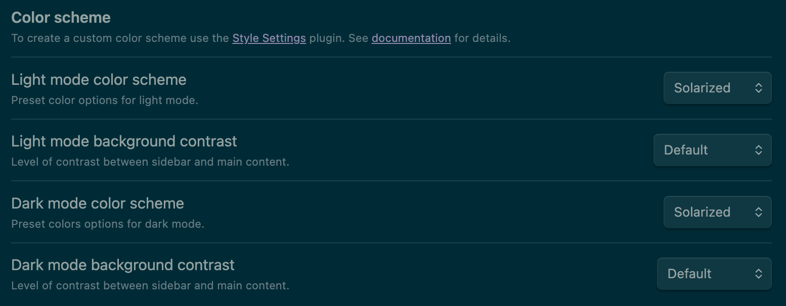
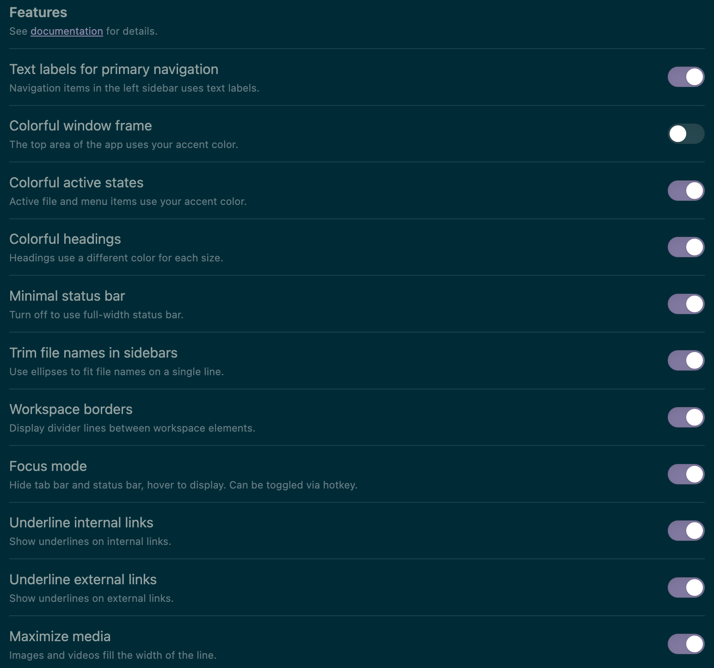

Though I use [Jekyll](https://jekyllrb.com), this should technically work with any blogging framework. This tutorial assumes that you are familiar with Jekyll, GitHub Pages, etc.

## Requirements
- [x] Public GitHub repository for your blog (e.g. [my blog's repository](https://github.com/lynkos/blog))
- [x] [Jekyll](https://jekyllrb.com)
- [x] [Obsidian](https://obsidian.md)
- [x] [Enveloppe plugin](https://enveloppe.ovh)  ([GitHub repository](https://github.com/Enveloppe/obsidian-enveloppe))
- [x] (**OPTIONAL**) Obsidian app ([iPhone](https://apps.apple.com/us/app/obsidian-connected-notes/id1557175442) **OR** [Android](https://play.google.com/store/apps/details?id=md.obsidian))
- [x] (**OPTIONAL**) [Giscus app](https://github.com/apps/giscus)

## Setup
### Obsidian Theme
I've always been a fan of dark mode color scheme, especially solarized dark. I also prefer to avoid cluttered UI, which is why I use the [**Minimal Theme Settings**](https://github.com/kepano/obsidian-minimal-settings) plugin.

1. Open **Settings** (<kbd>Command ⌘</kbd> + <kbd>,</kbd>) in **Obsidian**

2. Go to **Community plugins** tab
3. If it isn't already, turn off **Restricted mode** to enable community plugins

4. Click **Browse**, which is next to **Community plugins**

5. Enter `Minimal Theme Settings` in the searchbar

6. Click on [Minimal Theme Settings](obsidian://show-plugin?id=obsidian-minimal-settings), then click **Install**

7. Once it's installed, go to **Appearance** tab

8. Next to **Themes**, select **Minimal** to apply the theme

9. Go to **Minimal Theme Settings** tab

10. Modify the settings to your liking

> Here are mine, for reference
{: .prompt-tip }




### Obsidian Mobile App
I use [Obsidian's iPhone app](https://apps.apple.com/us/app/obsidian-connected-notes/id1557175442) with iCloud, which I'll walk through in this section, though Obsidian also offers Obsidian Sync as an alternative. If you don't have an Apple device, iCloud isn't applicable.

1. Once the Obsidian app is downloaded, check your iCloud Drive: There should be an `Obsidian` folder; if not, make one

2. Move all your vaults (i.e. directories) to `Obsidian` folder. E.g. my vault is named `Writing`, with path of `iCloud Drive/Obsidian/Writing/`{: .filepath} (which, in my case, points to `$HOME/Library/Mobile Documents/iCloud~md~obsidian/Documents/Writing/`{: .filepath})

### Setup Enveloppe
1. Launch **Obsidian**

2. Open **Settings** (<kbd>Command ⌘</kbd> + <kbd>,</kbd>)

3. Go to **Community plugins** tab

4. Turn off **Restricted mode** to enable community plugins

5. Click **Browse**, which is next to **Community plugins**

6. Enter `Enveloppe` in the searchbar

7. Click on [Enveloppe](obsidian://show-plugin?id=obsidian-mkdocs-publisher), then click **Install**

8. Once Enveloppe's installed, go to its settings (i.e. under **Community plugins** section in the settings sidebar, click **Enveloppe**)

9. Copy my Enveloppe settings

	```json
	{
	  "github": {
	    "branch": "main",
	    "automaticallyMergePR": true,
	    "dryRun": {
	      "enable": false,
	      "folderName": "enveloppe"
	    },
	    "api": {
	      "tiersForApi": "Github Free/Pro/Team (default)",
	      "hostname": ""
	    },
	    "workflow": {
	      "commitMessage": "[OBSIDIAN] Merge",
	      "name": ""
	    },
	    "verifiedRepo": true
	  },
	  "upload": {
	    "behavior": "fixed",
	    "defaultName": "_posts",
	    "rootFolder": "",
	    "yamlFolderKey": "",
	    "frontmatterTitle": {
	      "enable": true,
	      "key": "filename"
	    },
	    "replaceTitle": [
	      {
	        "regex": "/\\s+/",
	        "replacement": "-",
	        "type": "title"
	      }
	    ],
	    "replacePath": [],
	    "autoclean": {
	      "includeAttachments": true,
	      "enable": false,
	      "excluded": []
	    },
	    "folderNote": {
	      "enable": false,
	      "rename": "index.md",
	      "addTitle": {
	        "enable": false,
	        "key": "title"
	      }
	    },
	    "metadataExtractorPath": ""
	  },
	  "conversion": {
	    "hardbreak": false,
	    "dataview": true,
	    "censorText": [],
	    "tags": {
	      "inline": false,
	      "exclude": [],
	      "fields": []
	    },
	    "links": {
	      "internal": true,
	      "unshared": true,
	      "wiki": true,
	      "slugify": "strict",
	      "unlink": true,
	      "relativePath": true,
	      "textPrefix": "/"
	    }
	  },
	  "embed": {
	    "attachments": true,
	    "overrideAttachments": [],
	    "keySendFile": [],
	    "notes": false,
	    "folder": "assets/img/obsidian",
	    "convertEmbedToLinks": "keep",
	    "charConvert": "->",
	    "unHandledObsidianExt": [],
	    "sendSimpleLinks": true,
	    "forcePush": true,
	    "useObsidianFolder": false
	  },
	  "plugin": {
	    "shareKey": "share",
	    "excludedFolder": [
	      "templates"
	    ],
	    "copyLink": {
	      "enable": false,
	      "links": "",
	      "removePart": [],
	      "addCmd": false,
	      "transform": {
	        "toUri": true,
	        "slugify": "lower",
	        "applyRegex": []
	      }
	    },
	    "setFrontmatterKey": "Set"
	  }
	}
	```
	{: file="enveloppe.json" }

10. Click **Import settings** and paste the copied `enveloppe.json` (from the previous step) where it says `Paste configuration here...`, then click **Save**

11. Under **GitHub config**, enter your **GitHub username**, **Repository name**, and — if your main branch is not named `main` — **Main branch** name

12. Generate a fine-grained personal access token for your GitHub repository in order to give Enveloppe necessary permissions to work by going to your [GitHub settings](https://github.com/settings)

13. Scroll down and click [**Developer settings**](https://github.com/settings/apps)

14. Click **Personal access tokens**, click [**Fine-grained tokens**](https://github.com/settings/personal-access-tokens), then click [**Generate new token**](https://github.com/settings/personal-access-tokens/new)

15. Enter a descriptive **Token name** (e.g. `Enveloppe (Obsidian)`) and **Description** (e.g. `Enveloppe (Obsidian Vault → GitHub Repo)`)

16. Choose your GitHub account as **Resource owner**

17. Select **No expiration** for **Expiration**

18. Under **Repository access**, click **Only select repositories** then click **Select repositories** and select the GitHub repository for your Jekyll blog (e.g. `lynkos/blog`)

19. Click **Repository permissions** under **Permissions**

20. Always choose the minimal permissions necessary, so all options should be set to **Access: No access**, with the exception of the following:

	| **Permission** | **Access**      | **Reason**                                     |
	| :--------------- | :-------------- | :-------------------------------- |
	| Contents            | Read and write | Create branch                                |
	| Metadata           | Read-only         | Mandatory                                      |
	| Pull requests     | Read and write | Create and merge pull requests  |
	| Workflows         | Read and write | Create/update file                          |

21. Click <kbd>Generate token</kbd>

22. Copy the generated GitHub personal access token; it should start with `github_` followed by a long, random string of alphanumeric characters and underscores

23. Back in Enveloppe settings, paste it in the **GitHub token** area

### Setup Comments
1. If you haven't already, make your blog's [GitHub repository public](https://docs.github.com/en/github/administering-a-repository/managing-repository-settings/setting-repository-visibility#making-a-repository-public)

2. [Enable your repository's **Discussions** feature](https://docs.github.com/en/github/administering-a-repository/managing-repository-settings/enabling-or-disabling-github-discussions-for-a-repository)

3. Install the [Giscus app](https://github.com/apps/giscus) on GitHub

4. Go to [Giscus](https://giscus.app) and fill out the form

5. Copy the auto-generated `<script>` under **Enable giscus**
   
   Example code with my configuration:

	```html
	<script src="https://giscus.app/client.js"
		data-repo="<GITHUB_USERNAME>/<REPO>"
		data-repo-id="<REPO_ID>"
		data-category="Announcements"
		data-category-id="<CATEGORY_ID>"
		data-mapping="pathname"
		data-strict="0"
		data-reactions-enabled="1"
		data-emit-metadata="0"
		data-input-position="top"
		data-theme="preferred_color_scheme"
		data-lang="en"
		data-loading="lazy"
		crossorigin="anonymous"
		async>
	</script>
	```

6. Add the `<script>` tag
   * If you're **NOT** using `jekyll-theme-chirpy`,  to your website's template where you want the comments to appear (**Note: If an element with the `giscus` class exists, the comments will be placed there instead**)
   * If you **ARE** using the [Jekyll theme Chirpy](https://github.com/cotes2020/jekyll-theme-chirpy), continue to the next section

**_OPTIONAL: ADD COMMENTS FEATURE TO `jekyll-theme-chirpy`_**

7. Go to `_config.yml` in your repository

8. Find the `comments` section

9. Set `provider` to `giscus`

10. Fill in all options under `giscus` with the values from the `<script>` you copied in **Step #5**
    
    Example code with my configuration for `comments` section:

	```yml
	comments:
	  # Global switch for the post-comment system. Keeping it empty means disabled.
	  provider: giscus # [disqus | utterances | giscus]
	  # The provider options are as follows:
	  disqus:
	    shortname: # fill with the Disqus shortname. › https://help.disqus.com/en/articles/1717111-what-s-a-shortname
	  # utterances settings › https://utteranc.es/
	  utterances:
	    repo: # <gh-username>/<repo>
	    issue_term: # < url | pathname | title | ...>
	  # Giscus options › https://giscus.app
	  giscus:
	    repo: <GITHUB_USERNAME>/<REPO>
	    repo_id: <REPO_ID>
	    category: "Announcements"
	    category_id: <CATEGORY_ID>
	    mapping: "pathname" # optional, default to 'pathname'
	    strict: 0 # optional, default to '0'
	    input_position: "top" # optional, default to 'bottom'
	    lang: en # optional, default to the value of `site.lang`
	    loading: lazy # comments loading will be deferred till user scrolls near comments container
	    reactions_enabled: 1 # optional, default to the value of `1`
	    theme: preferred_color_scheme # comments theme
	```
	{: file="_config.yml" }

### Setup Image Proxy
A custom [Cloudflare Worker](https://workers.cloudflare.com) hotlinks images from sites that may restrict it; this way I can embed images from Twitter/X. Custom Ruby plugin [`_plugins/gallery.rb`](https://github.com/lynkos/blog/blob/main/_plugins/gallery.rb) automatically prepends Twitter/X URLs within a gallery with the value of [`worker_base_url`](https://github.com/lynkos/blog/blob/main/_plugins/gallery.rb#L33). Additional sites will be added as needed. This proxy currently only supports Twitter/X.

1. Sign up and/or login to [Cloudflare](https://cloudflare.com)

2. Go to [your dashboard](https://dash.cloudflare.com)

3. In the left pane, click **Compute (Workers)**, then **Workers & Pages**

4. Click the blue <kbd>Create application</kbd> button in the upper-right corner

5. In the **Workers** tab, click the blue <kbd>Get Started</kbd> button to the right of **Start with Hello World!**

6. Name the worker `img-proxy`

7. Click <kbd>Deploy</kbd>

8. You should be redirected to a page that says **Success! Your project is deployed to Region: ...**

9. Click the <kbd>Edit Code</kbd> button; you can also access this page later by going to **Compute (Workers)** > **Workers & Pages**, clicking the worker (i.e. `img-proxy`), then clicking the small icon **</>** in the upper-right corner

10. This should open the Cloudflare Workers IDE; replace the default code in `worker.js` with the following code:
    
    ```js
    export default {
      /**
       * @param {{ url: string | URL; }} request
       */
      async fetch(request) {
        const url = new URL(request.url);
        const target = url.searchParams.get("url"); // i.e. ?url=https://pbs.twimg.com/media/...

        if (!target) {
          return new Response("Missing ?url= param", { status: 400 });
        }

        try {
          const resp = await fetch(target, {
            headers: { "User-Agent": "Mozilla/5.0" }
          });

          const headers = new Headers(resp.headers);
          headers.set("Access-Control-Allow-Origin", "*");

          return new Response(await resp.arrayBuffer(), {
            status: resp.status,
            headers
          });
        } catch (err) {
          return new Response("Fetch error: " + err.message, { status: 502 });
        }
      }
    };
    ```
    {: file="worker.js" }

	> Test the worker in the **Preview** pane by adding `?url=` and the link to an image on Twitter (e.g. `https://pbs.twimg.com/media/GzPhoaKWoAA16uA?format=jpg&name=medium`) following AFTER your worker's URL (i.e. `https://img-proxy.<YOUR_DOMAIN_NAME>.workers.dev/`) in the input field
	> 
	> So, in this example, the full URL is: `https://img-proxy.<YOUR_DOMAIN_NAME>.workers.dev/?url=https://pbs.twimg.com/media/GzPhoaKWoAA16uA?format=jpg&name=medium`
	>
	> Click the <kbd>Reload</kbd> button (circular arrow icon) to the right of the input field to test it; if successful, you should see the image in the **Preview** pane
	{: .prompt-tip }

11. Click <kbd>Deploy</kbd> in the upper-right corner

12. You can now use this worker as an image proxy by using the following URL format, where `<YOUR_DOMAIN_NAME>` is your Cloudflare domain (e.g. `example.com`) and `<IMAGE_URL>` is the full URL of the image you want to hotlink (e.g. `https://pbs.twimg.com/media/GzPhoaKWoAA16uA?format=jpg&name=medium`):
    
    ```html
    https://img-proxy.<YOUR_DOMAIN_NAME>.workers.dev/?url=<IMAGE_URL>
    ```
    {: .nolineno }

**_OPTIONAL: USE CUSTOM DOMAIN (e.g. `img-proxy.<YOUR_ROOT_DOMAIN>`)_**

13.   In the left pane, click **DNS**, then **Records**

14.   Click the blue <kbd>+ Add record</kbd> button, then add a new record with the following details:
      * **Type**: `CNAME`
      * **Name**: `img-proxy` (or whatever subdomain you want to use)
      * **IPv4 address**: `workers.dev`
      * **Proxy status**: `Proxied` aka Enabled (orange cloud icon)
      * **TTL**: `Auto`
      * **Comment**: `Map img-proxy worker (at img-proxy.<YOUR_DOMAIN_NAME>.workers.dev) to img-proxy.<YOUR_ROOT_DOMAIN>`

15.  Click <kbd>Save</kbd>

16.  Click **Workers Routes** in the left pane, then click the blue <kbd>Add route</kbd> button in the **HTTP Routes** section

17.  In the **Route** field, enter `img-proxy.<YOUR_ROOT_DOMAIN>/*`

18.  Under **Worker**, select `img-proxy` worker (or whatever you named it) from the dropdown

19.  Click <kbd>Save</kbd>

20.  You can now use the custom domain for your image proxy at `https://img-proxy.<YOUR_ROOT_DOMAIN>/?url=<IMAGE_URL>` (e.g. `https://img-proxy.example.com/?url=https://pbs.twimg.com/media/GzPhoaKWoAA16uA?format=jpg&name=medium`)

### Create Hotkeys
1. Launch **Obsidian**

2. Save the template in [Default Template](2025-03-31-blogging-setup.md#default-template) to your vault (e.g. `templates/default.txt`{: .filepath})

3. Open **Settings** (<kbd>Command ⌘</kbd> + <kbd>,</kbd>)

4. Go to **Hotkeys** tab

5. Scroll to **Templates: Insert template**

6. Click the **+** icon (says **Customize this command** when you hover over it)

7. Press <kbd>Command ⌘</kbd> + <kbd>Shift ⇧</kbd> + <kbd>T</kbd>, or your preferred hotkey

8. Scroll to **Enveloppe: Upload single current active note**

9. Click the **+** icon (says **Customize this command** when you hover over it)

10. Press <kbd>Command ⌘</kbd> + <kbd>Shift ⇧</kbd> + <kbd>P</kbd>, or your preferred hotkey

Now we can automatically apply the template to any new post and auto-publish your Obsidian post to your blog with those hotkeys!

> Make sure `share: true` is in the frontmatter, otherwise it won't post
{: .prompt-important }

## Writing Posts
### Default Template
You'll need to add the following to the top of every Markdown post you make

```plaintext
---
share: false
title: {{title}}
date: {{date}} {{time}}
filename: "{{date}}-{{title}}"
description:
math: false
pin: false
toc: true
comments: true
categories:
tags:
image:
  path:
  lqip:
  alt:
---
```
{: file="templates/default.txt" }

|    **Key**    | **Description**                                                                                 |
| :------------ | :---------------------------------------------------------------------------------------------- |
| `share`       | When `true`, it will push to Github                                                             |
| `title`       | Post title                                                                                      |
| `date`        | Date and time created; format `yyyy-mm-dd hh:mm:ss utc_offset`                                  |
| `filename`    | Where your file will be saved in Github; format `yyyy-mm-dd-title-here`                         |
| `description` | Optional post description; will appear below post title and in previews                         |
| `math`        | When `true`, enables MathJax for LaTeX processing                                               |
| `pin`         | When `true`, it will pin this post on website                                                   |
| `toc`         | When `false`, the table of contents is hidden                                                   |
| `comments`    | When `false`, the comments section is hidden                                                    |
| `categories`  | Optional list of categories; 1st element is main category, remaining elements are subcategories |
| `tags`        | Optional list of tags                                                                           |
| `path`        | Optional path to preview image                                                                  |
| `lqip`        | Optional preview image's base64-encoded LQIP                                                    |
| `alt`         | Optional caption and alt text for preview image (can be left blank)                             |

### Add Preview Image
To add a preview image to a post, make sure the following is in your Markdown file's front matter

```yaml
image:
  path: /path/to/image.png
  lqip: base64-encoded-lqip
  alt: Optional image caption and alt text
```
{: .nolineno }

To generate a base64-encoded LQIP for the `lqip` field:
1. Visit [lqip generator](https://chrisleverseo.com/tools/lqip-generator-tool)

2. Upload your preview image

3. Customize the options as needed; here are my recommendations:
	* **Placeholder Size**: `Small`
	* **Quality**: `60`
	* **Blur Amount**: `5px`

4. Click <kbd>Generate LQIP</kbd>

5. Right-click the generated image that appears under **LQIP (Scaled & Blurred)**

6. Depending on your browser, copy the image link directly (i.e. click <kbd>Copy Image Link</kbd>) **OR** open the image in a new tab (i.e. <kbd>Open Image in New Tab</kbd>) and copy the URL in the address bar
   
	> Image link **MUST** be a base64 string that starts with `data:content/type;base64`
	{: .prompt-important }

6. Paste the base64 string (aka image link) in the `lqip` field of the front matter (i.e. use it to replace `base64-encoded-lqip`)

	> To verify that the base64 string works, visit [Base64 Image Viewer](https://jaredwinick.github.io/base64-image-viewer) and paste the base64 string in the input field below **Base64 Image String**
	{: .prompt-tip }

## Appendix
### Sync Fork with Upstream
To keep fork up-to-date with original repository (i.e. Chirpy)

1. Link the upstream (i.e. original) repository to fork

	```sh
	git remote add upstream https://github.com/cotes2020/jekyll-theme-chirpy.git
	```
	{: .nolineno }

	> Use this command if you've already linked the upstream repository and want to re-link it
	> ```sh
	> git remote set-url upstream https://github.com/cotes2020/jekyll-theme-chirpy.git
	> ```
	> {: .nolineno }
	{: .prompt-tip }

2. Confirm the remote URL with either command
	* Command #1
	  ```sh
	  git remote show
	  ```
	  {: .nolineno }
	
	* Example Output #1
	  ```plaintext
	  origin
	  upstream
	  ```
	
	* Command #2
	  ```sh
	  git remote -v
	  ```
	  {: .nolineno }
	
	* Example Output #2
	  ```plaintext
	  origin  https://github.com/lynkos/blog.git (fetch)
	  origin  https://github.com/lynkos/blog.git (push)
	  upstream        https://github.com/cotes2020/jekyll-theme-chirpy.git (fetch)
	  upstream        https://github.com/cotes2020/jekyll-theme-chirpy.git (push)
	  ```

3. Fetch latest changes from upstream repository

	```sh
	git fetch upstream master
	```
	{: .nolineno }

4. Switch to `master` branch (so it's recognized)

	```sh
	git checkout master
	```
	{: .nolineno }

5. Switch to the branch you want to sync

	```sh
	git checkout main
	```
	{: .nolineno }

6. Merge changes from upstream into local branch

	```sh
	git merge upstream/main
	```
	{: .nolineno }

7. Push changes to your fork

	```sh
	git push origin main
	```
	{: .nolineno }

### Contribute Upstream
Continue reading if you want to create a pull request in [`jekyll-theme-chirpy`](https://github.com/cotes2020/jekyll-theme-chirpy) with only a subset of your commits. This is useful if you want to add a feature to upstream without committing all your changes.

1. If you haven't already, complete the steps in [Sync Fork with Upstream](2025-03-31-blogging-setup.md#sync-fork-with-upstream) section

2. Create a new branch, e.g. `BRANCH_NAME`

	```sh
	git checkout -b BRANCH_NAME upstream/master
	```
	{: .nolineno }

3. Cherry pick the commit(s) you want to include in the PR

	```sh
	git cherry-pick COMMIT_HASH
	```
	{: .nolineno }

4. Push your branch

	```sh
	git push origin BRANCH_NAME
	```
	{: .nolineno }

5. If successful, the terminal should output something similar to this:

   ```plaintext
   Enumerating objects: 111, done.
   Counting objects: 100% (83/83), done.
   Delta compression using up to 16 threads
   Compressing objects: 100% (50/50), done.
   Writing objects: 100% (51/51), 8.50 KiB | 1.70 MiB/s, done.
   Total 51 (delta 36), reused 0 (delta 0), pack-reused 0 (from 0)
   remote: Resolving deltas: 100% (36/36), completed with 26 local objects.
   remote: 
   remote: Create a pull request for 'BRANCH_NAME' on GitHub by visiting:
   remote:      https://github.com/GITHUB_USERNAME/REPOSITORY_NAME/pull/new/BRANCH_NAME
   remote: 
   To https://github.com/GITHUB_USERNAME/REPOSITORY_NAME.git
    * [new branch]      BRANCH_NAME -> BRANCH_NAME
   ```

6. Go to the originally forked repository, i.e. [`jekyll-theme-chirpy`](https://github.com/cotes2020/jekyll-theme-chirpy)

7. Click the <kbd>New pull request</kbd> button

8. Complete the pull request template accordingly

9. Click the <kbd>Create pull request</kbd> button

## Credits
* This tutorial is inspired by [Alex Oliveira](https://alexoliveira.cc)'s blog post [Jekyll Blogging with Obsidian](https://alexoliveira.cc/guide/jekyll-with-obsidian)
* Preview image taken from [`@socra`](https://velog.io/@socra/Obsidian%EC%9C%BC%EB%A1%9C-%EC%A7%80%ED%82%AC-%EB%B8%94%EB%A1%9C%EA%B7%B8-%EA%B4%80%EB%A6%AC%ED%95%98%EA%B8%B0)
* Full credit for [`jekyll-theme-chirpy`](https://github.com/cotes2020/jekyll-theme-chirpy) goes to [`cotes2020`](https://github.com/cotes2020) (aka [Cotes Chung](https://cotes.page)); for more information:
	* [Wiki docs](https://github.com/cotes2020/jekyll-theme-chirpy/wiki)
	* [Original license](https://github.com/cotes2020/jekyll-theme-chirpy/blob/master/LICENSE)