> **This article/tutorial is still under construction. Feel free to bookmark this post to come back later, as there may be new information by then!**
{: .prompt-info }

# Introduction
We'll be going over 3 separate options:
- MLC LLM
- llama.cpp
- MLX
Along with the pros and cons of each

# Shared Requirements
## Conda
Install conda

1. Update conda

```sh
conda update --yes -n base -c defaults conda
```

2. Install `conda-libmamba-solver`

```sh
conda install --yes -n base conda-libmamba-solver
```

3. Set as default solver

```sh
conda config --set solver libmamba
```

4. Confirm it's the default

```sh
conda config --show-sources
```

Output should look similar to (or include)

```plaintext
==> /Users/lynkos/.condarc <==
solver: libmamba
```

> `conda-libmamba-solver` is much faster than classic for [many reasons](https://conda.github.io/conda-libmamba-solver/user-guide/libmamba-vs-classic/), but there are certain tricks you can use to make it even faster!
> - **Explicit is better**. Instead of letting the solver do all the work, specify target versions for your packages. `conda install python=3.11 numpy` is way better than `conda install python numpy`.
> - Use `--strict-channel-priority`. Strict channel priority drastically reduces the solver search space when you are mixing channels. Make this decision permanent with `conda config --set channel_priority strict`.
> - Use `--update-specs`. For existing environments, do not attempt to freeze installed packages by default.
> - Experimental: `CONDA_LIBMAMBA_SOLVER_MAX_ATTEMPTS=0`. Setting this environment variable will disable the retry loop, making it behave more like `micromamba`.
{: .prompt-tip }

## Homebrew Packages
Install necessary packages: Ninja, git, git LFS, Hugging Face CLI

```sh
brew install ninja git git-lfs huggingface-cli
```

## Ccache
Optional C/C++ compiler cache; ideal for repeated builds

## Directory Structure
Create directory for LLMs in your home directory

```sh
mkdir -p $HOME/.llm
```

# llama.cpp
## Background

## Requirements

## Build and Install
1. Create Conda environment

```sh
conda create -n llama-env -c conda-forge cmake python=3.10
```

2. Activate build environment

```sh
conda activate llama-env
```

3. Create directory structure

```sh
mkdir -p $HOME/.llm/llama/{build,install}
```

4. Enter your newly created `llama` directory

```sh
cd $HOME/.llm/llama
```

5. Clone and enter `llama.cpp` repo

```sh
git clone https://github.com/ggml-org/llama.cpp && cd llama.cpp
```

6. Configure build system with `CMake`

```sh
cmake -B ../build -G Ninja \
-DCMAKE_BUILD_TYPE=Release \
-DCMAKE_INSTALL_PREFIX=$HOME/.llm/llama/install \
-DCMAKE_PREFIX_PATH=$HOME/.llm/llama/install \
-DCMAKE_INTERPROCEDURAL_OPTIMIZATION=TRUE \
-DCMAKE_C_COMPILER=clang \
-DCMAKE_CXX_COMPILER=clang++ \
-DCMAKE_C_FLAGS="-O3 -mcpu=native -fomit-frame-pointer -fvectorize -fslp-vectorize -ftree-vectorize -ffp-contract=fast -funroll-loops -fno-stack-protector -dead_strip" \
-DCMAKE_CXX_FLAGS="-O3 -mcpu=native -fomit-frame-pointer -fvectorize -fslp-vectorize -ftree-vectorize -ffp-contract=fast -funroll-loops -fno-stack-protector -dead_strip" \
-DCMAKE_LIBRARY_PATH="/usr/lib:/usr/local/lib:/Library/Developer/CommandLineTools/usr/lib:/System/Library/Frameworks/Accelerate.framework:/System/Library/Frameworks/Metal.framework" \
-DCMAKE_EXE_LINKER_FLAGS="-Wl,-S,-framework Accelerate,-framework Metal,-framework Foundation,-framework MetalKit" \
-DCMAKE_OSX_SYSROOT=$(xcrun --sdk macosx --show-sdk-path) \
-DCMAKE_OSX_ARCHITECTURES=arm64 \
-DCMAKE_POLICY_DEFAULT_CMP0077=NEW \
-DHIDE_PRIVATE_SYMBOLS=ON \
-DBUILD_SHARED_LIBS=ON \
-DBUILD_TESTING=OFF \
-DUSE_METAL=ON \
-DUSE_MPS=OFF \
-DUSE_GTEST=OFF \
-DUSE_LIBBACKTRACE=OFF \
-DGGML_INCLUDE_INSTALL_DIR=$HOME/.llm/llama/install/include \
-DGGML_CUDA_GRAPHS=OFF \
-DGGML_CUDA_FA=OFF \
-DGGML_METAL=ON \
-DGGML_METAL_EMBED_LIBRARY=ON \
-DGGML_METAL_USE_BF16=ON \
-DGGML_METAL_NDEBUG=ON \
-DLLAMA_ALL_WARNINGS=OFF \
-DLLAMA_BUILD_EXAMPLES=OFF \
-DLLAMA_BUILD_TESTS=OFF \
-DLLAMA_BUILD_SERVER=OFF \
-DLLAMA_INCLUDE_INSTALL_DIR=$HOME/.llm/llama/install/include \
-DLLAMA_LIB_INSTALL_DIR=$HOME/.llm/llama/install/lib \
-DLLAMA_BIN_INSTALL_DIR=$HOME/.llm/llama/install/bin \
-DLLAMA_CURL=ON \
-DLLAMA_METAL=ON \
-DLLAMA_METAL_EMBED_LIBRARY=ON \
-DLLAMA_NATIVE=ON \
-DLLAMA_ACCELERATE=ON \
-DLLAMA_BLAS=ON \
-DLLAMA_BLAS_VENDOR=Apple \
-DLLAMA_AVX=OFF \
-DLLAMA_AVX2=OFF \
-DLLAMA_AVX512=OFF \
-DLLAMA_F16C=OFF \
-DLLAMA_FMA=OFF \
-DLLAMA_LLAMAFILE=OFF
```

> List valid compiler flags
> ```sh
> clang -mcpu=help
> ```
> 
> List valid CMake flags with `ccmake`
> ```sh
> ccmake .
> ```
>
> List valid CMake flags with `cmake`
> ```sh
> cmake -L
> ```
{: .prompt-tip }

> If you're compiling **heavily vectorized code**, you might want to explore `-fvectorize` or `-fassociative-math` for `DCMAKE_C_FLAGS` and `DCMAKE_CXX_FLAGS`
{: .prompt-tip }
  
7. Build and compile `llama.cpp` with `CMake`

```sh
cmake --build ../build --config Release -j $(sysctl -n hw.logicalcpu)
```

8. Install

```sh
cmake --install ../build
```

## Usage

# MLX
## Background
## Requirements
## Initial Setup
## Build and Install
## Usage

# MLC LLM
## Background
<figure>
	<picture>
		<source srcset="https://llm.mlc.ai/docs/_images/project-workflow.svg">
		
	</picture>
	<figcaption style="text-align: center">MLC LLM Workflow</figcaption>
</figure>

## Requirements
- MacBook Pro Apple Silicon M-series
- Conda
- Homebrew
- Hugging Face Account
- [Rust and Cargo](https://www.rust-lang.org/tools/install) (required by Hugging Face’s tokenizer)

## Initial Setup
### Directory Structure
Create directories for TVM Unity (used by MLC LLM), MLC LLM, and LLVM (used by TVM Unity compiler) in your `.llm` directory

```sh
mkdir -p $HOME/.llm/{tvm-unity,mlc-llm,llvm-tvm}
```

Your directory structure should look similar to this

```plaintext
$HOME/
├── .llm/
│   ├── tvm-unity/
│   ├── mlc-llm/
│   └── llvm-tvm/
└── ...
```

### Rust and Cargo
1. Download `rustup` and install Rust

```sh
curl --proto '=https' --tlsv1.2 -sSf https://sh.rustup.rs | sh
```

2. Once you are prompted to specify your installation method, select `2) Customize installation` by entering `2` in the CLI

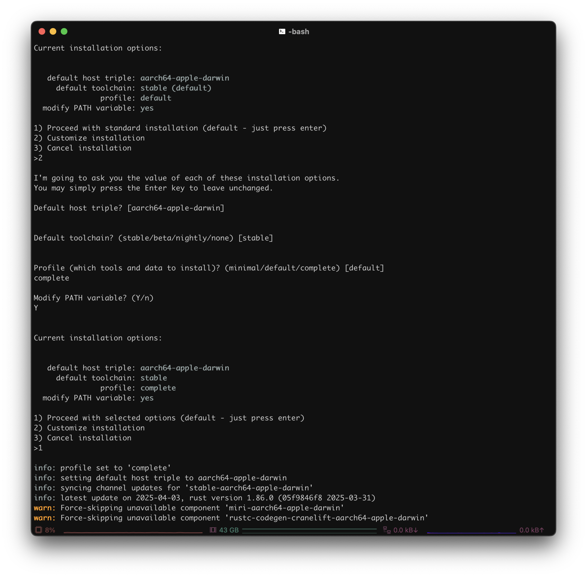

```plaintext
1) Proceed with standard installation (default - just press enter)
2) Customize installation
3) Cancel installation
```

3. Choose the following installation options:
	- **Default host triple?**: Press <kbd>Enter</kbd> (i.e. default)
	- **Default toolchain?**: Press <kbd>Enter</kbd> (i.e. default)
	- **Profile (which tools and data to install)?**: `complete`
	- **Modify PATH variable? (Y/n)**: `Y`

```plaintext
I'm going to ask you the value of each of these installation options.
You may simply press the Enter key to leave unchanged.

Default host triple? [aarch64-apple-darwin]


Default toolchain? (stable/beta/nightly/none) [stable]


Profile (which tools and data to install)? (minimal/default/complete) [default]
complete

Modify PATH variable? (Y/n)
Y
```

4. Once you see something similar to this, enter `1` to proceed with the customized installation options

```plaintext
Current installation options:
   default host triple: aarch64-apple-darwin
     default toolchain: stable
               profile: complete
  modify PATH variable: yes

1) Proceed with selected options (default - just press enter)
2) Customize installation
3) Cancel installation
```

5. After it's installed, configure your shell (i.e. `.bashrc`, `.zsh`, `.profile`, `.bash_profile`, etc.) to reload your `PATH` environment variable to include
Cargo's bin directory (`$HOME/.cargo/bin`)

```sh
. "$HOME/.cargo/env"
```

## Build and Install
### LLVM
1. Create Conda environment with build dependencies

```sh
conda create -n tvm-build-venv -c conda-forge "cmake>=3.24" git python=3.11 cython
```

2. Activate build environment

```sh
conda activate tvm-build-venv
```

3. Enter `llvm-tvm`

```sh
cd $HOME/.llm/llvm-tvm
```

4. Shallowly (saves storage and speed) clone latest stable release (currently `v20.1.3`) from LLVM

> LLVM version must be at least 15 (i.e. `LLVM >= 15`) in order to work with [TVM Unity](https://llm.mlc.ai/docs/install/tvm.html) compiler
{: .prompt-info }

```sh
git clone --depth 1 --branch llvmorg-20.1.3 https://github.com/llvm/llvm-project.git
```

5. Create `build` and `install` directories for later use

```sh
mkdir build install
```

6. Enter new LLVM directory

```sh
cd llvm-project
```

7. Filter user branches from git fetch/pull

```sh
git config --add remote.origin.fetch '^refs/heads/users/*'
git config --add remote.origin.fetch '^refs/heads/revert-*'
```

8. Export `$PATH` and `$SDKROOT`

```sh
export PATH=$HOME/.llm/llvm-tvm/install/bin:$PATH
export SDKROOT=$(xcrun --sdk macosx --show-sdk-path)
```

> Optional: Add environment variables to your `.bashrc` (or other shell startup file)
> ```sh
> echo -e 'export PATH=$HOME/.llm/llvm-tvm/install/bin:$PATH\nexport SDKROOT=$(xcrun --sdk macosx --show-sdk-path)' >> $HOME/.bashrc
> ```
{: .prompt-tip }

9. Configure and build LLVM, Clang, and LLD (i.e. LLVM linker)

```sh
cmake -S llvm -B ../build -G Ninja \
-DCMAKE_BUILD_TYPE=Release \
-DCMAKE_INSTALL_PREFIX=$HOME/.llm/llvm-tvm/install \
-DCMAKE_OSX_SYSROOT=$SDKROOT \
-DCMAKE_C_COMPILER=$HOME/.llm/llvm-tvm/install/bin/clang \
-DCMAKE_CXX_COMPILER=$HOME/.llm/llvm-tvm/install/bin/clang++ \
-DCMAKE_CXX_FLAGS="-O3 -march=native -mtune=native -fno-stack-protector" \
-DCMAKE_C_FLAGS="-O3 -march=native -mtune=native -fno-stack-protector" \
-DCMAKE_LIBRARY_PATH="/usr/lib:/usr/local/lib:/Library/Developer/CommandLineTools/usr/lib" \
-DCMAKE_OSX_ARCHITECTURES=arm64 \
-DLLVM_ENABLE_FFI=ON \
-DLLVM_ENABLE_LTO=Thin \
-DLLVM_USE_LINKER=lld \
-DLLVM_ENABLE_PROJECTS="clang;lld;llvm" \
-DLLVM_ENABLE_RTTI=ON \
-DLLVM_TARGET_ARCH=arm64 \
-DLLVM_TARGETS_TO_BUILD="AArch64;host" \
-DLLVM_ENABLE_ASSERTIONS=OFF \
-DLLVM_ENABLE_BACKTRACES=OFF \
-DLLVM_PARALLEL_COMPILE_JOBS=$(sysctl -n hw.logicalcpu) \
-DLLVM_PARALLEL_LINK_JOBS=$(($(sysctl -n hw.logicalcpu) / 2)) \
-DLLVM_PARALLEL_TABLEGEN_JOBS=$(($(sysctl -n hw.logicalcpu) / 2)) \
-DLLVM_INCLUDE_TESTS=OFF \
-DLLVM_INCLUDE_DOCS=OFF \
-DLLVM_INCLUDE_EXAMPLES=OFF \
-DLLVM_OPTIMIZED_TABLEGEN=ON
```

> List valid compiler flags
> ```sh
> clang -mcpu=help
> ```
> 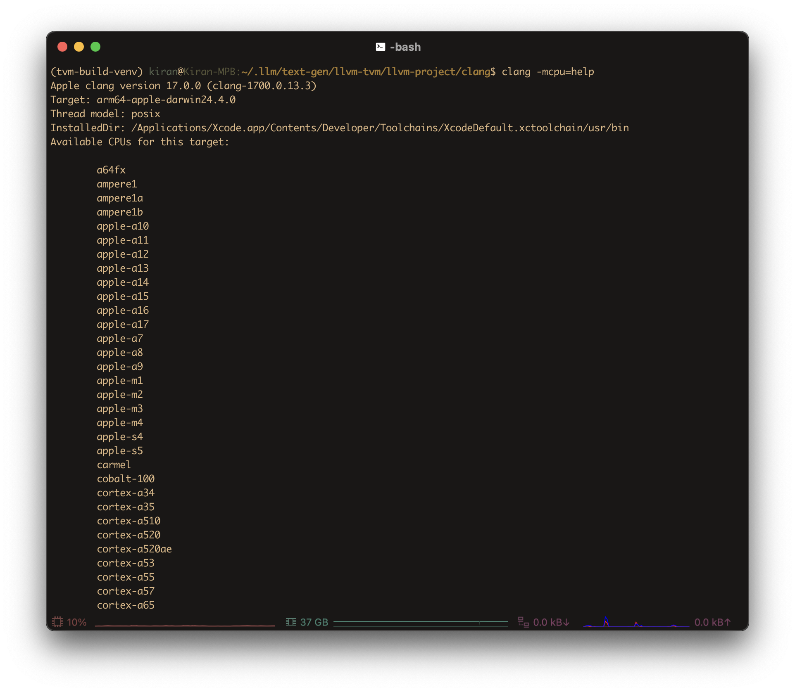
> 
> List valid CMake flags with `ccmake`
> ```sh
> ccmake .
> ```
> 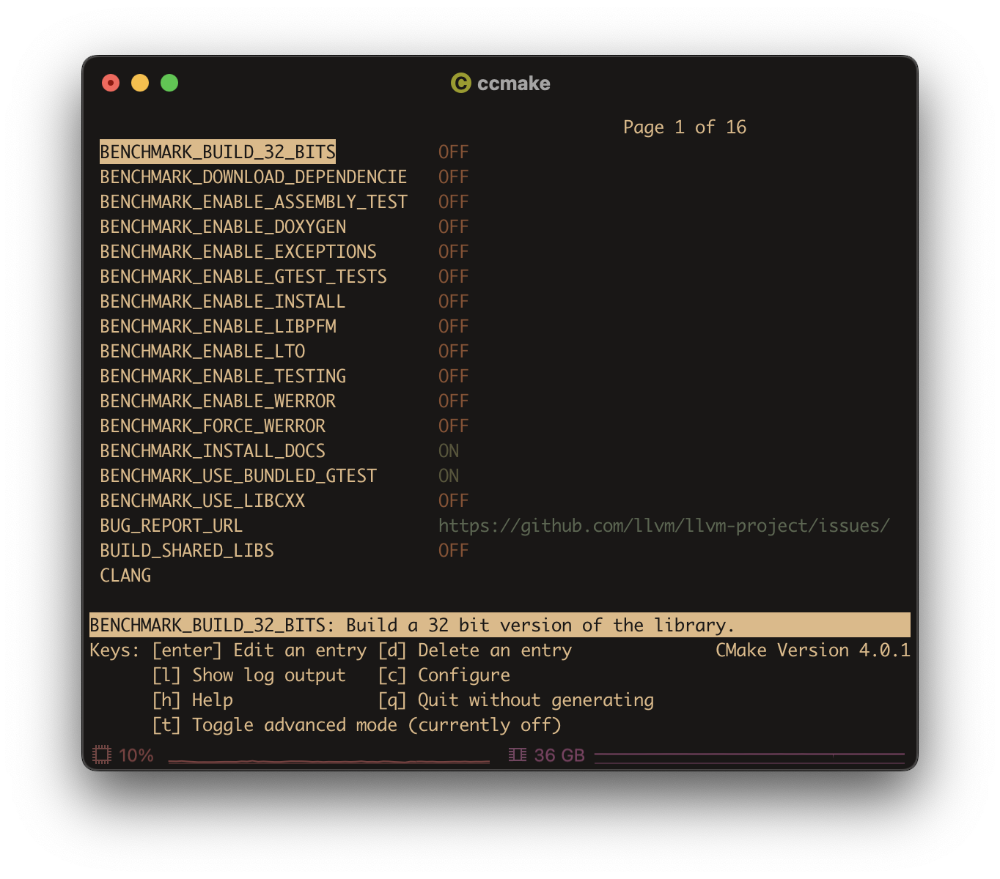
>
> List valid CMake flags with `cmake`
> ```sh
> cmake -L
> ```
> 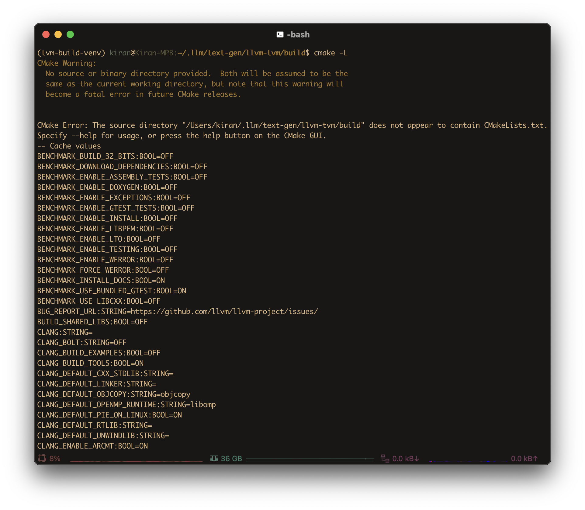
{: .prompt-tip }

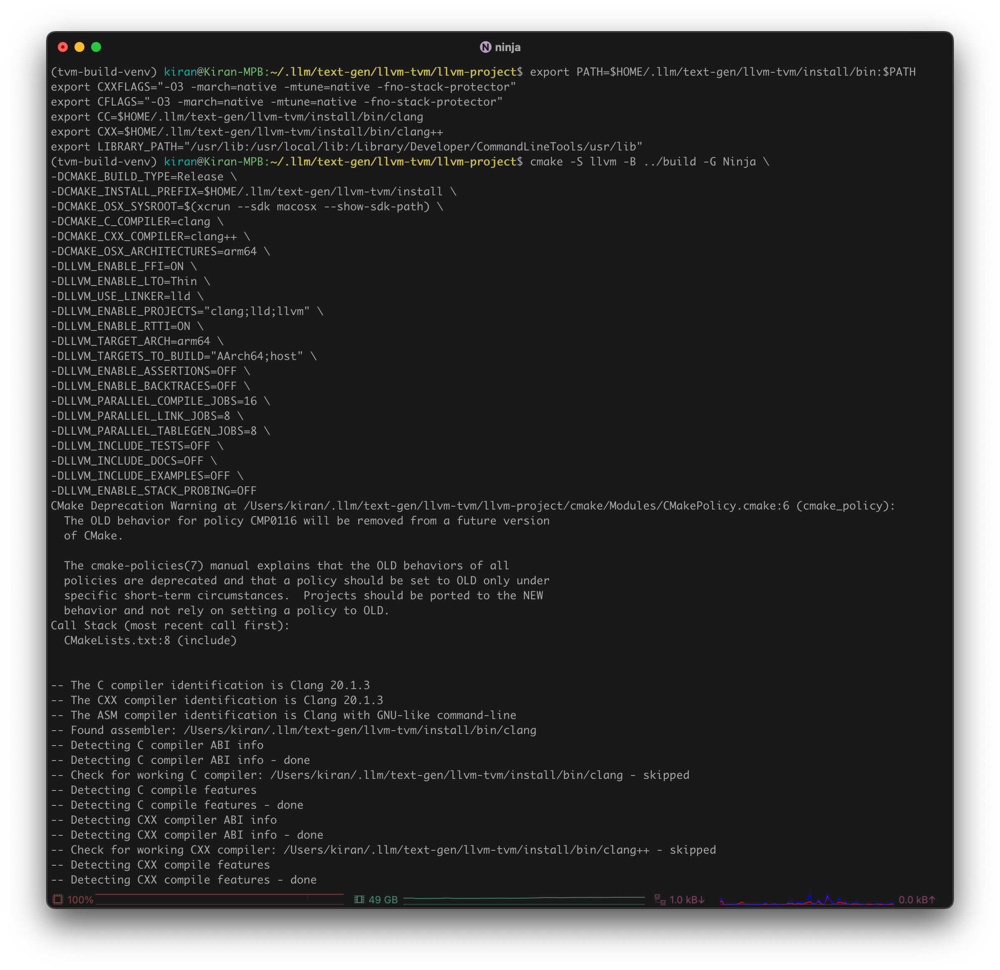

10. Go to `build`

```sh
cd ../build
```

11. Run `ninja`

```sh
ninja
```

> Use `-v` flag to see which command is running:
> ```sh
> ninja -v
> ```
> Specify `ninja` as your default generator:
> ```sh
> export CMAKE_GENERATOR=Ninja
> ```
{: .prompt-tip }

> The last part of a `ninja` build might feel slowest and/or longest, though this is due to:
> - **Front-loading parallel work**: Ninja is extremely parallel — early on, it schedules as many jobs as possible. If you have 16 jobs running (like in your setup), it chews through the easy/independent stuff fast.
> - **Dependency chains bottleneck**: Near the end, many remaining files depend on the completion of earlier ones. So ninja can’t start them in parallel — it must wait. You end up with fewer and fewer jobs running, sometimes just one.
> - **Final linking is heavy**: The very last steps — especially linking large binaries like `clang` or `lld` — take a ton of CPU and memory, and they can’t be parallelized much. This slows things down dramatically.
> - **Perceived slowness**: Early on, ninja might do 500 steps in 30 seconds. Near the end, it might do just 10 steps in 30 seconds. So it feels slower, even though it’s just hitting the heavy stuff.
{: .prompt-info }

12. Install via `ninja`

```sh
ninja install
```

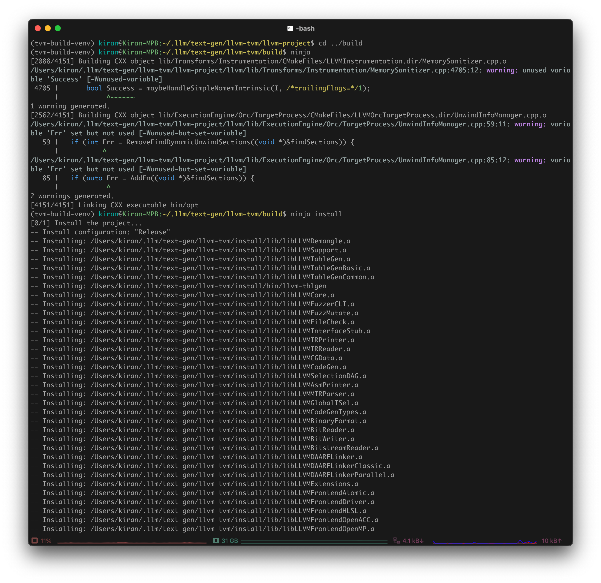

#### Validate LLVM Installation
Confirm that LLVM was compiled with support for Arm(R)-based targets

```sh
$HOME/.llm/llvm-tvm/install/bin/llvm-config --version
$HOME/.llm/llvm-tvm/install/bin/llvm-config --targets-built
$HOME/.llm/llvm-tvm/install/bin/llvm-config --host-target
```

Should output something similar to:

```plaintext
20.1.3
AArch64
arm64-apple-darwin24.4.0
```

### TVM Unity Compiler
> Make sure `tvm-build-venv` Conda environment is activated:
> ```sh
> conda activate tvm-build-venv
> ```
{: .prompt-info }

1. Enter `tvm-unity`

```sh
cd $HOME/.llm/tvm-unity
```

2. Clone TVM Unity from GitHub

```sh
git clone --recursive https://github.com/mlc-ai/relax.git tvm-unity
```

3. Create `build` and `install` directories for later use

```sh
mkdir build install
```

4. Enter `build`

```sh
cd build
```

5. Ensure TVM uses custom LLVM (so it uses the right one when you `import tvm` in Python)

```sh
export LLVM_HOME=$HOME/.llm/llvm-tvm
export LLVM_CONFIG=$LLVM_HOME/install/bin/llvm-config

export TVM_HOME=$HOME/.llm/tvm-unity
export TVM_LIBRARY_PATH=$TVM_HOME/build
export DYLD_LIBRARY_PATH=$TVM_LIBRARY_PATH:$DYLD_LIBRARY_PATH
export TVM_LLVM_VERSION=$(LLVM_CONFIG=$LLVM_CONFIG $LLVM_CONFIG --version | cut -d. -f1)
```

> Optional: Add environment variables to your `.bashrc` (or other shell startup file)
> ```sh
> echo -e 'export LLVM_HOME=$HOME/.llm/llvm-tvm\nexport LLVM_CONFIG=$LLVM_HOME/install/bin/llvm-config\nexport TVM_HOME=$HOME/.llm/tvm-unity\nexport TVM_LIBRARY_PATH=$TVM_HOME/build\nexport DYLD_LIBRARY_PATH=$TVM_LIBRARY_PATH:$DYLD_LIBRARY_PATH\nexport TVM_LLVM_VERSION=$(LLVM_CONFIG=$LLVM_CONFIG $LLVM_CONFIG --version | cut -d. -f1)' >> $HOME/.bashrc
> ```
{: .prompt-tip }

6. Configure build
  
```sh
cmake ../tvm-unity -G Ninja \
  -DCMAKE_BUILD_TYPE=Release \
  -DCMAKE_INSTALL_PREFIX=$TVM_HOME/install \
  -DCMAKE_OSX_SYSROOT=$SDKROOT \
  -DUSE_LLVM="$LLVM_CONFIG --ignore-libllvm --link-static" \
  -DCMAKE_OSX_ARCHITECTURES=arm64 \
  -DCMAKE_PREFIX_PATH=$LLVM_HOME/install \
  -DBUILD_STATIC_RUNTIME=ON \
  -DHIDE_PRIVATE_SYMBOLS=ON \
  -DUSE_METAL=ON \
  -DUSE_MPS=OFF \
  -DUSE_GTEST=OFF \
  -DUSE_LIBBACKTRACE=OFF \
  -DCMAKE_INTERPROCEDURAL_OPTIMIZATION=TRUE \
  -DCMAKE_C_COMPILER=$LLVM_HOME/install/bin/clang \
  -DCMAKE_CXX_COMPILER=$LLVM_HOME/install/bin/clang++ \
  -DCMAKE_C_FLAGS="-O3 -mcpu=native -march=native -funroll-loops" \
  -DCMAKE_CXX_FLAGS="-O3 -mcpu=native -march=native -funroll-loops" \
  -DCMAKE_EXE_LINKER_FLAGS="-Wl,-S"
```

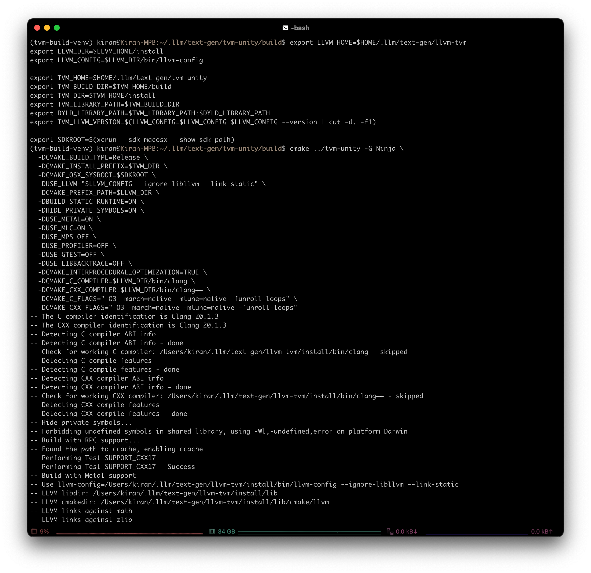

> If you're compiling **heavily vectorized code**, you might want to explore `-fvectorize` or `-fassociative-math` for `DCMAKE_C_FLAGS` and `DCMAKE_CXX_FLAGS`
{: .prompt-tip }

7. Build

```sh
cmake --build . --parallel $(sysctl -n hw.logicalcpu)
```

> If you don’t need to reuse any previous build data (e.g. `ccache` or incremental builds), include `--clean-first` flag to force clean a build (might help with memory)
> ```sh
> cmake --build . --clean-first --parallel $(sysctl -n hw.logicalcpu)
> ```
{: .prompt-tip }

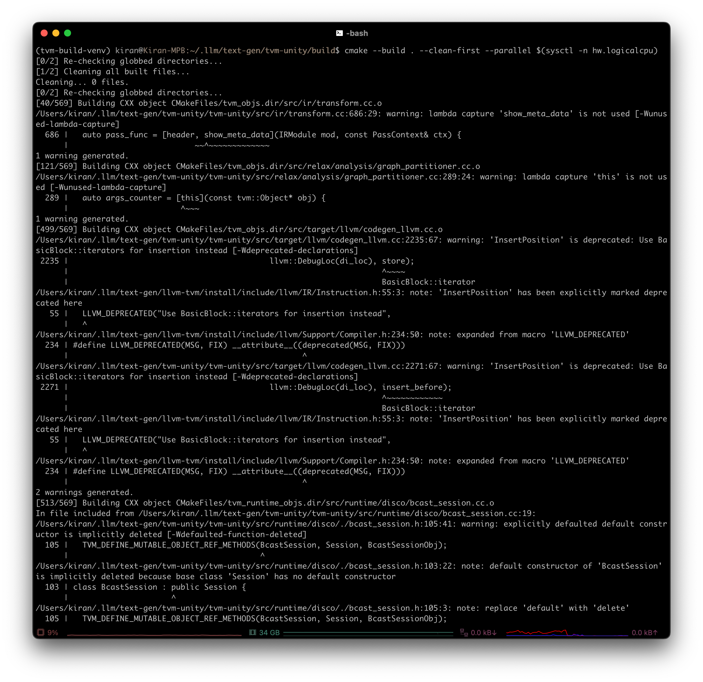

8. If successful, you should have both `libtvm` and `libtvm_runtime` within `$HOME/.llm/tvm-unity/build` directory

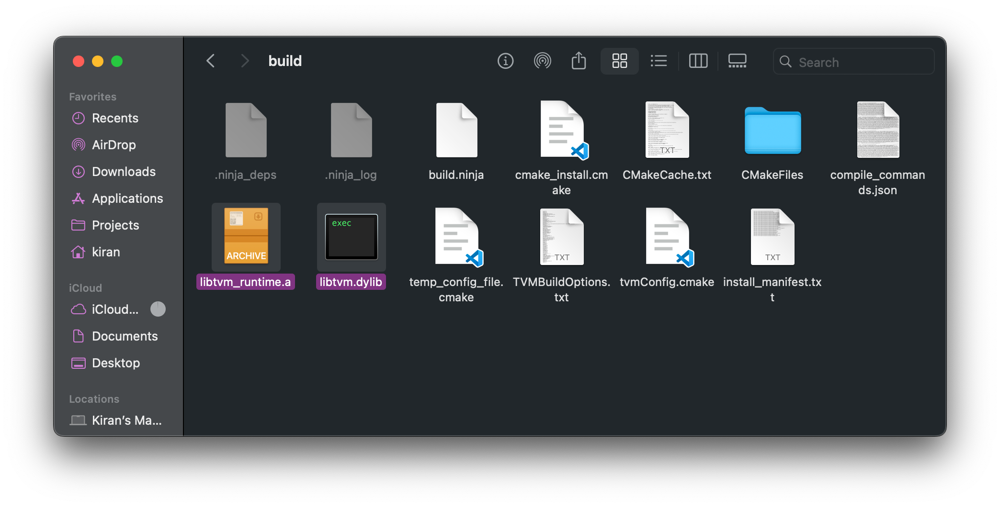

9. Install built binaries into `install` directory

```sh
cmake --build . --target install
```

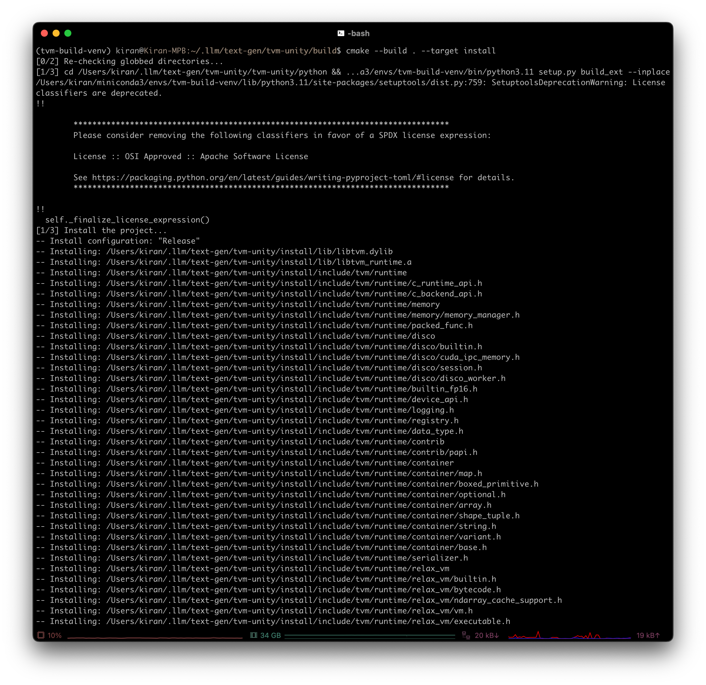

10. Set environment variables

```sh
export PYTHONPATH=$TVM_HOME/tvm-unity/python:$PYTHONPATH
```

> Optional: Add environment variables to your `.bashrc` (or other shell startup file)
> ```sh
> echo -e 'export PYTHONPATH=$TVM_HOME/tvm-unity/python:$PYTHONPATH' >> $HOME/.bashrc
> ```
{: .prompt-tip }

11. Go to `python` directory (fullpath: `$HOME/.llm/tvm-unity/tvm-unity/python`)

```sh
cd ../tvm-unity/python
```

12. Install Python bindings

```sh
pip install -e .
```

> Make sure `tvm-build-venv` Conda environment is activated before running `pip install -e .` or doing a CMake build
> ```sh
> conda activate tvm-build-venv
> ```
{: .prompt-tip }

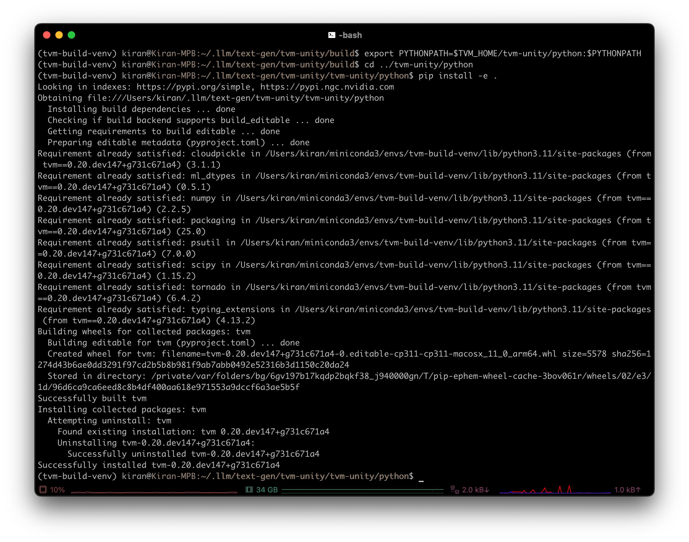

#### Validate TVM Installation
Using a compiler infrastructure with multiple language bindings could be error-prone. Therefore, it is highly recommended to validate TVM Unity installation before use.

1. **Locate TVM Python package.** The following command can help confirm that TVM is properly installed as a python package and provide the location of the TVM python package:

```python
>>> python -c "import tvm; print(tvm.__file__)"
/some-path/lib/python3.11/site-packages/tvm/__init__.py
```

2. **Confirm which TVM library is used.** When maintaining multiple build or installation of TVM, it becomes important to double check if the python package is using the proper `libtvm`:

```python
>>> python -c "import tvm; print(tvm._ffi.base._LIB)"
<CDLL '/some-path/lib/python3.11/site-packages/tvm/libtvm.dylib', handle 95ada510 at 0x1030e4e50>
```

3. **Reflect TVM build option.** Sometimes when downstream application fails, it could likely be some mistakes with a wrong TVM commit, or wrong build flags. To find it out, the following commands will be helpful:

```python
>>> python -c "import tvm; print('\n'.join(f'{k}: {v}' for k, v in tvm.support.libinfo().items()))"
... # Omitted less relevant options
GIT_COMMIT_HASH: 731c671a4f7a4e890011524b440c367ff4d98e14
HIDE_PRIVATE_SYMBOLS: ON
USE_LLVM: /Users/kiran/.llm/llvm-tvm/install/bin/llvm-config --ignore-libllvm --link-static
LLVM_VERSION: 20.1.3
USE_VULKAN: OFF
USE_CUDA: OFF
CUDA_VERSION: NOT-FOUND
USE_OPENCL: OFF
USE_METAL: ON
USE_ROCM: OFF
```

> `GIT_COMMIT_HASH` indicates the exact commit of the TVM build, and it can be found on GitHub via `https://github.com/mlc-ai/relax/commit/$GIT_COMMIT_HASH`
{: .prompt-info }

4. **Check device detection.** Sometimes it could be helpful to understand if TVM could detect your device at all:

```python
>>> python -c "import tvm; print(tvm.metal().exist)"
True
```

Please note that the commands above verify the presence of an actual device on the local machine for the TVM runtime (not the compiler) to execute properly. However, TVM compiler can perform compilation tasks without requiring a physical device. As long as the necessary toolchain (e.g. NVCC) is available, TVM supports cross-compilation even in the absence of an actual device.

### MLC LLM
(Frontend for text generation)

1. Create the conda environment with build dependencies

```sh
conda create -n mlc-chat-venv -c conda-forge "cmake>=3.24" rust git python=3.11
```

2. Enter build environment

```sh
conda activate mlc-chat-venv
```

3. Enter `mlc-llm`

```sh
cd $HOME/.llm/mlc-llm
```

4. Clone and enter MLC LLM

```sh
git clone --recursive https://github.com/mlc-ai/mlc-llm.git && cd mlc-llm
```

5. Create and enter `build` directory

```sh
mkdir build && cd build
```

6. Generate build config

```sh
python ../cmake/gen_cmake_config.py
```

7. Patch `msgpack/CMakeLists.txt` and `sentencepiece/CMakeLists.txt` files by replacing `cmake_minimum_required(VERSION 2.8)` with `cmake_minimum_required(VERSION 3.5...3.28)`

8. Build MLC LLM libraries

```sh
cmake .. -DCMAKE_PREFIX_PATH=$HOME/.llm/tvm-unity/install
cmake --build . --parallel $(sysctl -n hw.logicalcpu)
```

9. Install to Python

```sh
cd ../python && pip install -e .
```

10. Install packages used by TVM Unity that might be missing

```sh
pip install cloudpickle psutil scipy tornado
```

11. Export environment variables

```sh
export MLC_LLM_SOURCE_DIR=$HOME/.llm/mlc-llm/mlc-llm
export PYTHONPATH=$MLC_LLM_SOURCE_DIR/python:$PYTHONPATH
```

> Optional: Add environment variables to your `.bashrc` (or other shell startup file)
> ```sh
> echo -e 'export MLC_LLM_SOURCE_DIR=$HOME/.llm/mlc-llm/mlc-llm\nexport PYTHONPATH=$MLC_LLM_SOURCE_DIR/python:$PYTHONPATH' >> $HOME/.bashrc
> ```
{: .prompt-tip }

12. Make sure to include TVM too

```sh
cd $HOME/.llm/tvm-unity/tvm-unity/python
```

13. Set environment variables

```sh
export TVM_HOME=$HOME/.llm/tvm-unity
export TVM_LIBRARY_PATH=$TVM_HOME/build
export DYLD_LIBRARY_PATH=$TVM_LIBRARY_PATH:$DYLD_LIBRARY_PATH
```

> Optional: Add environment variables to your `.bashrc` (or other shell startup file)
> ```sh
> echo -e 'export TVM_HOME=$HOME/.llm/tvm-unity\nexport TVM_LIBRARY_PATH=$TVM_HOME/build\nexport DYLD_LIBRARY_PATH=$TVM_LIBRARY_PATH:$DYLD_LIBRARY_PATH' >> $HOME/.bashrc
> ```
{: .prompt-tip }

14. Install `tvm` as Python package to `mlc-chat-venv`

```sh
pip install -e .
```

#### Validate MLC LLM Installation
```sh
# expected to see `libmlc_llm.so` and `libtvm_runtime.so`
ls -l ../build

# expected to see help message
python -m mlc_llm chat -h

# expected to see something similar to `<module 'mlc_llm' from '$HOME/.llm/mlc-llm/mlc-llm/python/mlc_llm/__init__.py'>`
python -c "import mlc_llm; print(mlc_llm)"
```

### Models
The following are required in order to run a model with MLC LLM in any platform:

- **Model weights**: Model converted to MLC format (e.g. [RedPajama-INCITE-Chat-3B-v1-q4f16_1-MLC](https://huggingface.co/mlc-ai/RedPajama-INCITE-Chat-3B-v1-q4f16_1-MLC/tree/main))
- **Model library**: Contains inference logic

#### Download Weights
1. Enter directory where models will be saved

```sh
cd $HOME/.llm/models
```

2. Initialize git LFS in order to be able to download large files (in this case, model weights)

```sh
git lfs install
```

3. Download model weights from HF, where `<HF_USER>` and `<HF_MODEL>` are the username and model's name on HuggingFace, respectively

```sh
git clone https://huggingface.co/<HF_USER>/<HF_MODEL>
```

E.g. `https://huggingface.co/togethercomputer/RedPajama-INCITE-Instruct-3B-v1`

#### Model Compilation
**Model compilation** optimizes the model inference for a given platform, allowing users bring their own new model architecture, use different quantization modes, and customize the overall model optimization flow. It's split into 3 main steps:
1. Convert weights
2. Generate `mlc-chat-config.json`
3. Compile model

##### Convert Weights
Models need to be converted to MLC format before they can be used in MLC LLM.

> Make sure you're in the directory where models will be saved
> ```sh
> cd $HOME/.llm/models
> ```
{: .prompt-info }

The general pattern for the weight conversion command (i.e. `mlc_llm convert_weight`):

```sh
mlc_llm convert_weight CONFIG \
--quantization QUANTIZATION_MODE \
[--model-type MODEL_TYPE] \
[--device DEVICE] \
[--source SOURCE] \
[--source-format SOURCE_FORMAT] \
--output OUTPUT
```

> `CONFIG` is a positional argument
> Arguments wrapped with `[ ]` are optional
{: .prompt-info }

`--CONFIG`
	Can be one of the following:
		- Path to a HuggingFace model directory that contains a `config.json`
		- Path to `config.json` in HuggingFace format
		- The name of a pre-defined model architecture
	A `config.json` file in HuggingFace format defines the model architecture, including the vocabulary size, the number of layers, the hidden size, number of attention heads, etc. Example: [https://huggingface.co/codellama/CodeLlama-7b-hf/blob/main/config.json](https://huggingface.co/codellama/CodeLlama-7b-hf/blob/main/config.json)
	A HuggingFace directory often contains a `config.json` which defines the model architecture, the non-quantized model weights in PyTorch or SafeTensor format, tokenizer configurations, as well as an optional `generation_config.json` provides additional default configuration for text generation. E.g.: [https://huggingface.co/codellama/CodeLlama-7b-hf/tree/main](https://huggingface.co/codellama/CodeLlama-7b-hf/tree/main)
	For existing pre-defined model architecture, see `MODEL_PRESETS` [here](https://github.com/mlc-ai/mlc-llm/blob/main/python/mlc_llm/compiler/model/model.py).

`--quantization QUANTIZATION_MODE`
	Quantization mode used to compile. Available options:
		- `q0f16`
		- `q0f32`
		- `q3f16_1`
		- `q4f16_1`
		- `q4f32_1`
		- `q4f16_awq`
	See [Quantization Mode](https://llm.mlc.ai/docs/compilation/configure_quantization.html#quantization-mode) for more information. Using 4-bit quantization is recommended, as the text generated by 3-bit quantized models may have bad quality depending on the model.

`--model-type MODEL_TYPE`
	Model architecture such as “llama”. If not set, it is inferred from `config.json`

`--device DEVICE`
	Device used to do quantization such as `"cuda"` or `“cuda:0”`. Will detect from local available GPUs if not specified.

`--source SOURCE`
	Path to original model weight; defaults to `config`

`--source-format SOURCE_FORMAT`
	Source model weight's format; defaults to `config`

`--output OUTPUT`
	Output directory to save the quantized model weight. Will create `params_shard_*.bin` and `ndarray-cache.json` in this directory

For example:

```sh
mlc_llm convert_weight RedPajama-INCITE-Chat-3B-v1 \
--quantization q4f16_1 \
-o RedPajama-INCITE-Chat-3B-v1-q4f16_1-MLC
```

##### Generate `mlc-chat-config.json`
A **model library**, specified in `mlc-chat-config.json` and generated by `gen_config`, contains:
 - The model architecture (e.g. `llama-2`, `gpt-neox`)
 - Quantization (e.g. `q4f16_1`, `q0f32`)
 - Metadata (e.g. `context_window_size`, `sliding_window_size`, `prefill-chunk-size`), which affects memory planning
 - Platform (e.g. `cuda`, `webgpu`, `iOS`)

> Make sure you're in the directory where models will be saved
> ```sh
> cd $HOME/.llm/models
> ```
{: .prompt-info }

1. Generate `mlc-chat-config.json` and process tokenizers

```sh
mlc_llm gen_config <HF_MODEL> \
--quantization q4f16_1 \
--conv-template redpajama_chat \
-o <CONVERTED_HF_MODEL>
```

For example:

```sh
mlc_llm gen_config $HOME/.llm/models/pygmalion-2-13b \
-o $HOME/.llm/models/pygmalion-2-13b-q4f16_1 \
--quantization q4f16_1 \
--conv-template redpajama_chat
```

```sh
mlc_llm gen_config RedPajama-INCITE-Chat-3B-v1 \
--quantization q4f16_1 \
--conv-template redpajama_chat \
-o RedPajama-INCITE-Chat-3B-v1-q4f16_1-MLC
```

> See [Compile Command Specification](https://llm.mlc.ai/docs/compilation/compile_models.html#compile-command-specification) for specification of `gen_config`
> 
> `mlc-chat-config.json` is crucial in both model compilation and runtime chatting
> 
> You can **optionally** customize `dist/RedPajama-INCITE-Instruct-3B-v1-q4f16_1-MLC/mlc-chat-config.json` (see [Customize MLC Chat Config](https://llm.mlc.ai/docs/deploy/mlc_chat_config.html#configure-mlc-chat-json) for more detailed instructions). You can also simply use the default configuration.
> 
> [conversation_template](https://github.com/mlc-ai/mlc-llm/blob/main/python/mlc_llm/conversation_template) directory contains a full list of conversation templates that MLC provides. If the model you are adding requires a new conversation template, you would need to add your own. Follow [this PR](https://github.com/mlc-ai/mlc-llm/pull/2163) as an example. However, adding your own template would require you [build mlc_llm from source](https://llm.mlc.ai/docs/install/mlc_llm.html#mlcchat-build-from-source) in order for it to be recognized by the runtime.
{: .prompt-info }

2. Confirm you have the right files

```sh
ls $HOME/.llm/models/<HF_MODEL>
```

The output should look similar to

```plaintext
mlc-chat-config.json         # Chat config
ndarray-cache.json           # Model weight info
params_shard_0.bin           # Model weights
params_shard_1.bin
...
tokenizer.json               # Tokenizer files
tokenizer_config.json
```

##### Compile Model
In many cases you do not need to explicitly call compile. If you are using the Python API, you can skip specifying `model_lib` and the system will JIT compile the library.

> Make sure you're in the directory where models will be saved
> ```sh
> cd $HOME/.llm/models
> ```
{: .prompt-info }

1. Complete instructions in [LLVM](2025-04-23-run-self-compiled-llms-locally-mbp.md#llvm), [TVM Unity Compiler](2025-04-23-run-self-compiled-llms-locally-mbp.md#tvm-unity-compiler), and [Usage](2025-04-23-run-self-compiled-llms-locally-mbp.md#usage) before continuing

2. Convert model weights, generate `mlc-chat-config.json`, and process tokenizers by following instructions in [Download Weights](2025-04-23-run-self-compiled-llms-locally-mbp.md#download-weights), [Convert Weights](2025-04-23-run-self-compiled-llms-locally-mbp.md#convert-weights), and [[#Generate `mlc-chat-config.json`]] respectively

3. Compile model library with specification in `mlc-chat-config.json`

```sh
mlc_llm compile <CONVERTED_HF_MODEL>/mlc-chat-config.json \
--device metal \
-o libs/<CONVERTED_HF_MODEL>-metal.so
```

For example:

```sh
mlc_llm compile RedPajama-INCITE-Chat-3B-v1-q4f16_1-MLC/mlc-chat-config.json \
--device metal \
-o libs/RedPajama-INCITE-Chat-3B-v1-q4f16_1-metal.so
```

#### Optional: Upload Weights to HuggingFace
1. Create a repository on Hugging Face

2. Enter directory where models will be saved

```sh
cd $HOME/.llm/models
```

3. Initialize git LFS in order to be able to download large files (in this case, model weights)

```sh
git lfs install
```

4. Download model weights from HF, where `<MY_HF_USERNAME>` and `<MY_HF_MODEL_REPO>` are your Hugging Face username and model's repo name on HuggingFace, respectively

```sh
git clone https://huggingface.co/<MY_HF_USERNAME>/<MY_HF_MODEL_REPO>
```

E.g. `https://huggingface.co/togethercomputer/RedPajama-INCITE-Instruct-3B-v1`

5. Enter newly cloned weights directory

```sh
cd <MY_HF_MODEL_REPO>
```

6. Copy your converted model weights into the Hugging Face repo

```sh
cp $HOME/.llm/models/<CONVERTED_HF_MODEL>/* .
```

E.g. `$HOME/.llm/models/RedPajama-INCITE-Instruct-3B-v1-q4f16_1-MLC/*`

7. Stage all changes

```sh
git add .
```

8. Commit staged changes

```sh
git commit -m "Add `<CONVERTED_HF_MODEL>` model weights"
```

9. Push commit(s) to remote repo (i.e. HuggingFace repo)

```sh
git push origin main
```

This would result in something like [RedPajama-INCITE-Chat-3B-v1-q4f16_1-MLC](https://huggingface.co/mlc-ai/RedPajama-INCITE-Chat-3B-v1-q4f16_1-MLC/tree/main), but for **Instruct** instead of **Chat**

10. You can now use the existing MLC tools such as chat/serve/package with the converted weights

```sh
mlc_llm chat HF://<MY_HF_USERNAME>/<MY_HF_MODEL_REPO>
```

#### Examples
##### Llama-2-7B
1. [Request access to the Llama-2 weights](https://huggingface.co/meta-llama) from Meta

2. After granted access, create directory `dist/models`

```sh
mkdir -p dist/models && cd dist/models
```

3. Download model to the directory

```sh
git lfs install
git clone https://huggingface.co/meta-llama/Llama-2-7b-chat-hf
cd ../..
```

4. Convert HF weights into MLC-compatible weights

```sh
mlc_llm convert_weight models/Llama-2-7b-chat-hf \
--quantization q4f16_1 \
-o dist/Llama-2-7b-chat-hf-q4f16_1-MLC
```

> All platforms can share the same compiled/quantized weights
{: .prompt-info }

5. Create output directory for compiled model library

```sh
mkdir -p dist/libs
```

6. Generate `mlc-chat-config.json` and process tokenizers

```sh
mlc_llm gen_config ./dist/models/Llama-2-7b-chat-hf \
--quantization q4f16_1 \
--conv-template llama-2 \
-o dist/Llama-2-7b-chat-hf-q4f16_1-MLC
```

7. Compile model library with specification in `mlc-chat-config.json`

```sh
mlc_llm compile ./dist/Llama-2-7b-chat-hf-q4f16_1-MLC/mlc-chat-config.json \
--device metal \
-o dist/libs/Llama-2-7b-chat-hf-q4f16_1-metal.so
```

> Using 3-bit quantization usually can be overly aggressive and only works for limited settings. If you encounter issues where the compiled model does not perform as expected, consider utilizing a higher number of bits for quantization (e.g., 4-bit quantization).
{: .prompt-tip }

##### Mistral-7B-Instruct-v0.2
##### Other Models

##### Sample List
- [MythoMax-L2](https://huggingface.co/Gryphe/MythoMax-L2-13b)
- [Chronos Hermes](https://huggingface.co/Austism/chronos-hermes-13b-v2)
- [Nous Hermes 2 (uncensored)](https://huggingface.co/NousResearch/Nous-Hermes-2-Mistral-7B-DPO)
- [Pygmalion 2](https://huggingface.co/PygmalionAI/pygmalion-2-13b)
- [Llama-2-13B-Unfiltered](https://huggingface.co/cognitivecomputations/WizardLM-1.0-Uncensored-Llama2-13b)

## Usage
> Make sure `mlc-chat-venv` Conda environment is activated:
> ```sh
> conda activate mlc-chat-venv
> ```
{: .prompt-info }

### MLC Python API
#### Run `MLCEngine`
##### Stream Response

```python
from mlc_llm import MLCEngine

# Create engine
model = "HF://mlc-ai/Llama-3-8B-Instruct-q4f16_1-MLC"
engine = MLCEngine(model)

# Build custom prompt using special tokens
prompt = (
	"<|system|>You are a concise assistant. Answer questions briefly and thoughtfully. Always respond in no more than three sentences."
	"<|user|>What is the meaning of life?"
	"<|model|>"
)

# Run chat completion in OpenAI API
for response in engine.chat.completions.create(
	messages=[{"role": "user", "content": prompt}],
	model=model,
	stream=True,
	temperature=0.6,
	top_p=0.9,
	stop=["</s>", "<|end|>"],
	frequency_penalty=0.6,
	presence_penalty=0.3,
):
	for choice in response.choices:
		print(choice.delta.content, end="", flush=True)

engine.terminate()
```

Example output

```plaintext

```

##### Optional: Tensor Parallelism
If you want to enable tensor parallelism to run LLMs on multiple GPUs, please specify argument `model_config_overrides` in MLCEngine constructor. E.g.

```python
from mlc_llm import MLCEngine
from mlc_llm.serve.config import EngineConfig

model = "HF://mlc-ai/Llama-3-8B-Instruct-q4f16_1-MLC"
engine = MLCEngine(
    model,
    engine_config=EngineConfig(tensor_parallel_shards=2),
)
```

#### Run `AsyncMLCEngine`
##### Stream Response
```python
import asyncio
from typing import Dict

from mlc_llm.serve import AsyncMLCEngine

model = "HF://mlc-ai/Llama-3-8B-Instruct-q4f16_1-MLC"
prompts = [
    "Write a three-day travel plan to Pittsburgh.",
    "What is the meaning of life?",
]

async def test_completion():
    # Create engine
    async_engine = AsyncMLCEngine(model=model)

    num_requests = len(prompts)
    output_texts: Dict[str, str] = {}

    async def generate_task(prompt: str):
        async for response in await async_engine.chat.completions.create(
            messages=[{"role": "user", "content": prompt}],
            model=model,
            stream=True,
        ):
            if response.id not in output_texts:
                output_texts[response.id] = ""
            output_texts[response.id] += response.choices[0].delta.content

    tasks = [asyncio.create_task(generate_task(prompts[i])) for i in range(num_requests)]
    await asyncio.gather(*tasks)

    # Print output.
    for request_id, output in output_texts.items():
        print(f"Output of request {request_id}:\n{output}\n")

    async_engine.terminate()

asyncio.run(test_completion())
```

##### Non-Stream Response
```python
response = await engine.chat.completions.create(
  messages=[{"role": "user", "content": "What is the meaning of life?"}],
  model=model,
  stream=False,
)
print(response)
```

##### Optional: Tensor Parallelism
If you want to enable tensor parallelism to run LLMs on multiple GPUs, please specify argument `model_config_overrides` in AsyncMLCEngine constructor. E.g.:

```python
from mlc_llm import AsyncMLCEngine
from mlc_llm.serve.config import EngineConfig

model = "HF://mlc-ai/Llama-3-8B-Instruct-q4f16_1-MLC"
engine = AsyncMLCEngine(
    model,
    engine_config=EngineConfig(tensor_parallel_shards=2),
)
```

#### Engine Mode
To ease the engine configuration, the constructors of [`mlc_llm.MLCEngine`](https://llm.mlc.ai/docs/deploy/python_engine.html#mlc_llm.MLCEngine "mlc_llm.MLCEngine") and [`mlc_llm.AsyncMLCEngine`](https://llm.mlc.ai/docs/deploy/python_engine.html#mlc_llm.AsyncMLCEngine "mlc_llm.AsyncMLCEngine") have an optional argument `mode`, which falls into one of the three options `"local"`, `"interactive"` or `"server"`. The default mode is `"local"`.

Each mode denotes a pre-defined configuration of the engine to satisfy different use cases. The choice of the mode controls the request concurrency of the engine, as well as engine’s KV cache token capacity (or in other words, the maximum number of tokens that the engine’s KV cache can hold), and further affects the GPU memory usage of the engine.

- mode `"local"` uses low request concurrency and low KV cache capacity, which is suitable for cases where **concurrent requests are not too many, and the user wants to save GPU memory usage**.
- mode `"interactive"` uses 1 as the request concurrency and low KV cache capacity, which is designed for **interactive use cases** such as chats and conversations.
- mode `"server"` uses as much request concurrency and KV cache capacity as possible. This mode aims to **fully utilize the GPU memory for large server scenarios** where concurrent requests may be many.

**For system benchmark, please select mode** `"server"`. Please refer to [API Reference](https://llm.mlc.ai/docs/deploy/python_engine.html#python-engine-api-reference) for detailed documentation of the engine mode.

### MLC Chat CLI
This is the command line tool to run MLC-compiled LLMs out of the box interactively.

1. Here's the general command pattern, where where `MODEL` is the model folder after compiling with [MLC-LLM build process](https://llm.mlc.ai/docs/compilation/compile_models.html#compile-model-libraries)

```sh
mlc_llm chat MODEL [--model-lib PATH-TO-MODEL-LIB] [--device DEVICE] [--overrides OVERRIDES]
```

`MODEL`
	This is required. Options:
		- Path to `mlc-chat-config.json`
		- MLC model directory that contains `mlc-chat-config.json` (i.e. after compiling with MLC-LLM build process)
		- Model name with its quantization scheme (e.g. `Llama-2-7b-chat-hf-q4f16_1`)
		- Link to a HF repository pointing to an MLC compiled model

`--model-lib`
	Full path to the model library file to use (e.g. a `.so` file). If unspecified, we will use the provided `model` to search over possible paths. It the model lib is not found, it will be compiled in a JIT manner. (default: "None")

`--device`
	The description of the device to run on. User should provide a string in the form of `device_name:device_id` or `device_name`, where `device_name` is one of `cuda`, `metal`, `vulkan`, `rocm`, `opencl`, `auto` (automatically detect the local device), and `device_id` is the device id to run on. The default value is `auto`, default device id is `0`.

`--overrides`
	Model configuration override. Supports overriding:
		- `context_window_size`
		- `prefill_chunk_size`
		- `sliding_window_size`
		- `attention_sink_size`
		- `max_num_sequence`
		- `tensor_parallel_shards`
	The overrides could be explicitly specified via details knobs, e.g. `-–overrides "context_window_size=1024;prefill_chunk_size=128"`

2. Once chat CLI's ready, use the following special commands to interact with the model:

`/help`                                Print special commands
`/exit`                                Quit CLI
`/stats`                              Print stats of last request (token/sec)
`/metrics`                          Print full engine metrics
`/reset`                              Restart fresh chat
`/set [overrides]`          Override settings in generation config. e.g. `/set temperature=0.5;top_p=0.8;seed=23;max_tokens=100;stop=str1,str2`
                       Note: Separate stop words in the `stop` option with commas (`,`)
Multi-line input: Use <kbd>Escape</kbd> + <kbd>Enter</kbd> to start a new line

E.g. Command format: `mlc_llm chat HF://<HF_USER>/<HF_MODEL>`. To use the model at `https://huggingface.co/mlc-ai/Llama-3-8B-Instruct-q4f16_1-MLC` with the chat

```sh
mlc_llm chat HF://mlc-ai/Llama-3-8B-Instruct-q4f16_1-MLC
```

`mlc_llm chat $HOME/.llm/models/pygmalion-2-13b-q4f16_1`

#### Optional: Tensor Parallelism
If you want to enable tensor parallelism to run LLMs on multiple GPUs, please specify argument `--overrides "tensor_parallel_shards=$NGPU"`. For example:

```sh
mlc_llm chat HF://mlc-ai/Llama-3-8B-Instruct-q4f16_1-MLC --overrides "tensor_parallel_shards=2"
```

### REST Server
For the third example, we launch a REST server to serve the 4-bit quantized Llama-3 model for OpenAI chat completion requests. The server can be launched in command line with

```sh
mlc_llm serve HF://mlc-ai/Llama-3-8B-Instruct-q4f16_1-MLC
```

The server is hooked at `http://127.0.0.1:8000` by default, and you can use `--host` and `--port` to set a different host and port. When the server is ready (showing `INFO: Uvicorn running on http://127.0.0.1:8000 (Press CTRL+C to quit)`), we can open a new shell and send a cURL request via the following command:

```sh
curl -X POST \
  -H "Content-Type: application/json" \
  -d '{
        "model": "HF://mlc-ai/Llama-3-8B-Instruct-q4f16_1-MLC",
        "messages": [
            {"role": "user", "content": "Hello! Our project is MLC LLM. What is the name of our project?"}
        ]
  }' \
  http://127.0.0.1:8000/v1/chat/completions
```

The server will process this request and send back the response.

#### Stream Response
Similar to [Python API](https://llm.mlc.ai/docs/get_started/introduction.html#introduction-to-mlc-llm-python-api), you can pass argument `"stream": true` to request for stream responses.

#### Optional: Tensor Parallelism
If you want to enable tensor parallelism to run LLMs on multiple GPUs, please specify argument `--overrides "tensor_parallel_shards=$NGPU"`. E.g.:

```sh
mlc_llm serve HF://mlc-ai/Llama-3-8B-Instruct-q4f16_1-MLC --overrides "tensor_parallel_shards=2"
```

### IDE Integration
MLC LLM has now support for code completion on multiple IDEs. This means you can easily integrate an LLM with coding capabilities with your IDE through the MLC LLM [REST API](https://llm.mlc.ai/docs/deploy/rest.html#deploy-rest-api). Here we provide a step-by-step guide on how to do this.

#### Convert Weights
To run a model with MLC LLM in any platform, you need to convert your model weights to the MLC format (e.g. [CodeLlama-7b-hf-q4f16_1-MLC](https://huggingface.co/mlc-ai/CodeLlama-7b-hf-q4f16_1-MLC)). You can always refer to [Convert Model Weights](https://llm.mlc.ai/docs/compilation/convert_weights.html#convert-weights-via-mlc) for in-depth details on how to convert your model weights. If you are using your own model weights, i.e., you finetuned the model on your personal codebase, it is important to follow these steps to convert the respective weights properly. However, it is also possible to download precompiled weights from the original models, available in the MLC format. See the full list of all precompiled weights [here](https://huggingface.co/mlc-ai).

```sh
mlc_llm convert_weight ./dist/models/CodeLlama-7b-hf \
--quantization q4f16_1 \
-o ./dist/CodeLlama-7b-hf-q4f16_1-MLC
```

#### Compile Model
Compiling the model architecture is the crucial step to optimize inference for a given platform. However, compilation relies on multiple settings that will impact the runtime. This configuration is specified inside the `mlc-chat-config.json` file, which can be generated by the `gen_config` command. You can learn more about the `gen_config` command [here](https://llm.mlc.ai/docs/compilation/compile_models.html#generate-mlc-chat-config).

```sh
# Generate `mlc-chat-config.json`
mlc_llm gen_config ./dist/models/CodeLlama-7b-hf \
--quantization q4f16_1 \
--conv-template LM \
-o ./dist/CodeLlama-7b-hf-q4f16_1-MLC
```

> Make sure to set the `--conv-template` flag to `LM`. This template is specifically tailored to perform vanilla LLM completion, generally adopted by code completion models.
{: .prompt-info }

After generating the MLC model configuration file, we are all set to compile and create the model library. You can learn more about the `compile` command [here](https://llm.mlc.ai/docs/compilation/compile_models.html#compile-model-library)

```sh
# Compile model library with specification in mlc-chat-config.json
mlc_llm compile ./dist/CodeLlama-7b-hf-q4f16_1-MLC/mlc-chat-config.json \
--device metal \
-o ./dist/libs/CodeLlama-7b-hf-q4f16_1-metal.so
```

> The generated model library can be shared across multiple model variants, as long as the architecture and number of parameters does not change, e.g., same architecture, but different weights (your finetuned model).
{: .prompt-info }

#### Set Up Inference Entrypoint
You can now locally deploy your compiled model with the MLC serve module. To find more details about the MLC LLM API visit our [REST API](https://llm.mlc.ai/docs/deploy/rest.html#deploy-rest-api) page.

```python
python -m mlc_llm.serve.server \
--model dist/CodeLlama-7b-hf-q4f16_1-MLC \
--model-lib ./dist/libs/CodeLlama-7b-hf-q4f16_1-cuda.so
```

#### Configure IDE Extension
After deploying the LLM we can easily connect the IDE with the MLC Rest API. In this guide, we will be using the Hugging Face Code Completion extension [llm-ls](https://github.com/huggingface/llm-ls) which has support across multiple IDEs (e.g., [vscode](https://github.com/huggingface/llm-vscode), [intellij](https://github.com/huggingface/llm-intellij) and [nvim](https://github.com/huggingface/llm.nvim)) to connect to an external OpenAI compatible API (i.e., our MLC LLM [REST API](https://llm.mlc.ai/docs/deploy/rest.html#deploy-rest-api)).

After installing the extension on your IDE, open the `settings.json` extension configuration file:


Then, make sure to replace the following settings with the respective values:

```plaintext
"llm.modelId": "dist/CodeLlama-7b-hf-q4f16_1-MLC"
"llm.url": "http://127.0.0.1:8000/v1/completions"
"llm.backend": "openai"
```

This will enable the extension to send OpenAI compatible requests to the MLC Serve API. Also, feel free to tune the API parameters. Please refer to our [REST API](https://llm.mlc.ai/docs/deploy/rest.html#deploy-rest-api) documentation for more details about these API parameters.

```json
"llm.requestBody": {
   "best_of": 1,
   "frequency_penalty": 0.0,
   "presence_penalty": 0.0,
   "logprobs": false,
   "top_logprobs": 0,
   "logit_bias": null,
   "max_tokens": 128,
   "seed": null,
   "stop": null,
   "suffix": null,
   "temperature": 1.0,
   "top_p": 1.0
}
```

The llm-ls extension supports a variety of different model code completion templates. Choose the one that best matches your model, i.e., the template with the correct tokenizer and Fill in the Middle tokens.


After everything is all set, the extension will be ready to use the responses from the MLC Serve API to provide off-the-shelf code completion on your IDE.


# Resources
- [Performance tips and tricks: `conda-libmamba-solver`](https://conda.github.io/conda-libmamba-solver/user-guide/performance)
- [Conda 23.10.0: `libmamba` is now the default solver](https://conda.org/blog/2023-11-06-conda-23-10-0-release/#with-this-23100-release-we-are-changing-the-default-solver-of-conda-to-conda-libmamba-solver--)
- [`llvm-project` (GitHub)](https://github.com/llvm/llvm-project)
- [Install MLC LLM Python Package](https://llm.mlc.ai/docs/install/mlc_llm)
- [`llm-tracker`: Apple Silicon Macs](https://llm-tracker.info/howto/Apple-Silicon-Macs)
- [Python API (MLC LLM)](https://llm.mlc.ai/docs/deploy/python_engine.html)
- [Install MLC LLM Python Package](https://llm.mlc.ai/docs/install/mlc_llm.html)
- [Convert Model Weights (MLC LLM)](https://llm.mlc.ai/docs/compilation/convert_weights.html#convert-model-weights)
- [Install TVM Unity Compiler (MLC LLM)](https://llm.mlc.ai/docs/install/tvm.html#option-2-build-from-source)
- [Install Conda (MLC LLM)](https://llm.mlc.ai/docs/install/conda.html#install-miniconda)
- [Getting Started with LLVM](https://llvm.org/docs/GettingStarted.html#getting-started-with-llvm)
- [How To Cross-Compile Clang/LLVM using Clang/LLVM](https://releases.llvm.org/8.0.1/docs/HowToCrossCompileLLVM.html)
- [CLI (MLC LLM)](https://llm.mlc.ai/docs/deploy/cli.html)
- [Uncensored Models](https://erichartford.com/uncensored-models)
- [-march=, -mcpu=, and -mtune=](https://maskray.me/blog/2022-08-28-march-mcpu-mtune)
- [It is more complicated than I thought: -mtune, -march in GCC](https://lemire.me/blog/2018/07/25/it-is-more-complicated-than-i-thought-mtune-march-in-gcc)
- [Beware of fast-math](https://simonbyrne.github.io/notes/fastmath)
- [Options That Control Optimization (GCC)](https://gcc.gnu.org/onlinedocs/gcc/Optimize-Options.html)
- [Understanding fast-math](https://www.nutrient.io/blog/understanding-fast-math)
- [Optimizations enabled by -ffast-math](https://kristerw.github.io/2021/10/19/fast-math)
- [Compiler flags across architectures: -march, -mtune, and -mcpu](https://community.arm.com/arm-community-blogs/b/tools-software-ides-blog/posts/compiler-flags-across-architectures-march-mtune-and-mcpu)