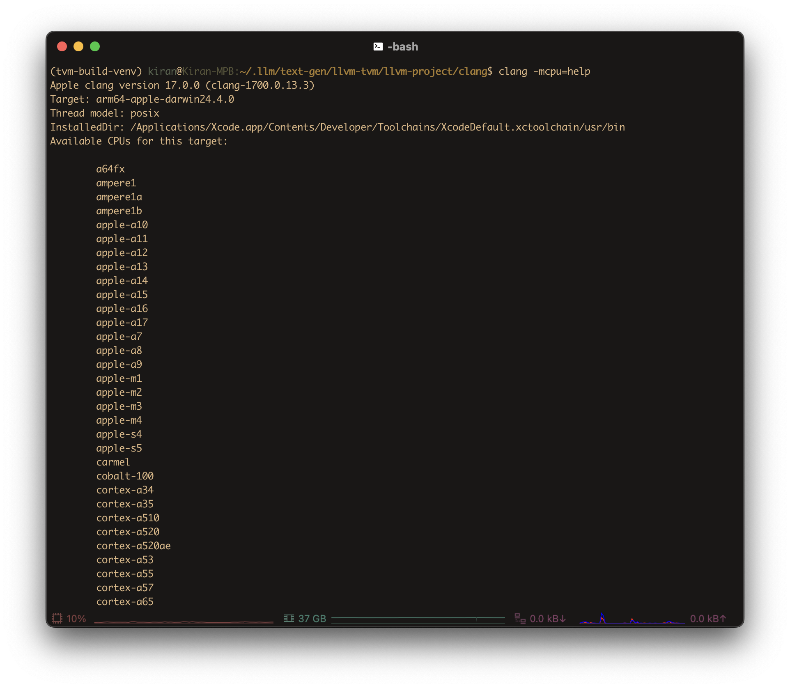
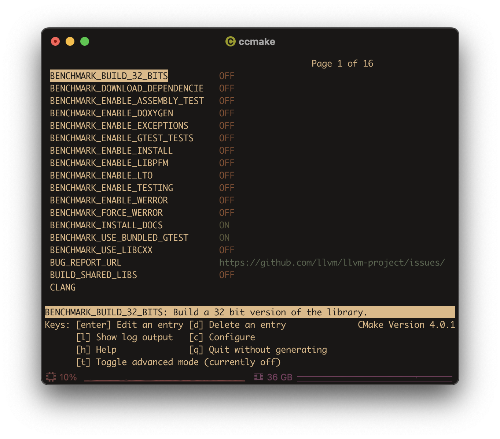
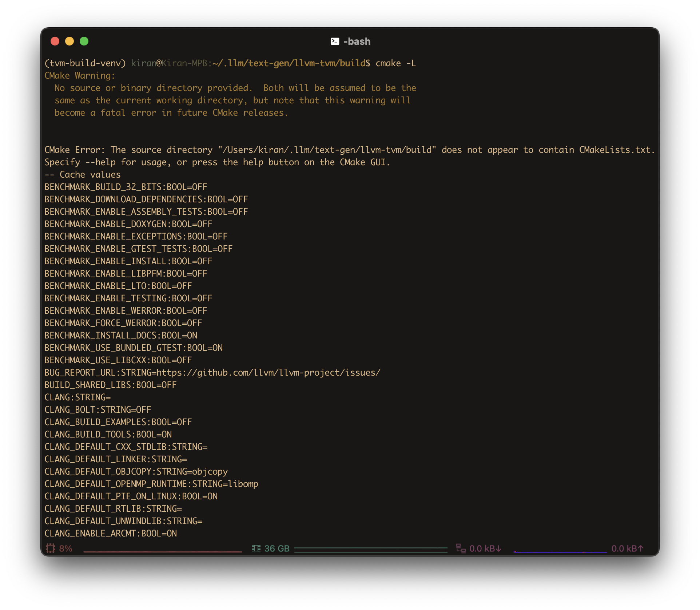
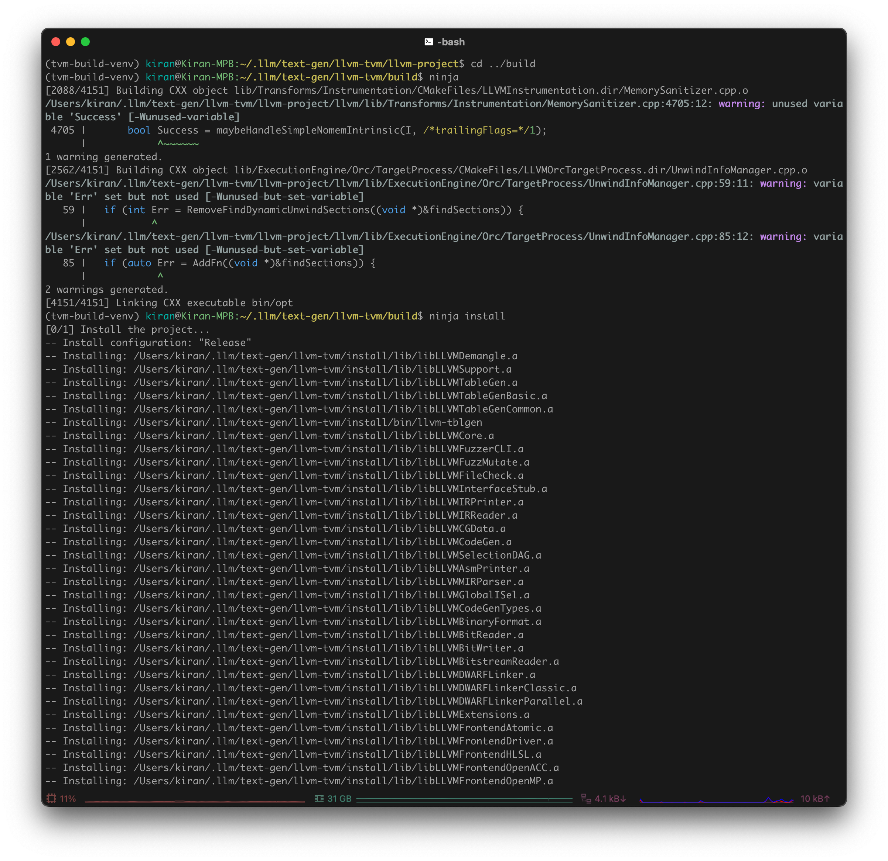
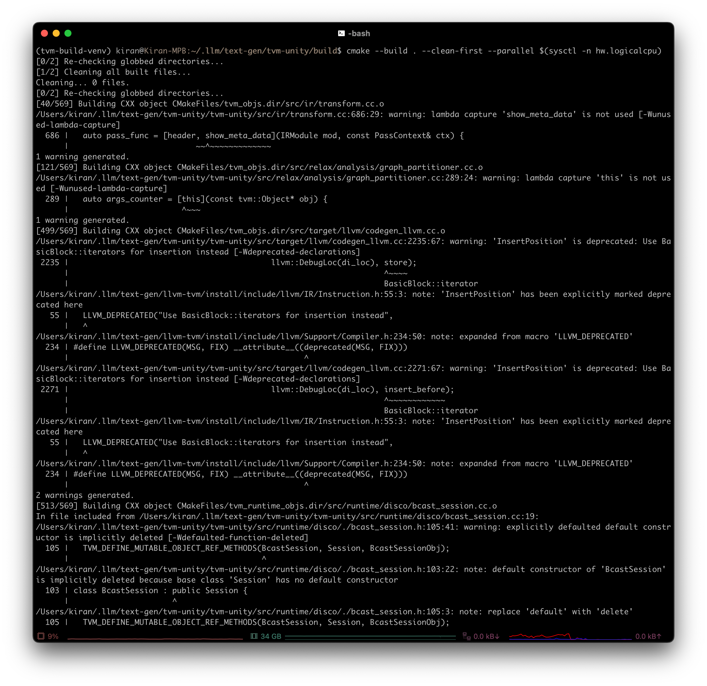
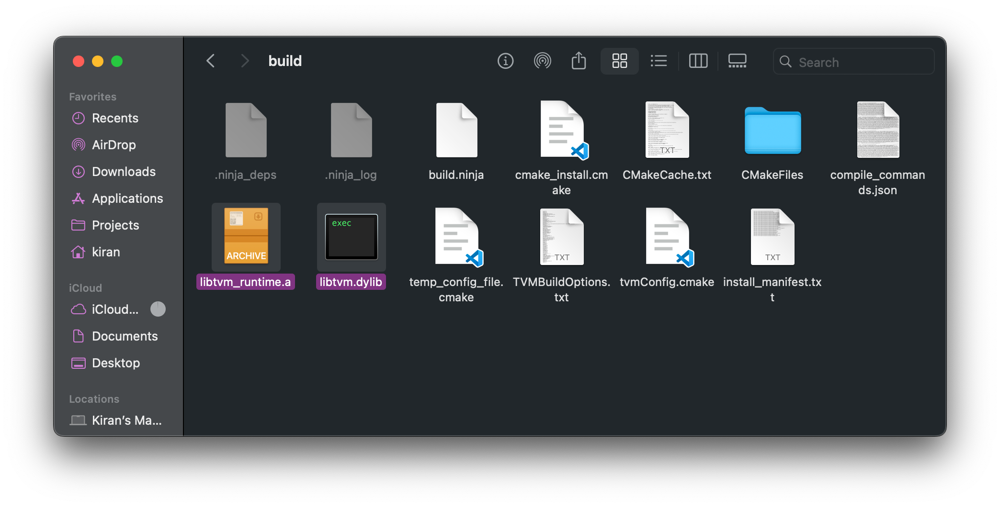
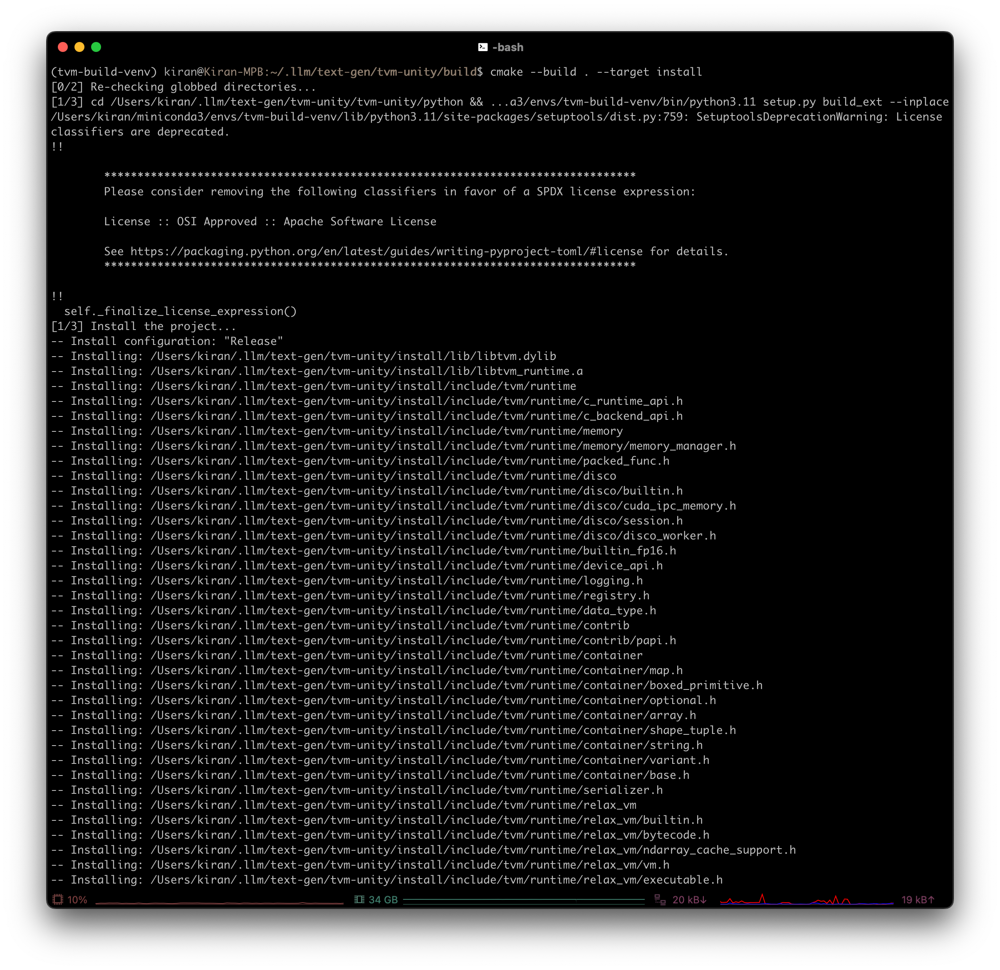

> **This article/tutorial is still under construction. Feel free to bookmark this post to come back later, as there may be new information by then!**
{: .prompt-important }

## Introduction
We'll be going over 3 separate options, along with the pros and cons of each:
- MLC LLM
- llama.cpp
- MLX (**WIP**)

## Requirements
- MacBook Pro Apple Silicon M-series
- Conda
- Homebrew
- Directory for LLMs
  ```sh
  mkdir -p $HOME/.llm
  ```
  {: .nolineno }

### Conda
1. Update conda

	```sh
	conda update --yes -n base -c defaults conda
	```
	{: .nolineno }

2. Install `conda-libmamba-solver`

	```sh
	conda install --yes -n base conda-libmamba-solver
	```
	{: .nolineno }

3. Set as default solver

	```sh
	conda config --set solver libmamba
	```
	{: .nolineno }

4. Confirm it's the default

	```sh
	conda config --show-sources
	```
	{: .nolineno }

Output should look similar to (or include)

```plaintext
==> /Users/lynkos/.condarc <==
solver: libmamba
```

> `conda-libmamba-solver` is much faster than classic for [many reasons](https://conda.github.io/conda-libmamba-solver/user-guide/libmamba-vs-classic/), though it's possible to make it faster:
> - Specify package(s) target versions, e.g. `conda install python=3.11 numpy` instead of `conda install python numpy`
> - Use strict channel priority, i.e. `--strict-channel-priority`, to reduce solver search space when mixing channels; set permanently with `conda config --set channel_priority strict`
> - Use `--update-specs`; for existing environments, don't freeze installed packages by default
> - Disable the retry loop with `CONDA_LIBMAMBA_SOLVER_MAX_ATTEMPTS=0`, making it behave more like `micromamba` (experimental!)
{: .prompt-tip }

### Homebrew
Install necessary packages: Ninja, git, git LFS, Hugging Face CLI

```sh
brew install ninja git git-lfs huggingface-cli
```
{: .nolineno }

### Ccache
Optional C/C++ compiler cache; ideal for repeated builds
```sh
brew install ccache
```
{: .nolineno }

## MLC LLM
### Background
<figure>
	<picture>
		<source srcset="https://llm.mlc.ai/docs/_images/project-workflow.svg">
		
	</picture>
	<figcaption style="text-align: center">MLC LLM Workflow</figcaption>
</figure>

### Requirements
- Hugging Face Account
- [Rust and Cargo](https://www.rust-lang.org/tools/install) (required by Hugging Face’s tokenizer)

### Initial Setup
#### Directory Structure
Create directories for TVM Unity (used by MLC LLM), MLC LLM, and LLVM (used by TVM Unity compiler) in your `.llm` directory

```sh
mkdir -p $HOME/.llm/{tvm-unity,mlc-llm,llvm-tvm}
```
{: .nolineno }

Your directory structure should look similar to this

```plaintext
$HOME/
├── .llm/
│   ├── tvm-unity/
│   ├── mlc-llm/
│   └── llvm-tvm/
└── ...
```

#### Rust and Cargo
1. Download `rustup` and install Rust

	```sh
	curl --proto '=https' --tlsv1.2 -sSf https://sh.rustup.rs | sh
	```
	{: .nolineno }

2. Once you are prompted to specify your installation method, select `2) Customize installation` by entering `2` in the CLI

	
	
	```plaintext
	1) Proceed with standard installation (default - just press enter)
	2) Customize installation
	3) Cancel installation
	```

3. Choose the following installation options:
	- **Default host triple?**: Press <kbd>Enter</kbd> (i.e. default)
	- **Default toolchain?**: Press <kbd>Enter</kbd> (i.e. default)
	- **Profile (which tools and data to install)?**: `complete`
	- **Modify PATH variable? (Y/n)**: `Y`

	```plaintext
	I'm going to ask you the value of each of these installation options.
	You may simply press the Enter key to leave unchanged.
	
	Default host triple? [aarch64-apple-darwin]
	
	Default toolchain? (stable/beta/nightly/none) [stable]
	
	Profile (which tools and data to install)? (minimal/default/complete) [default]
	complete
	
	Modify PATH variable? (Y/n)
	Y
	```

4. Once you see something similar to this, enter `1` to proceed with the customized installation options

	```plaintext
	Current installation options:
	   default host triple: aarch64-apple-darwin
	     default toolchain: stable
	               profile: complete
	  modify PATH variable: yes
	
	1) Proceed with selected options (default - just press enter)
	2) Customize installation
	3) Cancel installation
	```

5. After installation, configure your shell (i.e. `.bashrc`, `.zsh`, `.profile`, `.bash_profile`, etc.) to reload your `PATH` environment variable to include
Cargo's bin directory (`$HOME/.cargo/bin`)

	```sh
	. "$HOME/.cargo/env"
	```
	{: .nolineno }

### Build and Install
#### Part 1: LLVM
1. Create Conda environment with build dependencies

	```sh
	conda create -n tvm-build-venv -c conda-forge "cmake>=3.24" git python=3.11 cython
	```
	{: .nolineno }

2. Activate build environment

	```sh
	conda activate tvm-build-venv
	```
	{: .nolineno }

3. Enter `llvm-tvm`

	```sh
	cd $HOME/.llm/llvm-tvm
	```
	{: .nolineno }

4. Shallowly (saves storage and speed) clone latest stable release (currently `v20.1.3`) from LLVM

	> LLVM version must be at least 15 (i.e. `LLVM >= 15`) in order to work with [TVM Unity](https://llm.mlc.ai/docs/install/tvm.html) compiler
	{: .prompt-info }
	
	```sh
	git clone --depth 1 --branch llvmorg-20.1.3 https://github.com/llvm/llvm-project.git
	```
	{: .nolineno }

5. Create `build` and `install` directories for later use

	```sh
	mkdir build install
	```
	{: .nolineno }

6. Enter new LLVM directory

	```sh
	cd llvm-project
	```
	{: .nolineno }

7. Filter user branches from git fetch/pull

	```sh
	git config --add remote.origin.fetch '^refs/heads/users/*'
	git config --add remote.origin.fetch '^refs/heads/revert-*'
	```
	{: .nolineno }

8. Export `$PATH` and `$SDKROOT`

	```sh
	export PATH=$HOME/.llm/llvm-tvm/install/bin:$PATH
	export SDKROOT=$(xcrun --sdk macosx --show-sdk-path)
	```
	{: .nolineno }
	
	> Optional: Add environment variables to your `.bashrc` (or other shell startup file)
	> ```sh
	> echo -e 'export PATH=$HOME/.llm/llvm-tvm/install/bin:$PATH\nexport SDKROOT=$(xcrun --sdk macosx --show-sdk-path)' >> $HOME/.bashrc
	> ```
	> {: .nolineno }
	{: .prompt-tip }

9. Configure and build LLVM, Clang, and LLD (i.e. LLVM linker)

	```sh
	cmake -S llvm -B ../build -G Ninja \
	-DCMAKE_BUILD_TYPE=Release \
	-DCMAKE_INSTALL_PREFIX=$HOME/.llm/llvm-tvm/install \
	-DCMAKE_OSX_SYSROOT=$SDKROOT \
	-DCMAKE_C_COMPILER=$HOME/.llm/llvm-tvm/install/bin/clang \
	-DCMAKE_CXX_COMPILER=$HOME/.llm/llvm-tvm/install/bin/clang++ \
	-DCMAKE_CXX_FLAGS="-O3 -march=native -mtune=native -fno-stack-protector" \
	-DCMAKE_C_FLAGS="-O3 -march=native -mtune=native -fno-stack-protector" \
	-DCMAKE_LIBRARY_PATH="/usr/lib:/usr/local/lib:/Library/Developer/CommandLineTools/usr/lib" \
	-DCMAKE_OSX_ARCHITECTURES=arm64 \
	-DLLVM_ENABLE_FFI=ON \
	-DLLVM_ENABLE_LTO=Thin \
	-DLLVM_USE_LINKER=lld \
	-DLLVM_ENABLE_PROJECTS="clang;lld;llvm" \
	-DLLVM_ENABLE_RTTI=ON \
	-DLLVM_TARGET_ARCH=arm64 \
	-DLLVM_TARGETS_TO_BUILD="AArch64;host" \
	-DLLVM_ENABLE_ASSERTIONS=OFF \
	-DLLVM_ENABLE_BACKTRACES=OFF \
	-DLLVM_PARALLEL_COMPILE_JOBS=$(sysctl -n hw.logicalcpu) \
	-DLLVM_PARALLEL_LINK_JOBS=$(($(sysctl -n hw.logicalcpu) / 2)) \
	-DLLVM_PARALLEL_TABLEGEN_JOBS=$(($(sysctl -n hw.logicalcpu) / 2)) \
	-DLLVM_INCLUDE_TESTS=OFF \
	-DLLVM_INCLUDE_DOCS=OFF \
	-DLLVM_INCLUDE_EXAMPLES=OFF \
	-DLLVM_OPTIMIZED_TABLEGEN=ON
	```

	> List valid compiler flags
	> ```sh
	> clang -mcpu=help
	> ```
	> {: .nolineno }
	> 
	> 
	> List valid CMake flags with `ccmake`
	> ```sh
	> ccmake .
	> ```
	> {: .nolineno }
	> 
	>
	> List valid CMake flags with `cmake`
	> ```sh
	> cmake -L
	> ```
	> {: .nolineno }
	> 
	{: .prompt-tip }
	
	

10. Go to `build`

	```sh
	cd ../build
	```
	{: .nolineno }

11. Run `ninja`

	```sh
	ninja
	```
	{: .nolineno }
	
	> Use `-v` flag to see which command is running:
	> ```sh
	> ninja -v
	> ```
	> {: .nolineno }
	> 
	> Specify `ninja` as your default generator:
	> ```sh
	> export CMAKE_GENERATOR=Ninja
	> ```
	> {: .nolineno }
	{: .prompt-tip }

	> The following text is LLM-generated and explains why the last part of a `ninja` build might feel slow and/or long:
	> - **Front-loading parallel work**: Ninja is extremely parallel — early on, it schedules as many jobs as possible. If you have 16 jobs running (like in your setup), it chews through the easy/independent stuff fast.
	> - **Dependency chains bottleneck**: Near the end, many remaining files depend on the completion of earlier ones. So ninja can’t start them in parallel — it must wait. You end up with fewer and fewer jobs running, sometimes just one.
	> - **Final linking is heavy**: The very last steps — especially linking large binaries like `clang` or `lld` — take a ton of CPU and memory, and they can’t be parallelized much. This slows things down dramatically.
	> - **Perceived slowness**: Early on, ninja might do 500 steps in 30 seconds. Near the end, it might do just 10 steps in 30 seconds. So it feels slower, even though it’s just hitting the heavy stuff.
	{: .prompt-info }

12. Install via `ninja`

	```sh
	ninja install
	```
	{: .nolineno }
	
	

13. Confirm that LLVM was compiled with support for Arm(R)-based targets

	```sh
	$HOME/.llm/llvm-tvm/install/bin/llvm-config --version
	$HOME/.llm/llvm-tvm/install/bin/llvm-config --targets-built
	$HOME/.llm/llvm-tvm/install/bin/llvm-config --host-target
	```
	{: .nolineno }

Should output something similar to:

```plaintext
20.1.3
AArch64
arm64-apple-darwin24.4.0
```

#### Part 2: TVM Unity Compiler
> Make sure `tvm-build-venv` Conda environment is activated:
> ```sh
> conda activate tvm-build-venv
> ```
> {: .nolineno }
{: .prompt-info }

1. Enter `tvm-unity`

	```sh
	cd $HOME/.llm/tvm-unity
	```
	{: .nolineno }

2. Clone TVM Unity from GitHub

	```sh
	git clone --recursive https://github.com/mlc-ai/relax.git tvm-unity
	```
	{: .nolineno }

3. Create `build` and `install` directories for later use

	```sh
	mkdir build install
	```
	{: .nolineno }

4. Enter `build`

	```sh
	cd build
	```
	{: .nolineno }

5. Ensure TVM uses custom LLVM (so it uses the right one when you `import tvm` in Python)

	```sh
	export LLVM_HOME=$HOME/.llm/llvm-tvm
	export LLVM_CONFIG=$LLVM_HOME/install/bin/llvm-config
	
	export TVM_HOME=$HOME/.llm/tvm-unity
	export TVM_LIBRARY_PATH=$TVM_HOME/build
	export DYLD_LIBRARY_PATH=$TVM_LIBRARY_PATH:$DYLD_LIBRARY_PATH
	export TVM_LLVM_VERSION=$(LLVM_CONFIG=$LLVM_CONFIG $LLVM_CONFIG --version | cut -d. -f1)
	```
	{: .nolineno }
	
	> Optional: Add environment variables to your `.bashrc` (or other shell startup file)
	> ```sh
	> echo -e 'export LLVM_HOME=$HOME/.llm/llvm-tvm\nexport LLVM_CONFIG=$LLVM_HOME/install/bin/llvm-config\nexport TVM_HOME=$HOME/.llm/tvm-unity\nexport TVM_LIBRARY_PATH=$TVM_HOME/build\nexport DYLD_LIBRARY_PATH=$TVM_LIBRARY_PATH:$DYLD_LIBRARY_PATH\nexport TVM_LLVM_VERSION=$(LLVM_CONFIG=$LLVM_CONFIG $LLVM_CONFIG --version | cut -d. -f1)' >> $HOME/.bashrc
	> ```
	> {: .nolineno }
	{: .prompt-tip }

6. Configure build
  
	```sh
	cmake ../tvm-unity -G Ninja \
	  -DCMAKE_BUILD_TYPE=Release \
	  -DCMAKE_INSTALL_PREFIX=$TVM_HOME/install \
	  -DCMAKE_OSX_SYSROOT=$SDKROOT \
	  -DUSE_LLVM="$LLVM_CONFIG --ignore-libllvm --link-static" \
	  -DCMAKE_OSX_ARCHITECTURES=arm64 \
	  -DCMAKE_PREFIX_PATH=$LLVM_HOME/install \
	  -DBUILD_STATIC_RUNTIME=ON \
	  -DHIDE_PRIVATE_SYMBOLS=ON \
	  -DUSE_METAL=ON \
	  -DUSE_MPS=OFF \
	  -DUSE_GTEST=OFF \
	  -DUSE_LIBBACKTRACE=OFF \
	  -DCMAKE_INTERPROCEDURAL_OPTIMIZATION=TRUE \
	  -DCMAKE_C_COMPILER=$LLVM_HOME/install/bin/clang \
	  -DCMAKE_CXX_COMPILER=$LLVM_HOME/install/bin/clang++ \
	  -DCMAKE_C_FLAGS="-O3 -mcpu=native -march=native -funroll-loops" \
	  -DCMAKE_CXX_FLAGS="-O3 -mcpu=native -march=native -funroll-loops" \
	  -DCMAKE_EXE_LINKER_FLAGS="-Wl,-S"
	```
	
	
	
	> If you're compiling **heavily vectorized code**, you might want to explore `-fvectorize` or `-fassociative-math` for `DCMAKE_C_FLAGS` and `DCMAKE_CXX_FLAGS`
	{: .prompt-tip }

7. Build

	```sh
	cmake --build . --parallel $(sysctl -n hw.logicalcpu)
	```
	{: .nolineno }
	
	> If you don’t need to reuse any previous build data (e.g. `ccache` or incremental builds), include `--clean-first` flag to force clean a build (might help with memory)
	> ```sh
	> cmake --build . --clean-first --parallel $(sysctl -n hw.logicalcpu)
	> ```
	> {: .nolineno }
	{: .prompt-tip }
	
	

8. If successful, you should have both `libtvm` and `libtvm_runtime` within `$HOME/.llm/tvm-unity/build` directory

	

9. Install built binaries into `install` directory

	```sh
	cmake --build . --target install
	```
	{: .nolineno }
	
	

10. Set environment variables

	```sh
	export PYTHONPATH=$TVM_HOME/tvm-unity/python:$PYTHONPATH
	```
	{: .nolineno }
	
	> Optional: Add environment variables to your `.bashrc` (or other shell startup file)
	> ```sh
	> echo -e 'export PYTHONPATH=$TVM_HOME/tvm-unity/python:$PYTHONPATH' >> $HOME/.bashrc
	> ```
	> {: .nolineno }
	{: .prompt-tip }

11. Go to `python` directory (fullpath: `$HOME/.llm/tvm-unity/tvm-unity/python`)

	```sh
	cd ../tvm-unity/python
	```
	{: .nolineno }

12. Install Python bindings

	```sh
	pip install -e .
	```
	{: .nolineno }
	
	> Make sure `tvm-build-venv` Conda environment is activated before running `pip install -e .` or doing a CMake build
	> ```sh
	> conda activate tvm-build-venv
	> ```
	> {: .nolineno }
	{: .prompt-tip }
	
	

13. Validate TVM installation by locating TVM Python package

	```python
	python -c "import tvm; print(tvm.__file__)"
	```
	{: .nolineno }
	
	Example output:
	
	```plaintext
	/some-path/lib/python3.11/site-packages/tvm/__init__.py
	```

14. Check which TVM library is used by confirming python package is using the proper `libtvm`

	```python
	python -c "import tvm; print(tvm._ffi.base._LIB)"
	```
	{: .nolineno }
	
	Example output:
	```plaintext
	<CDLL '/some-path/lib/python3.11/site-packages/tvm/libtvm.dylib', handle 95ada510 at 0x1030e4e50>
	```

> Wrong TVM commit or build flags may cause downstream applications.
> 
> Troubleshoot with this command:
> ```python
> python -c "import tvm; print('\n'.join(f'{k}: {v}' for k, v in tvm.support.libinfo().items()))"
> ```
> {: .nolineno }
> 
> Example output, where `GIT_COMMIT_HASH` is the exact commit of the TVM build (found at `https://github.com/mlc-ai/relax/commit/$GIT_COMMIT_HASH`):
> ```plaintext
> ... # Omitted less relevant options
> GIT_COMMIT_HASH: 731c671a4f7a4e890011524b440c367ff4d98e14
> HIDE_PRIVATE_SYMBOLS: ON
> USE_LLVM: /Users/kiran/.llm/llvm-tvm/install/bin/llvm-config --ignore-libllvm --link-static
> LLVM_VERSION: 20.1.3
> USE_VULKAN: OFF
> USE_CUDA: OFF
> CUDA_VERSION: NOT-FOUND
> USE_OPENCL: OFF
> USE_METAL: ON
> USE_ROCM: OFF
> ```
> 
> To check if TVM detects your device:
> ```python
> python -c "import tvm; print(tvm.metal().exist)"
> ```
> {: .nolineno }
> 
> Expected output:
> ```plaintext
> True
> ```
{: .prompt-tip }

> Please note that the commands above verify the presence of an actual device on the local machine for the TVM runtime (not the compiler) to execute properly. However, TVM compiler can perform compilation tasks without requiring a physical device. As long as the necessary toolchain (e.g. NVCC) is available, TVM supports cross-compilation even in the absence of an actual device.
{: .prompt-info }

#### Part 3: MLC LLM
> Frontend for text generation.
{: .prompt-info }

1. Create the conda environment with build dependencies

	```sh
	conda create -n mlc-chat-venv -c conda-forge "cmake>=3.24" rust git python=3.11
	```
	{: .nolineno }

2. Enter build environment

	```sh
	conda activate mlc-chat-venv
	```
	{: .nolineno }

3. Enter `mlc-llm`

	```sh
	cd $HOME/.llm/mlc-llm
	```
	{: .nolineno }

4. Clone and enter MLC LLM

	```sh
	git clone --recursive https://github.com/mlc-ai/mlc-llm.git && cd mlc-llm
	```
	{: .nolineno }

5. Create and enter `build` directory

	```sh
	mkdir build && cd build
	```
	{: .nolineno }

6. Generate build config

	```sh
	python ../cmake/gen_cmake_config.py
	```
	{: .nolineno }
	
	> Patch `msgpack/CMakeLists.txt` and `sentencepiece/CMakeLists.txt` files by replacing `cmake_minimum_required(VERSION 2.8)` with `cmake_minimum_required(VERSION 3.5...3.28)`
	{: .prompt-info }

7. Build MLC LLM libraries

	```sh
	cmake .. -DCMAKE_PREFIX_PATH=$HOME/.llm/tvm-unity/install
	cmake --build . --parallel $(sysctl -n hw.logicalcpu)
	```
	{: .nolineno }

8. Install to Python

	```sh
	cd ../python && pip install -e .
	```
	{: .nolineno }

9. Install potentially missing packages used by TVM Unity

	```sh
	pip install cloudpickle psutil scipy tornado
	```
	{: .nolineno }

10. Export environment variables

	```sh
	export MLC_LLM_SOURCE_DIR=$HOME/.llm/mlc-llm/mlc-llm
	export PYTHONPATH=$MLC_LLM_SOURCE_DIR/python:$PYTHONPATH
	```
	{: .nolineno }
	
	> Optional: Add environment variables to your `.bashrc` (or other shell startup file)
	> ```sh
	> echo -e 'export MLC_LLM_SOURCE_DIR=$HOME/.llm/mlc-llm/mlc-llm\nexport PYTHONPATH=$MLC_LLM_SOURCE_DIR/python:$PYTHONPATH' >> $HOME/.bashrc
	> ```
	> {: .nolineno }
	{: .prompt-tip }

11. Make sure to include TVM too

	```sh
	cd $HOME/.llm/tvm-unity/tvm-unity/python
	```
	{: .nolineno }

12. Set environment variables

	```sh
	export TVM_HOME=$HOME/.llm/tvm-unity
	export TVM_LIBRARY_PATH=$TVM_HOME/build
	export DYLD_LIBRARY_PATH=$TVM_LIBRARY_PATH:$DYLD_LIBRARY_PATH
	```
	{: .nolineno }
	
	> Optional: Add environment variables to your `.bashrc` (or other shell startup file)
	> ```sh
	> echo -e 'export TVM_HOME=$HOME/.llm/tvm-unity\nexport TVM_LIBRARY_PATH=$TVM_HOME/build\nexport DYLD_LIBRARY_PATH=$TVM_LIBRARY_PATH:$DYLD_LIBRARY_PATH' >> $HOME/.bashrc
	> ```
	> {: .nolineno }
	{: .prompt-tip }

13. Install `tvm` as Python package to `mlc-chat-venv`

	```sh
	pip install -e .
	```
	{: .nolineno }

14. Validate MLC LLM Installation with the following commands:

	```sh
	ls -l ../build
	```
	{: .nolineno }

Output should include `libmlc_llm.so` and `libtvm_runtime.so`

```sh
python -m mlc_llm chat -h
```
{: .nolineno }

Output should display help message
 
```sh
python -c "import mlc_llm; print(mlc_llm)"
```
{: .nolineno }

 Output should display something similar to `<module 'mlc_llm' from '$HOME/.llm/mlc-llm/mlc-llm/python/mlc_llm/__init__.py'>`

#### Part 4: Models
> Requirements for running a model with MLC LLM:
> - **Model weights**: Model converted to MLC format
> 	- E.g. [`RedPajama-INCITE-Chat-3B-v1-q4f16_1-MLC`](https://huggingface.co/mlc-ai/RedPajama-INCITE-Chat-3B-v1-q4f16_1-MLC/tree/main)
> 	- [Convert model weights](https://llm.mlc.ai/docs/compilation/convert_weights.html#convert-weights-via-mlc)
> 	- [Precompiled MLC weights](https://huggingface.co/mlc-ai)
> - **Model library**: specified in `mlc-chat-config.json` and generated by `gen_config`, contains inference logic:
 > 	- Model architecture (e.g. `llama-2`, `gpt-neox`)
 > 	- Quantization (e.g. `q4f16_1`, `q0f32`)
 > 	- Metadata (e.g. `context_window_size`, `sliding_window_size`, `prefill-chunk-size`), which affects memory planning
 > 	- Platform (e.g. `cuda`, `webgpu`, `iOS`)
{: .prompt-info }

##### Model Compilation
> Optimizes the model inference for a given platform, allowing users bring their own new model architecture, use different quantization modes, and customize the overall model optimization flow.
{: .prompt-info }

1. Enter directory where models will be saved

	```sh
	cd $HOME/.llm/models
	```
	{: .nolineno }

2. Initialize git LFS in order to be able to download large files (in this case, model weights)

	```sh
	git lfs install
	```
	{: .nolineno }

3. Download model weights from HF, where `<HF_USER>` and `<HF_MODEL>` are the username and model's name on HuggingFace, respectively

	```sh
	git clone https://huggingface.co/<HF_USER>/<HF_MODEL>
	```
	{: .nolineno }
	
	E.g. `https://huggingface.co/togethercomputer/RedPajama-INCITE-Instruct-3B-v1`

4. Convert weight to MLC format to use in MLC LLM. General pattern for the weight conversion command (i.e. `mlc_llm convert_weight`); optional args are wrapped with `[ ]`:

	```sh
	mlc_llm convert_weight <CONFIG> \
	--quantization <QUANTIZATION_MODE> \
	[--model-type <MODEL_TYPE>] \
	[--device <DEVICE>] \
	[--source <SOURCE>] \
	[--source-format <SOURCE_FORMAT>] \
	--output <OUTPUT>
	```
	{: .nolineno }
	
	| Argument                             | Description                                                                                                                                | Options                                                                                                                                                                                                                                                                                                                                                                                                                                                                                                                                                                    | Default                     |
	|--------------------------------------|--------------------------------------------------------------------------------------------------------------------------------------------|----------------------------------------------------------------------------------------------------------------------------------------------------------------------------------------------------------------------------------------------------------------------------------------------------------------------------------------------------------------------------------------------------------------------------------------------------------------------------------------------------------------------------------------------------------------------------|-----------------------------|
	| `<CONFIG>`                           | Defines model architecture, including vocabulary size, number of layers, hidden size, number of attention heads, etc.                      | - Path to HuggingFace model directory with `config.json`; includes non-quantized model weights in PyTorch or SafeTensor format, tokenizer configurations, and `generation_config.json` for more default configuration for text generation ([example](https://huggingface.co/codellama/CodeLlama-7b-hf/tree/main))<br> - Path to `config.json` ([example](https://huggingface.co/codellama/CodeLlama-7b-hf/blob/main/config.json))<br> - Pre-defined model name ([see `MODEL_PRESETS`](https://github.com/mlc-ai/mlc-llm/blob/main/python/mlc_llm/compiler/model/model.py)) |                             |
	| `--quantization <QUANTIZATION_MODE>` | ([Quantization mode](https://llm.mlc.ai/docs/compilation/configure_quantization.html#quantization-mode) used during compilation            | - `q0f16`<br> - `q0f32`<br> - `q3f16_1`<br> - `q4f16_1`<br> - `q4f32_1`<br> - `q4f16_awq`)                                                                                                                                                                                                                                                                                                                                                                                                                                                                                 |                             |
	| `--model-type <MODEL_TYPE>`          | Model architecture                                                                                                                         | `"llama"`, etc.                                                                                                                                                                                                                                                                                                                                                                                                                                                                                                                                                            | Inferred from `config.json` |
	| `--device <DEVICE>`                  | Device used for quantization                                                                                                               | `"cuda"`, `"cuda:0"`, etc.                                                                                                                                                                                                                                                                                                                                                                                                                                                                                                                                                 | Auto-detected GPU           |
	| `--source <SOURCE>`                  | Path to original model weight                                                                                                              | Path to model                                                                                                                                                                                                                                                                                                                                                                                                                                                                                                                                                              | Inferred from `config`      |
	| `--source-format <SOURCE_FORMAT>`    | Source model weight's format                                                                                                               | Format type                                                                                                                                                                                                                                                                                                                                                                                                                                                                                                                                                                | Inferred from `config`      |
	| `--output, -o <OUTPUT>`              | Output directory for quantized weights (i.e. where to save quantized model weight); contains `params_shard_*.bin` and `ndarray-cache.json` | Path to directory                                                                                                                                                                                                                                                                                                                                                                                                                                                                                                                                                          |                             |
	
	E.g.:
	
	```sh
	mlc_llm convert_weight RedPajama-INCITE-Chat-3B-v1 \
	--quantization q4f16_1 \
	-o RedPajama-INCITE-Chat-3B-v1-q4f16_1-MLC
	```
	{: .nolineno }
	
	> Using 4-bit quantization is recommended, as the text generated by 3-bit quantized models may have bad quality depending on the model.
	{: .prompt-tip }

5. [Generate `mlc-chat-config.json`](https://llm.mlc.ai/docs/compilation/compile_models.html#generate-mlc-chat-config) and process tokenizers

	```sh
	mlc_llm gen_config <HF_MODEL> \
	--quantization <QUANTIZATION_MODE> \
	--conv-template <TEMPLATE> \
	-o <CONVERTED_HF_MODEL>
	```
	{: .nolineno }
	
	E.g. Local path
	
	```sh
	mlc_llm gen_config $HOME/.llm/models/pygmalion-2-13b \
	--quantization q4f16_1 \
	--conv-template LM \
	-o $HOME/.llm/models/pygmalion-2-13b-q4f16_1
	```
	{: .nolineno }
	
	> `--conv-template LM` uses a template tailored to perform vanilla LLM completion (generally adopted by code completion models)
	{: .prompt-info }
	
	E.g. HuggingFace model
	
	```sh
	mlc_llm gen_config RedPajama-INCITE-Chat-3B-v1 \
	--quantization q4f16_1 \
	--conv-template redpajama_chat \
	-o RedPajama-INCITE-Chat-3B-v1-q4f16_1-MLC
	```
	{: .nolineno }
	
	> - See [Compile Command Specification](https://llm.mlc.ai/docs/compilation/compile_models.html#compile-command-specification) for specification of `gen_config`
	> - Optional: [Customize MLC chat config](https://llm.mlc.ai/docs/deploy/mlc_chat_config.html#configure-mlc-chat-json)
	> - [conversation_template](https://github.com/mlc-ai/mlc-llm/blob/main/python/mlc_llm/conversation_template) directory contains a full list of conversation templates that MLC provides. If the model you are adding requires a new conversation template, you would need to add your own. Follow [this PR](https://github.com/mlc-ai/mlc-llm/pull/2163) as an example. However, adding your own template would require you [build mlc_llm from source](https://llm.mlc.ai/docs/install/mlc_llm.html#mlcchat-build-from-source) in order for it to be recognized by the runtime.
	{: .prompt-info }

6. Confirm you have the right files

	```sh
	ls $HOME/.llm/models/<HF_MODEL>
	```
	{: .nolineno }
	
	The output should look similar to
	
	```plaintext
	mlc-chat-config.json         # Chat config
	ndarray-cache.json           # Model weight info
	params_shard_0.bin           # Model weights
	params_shard_1.bin
	...
	tokenizer.json               # Tokenizer files
	tokenizer_config.json
	```

7. [Compile and create model library](https://llm.mlc.ai/docs/compilation/compile_models.html#compile-model-library) with specification in `mlc-chat-config.json`

	```sh
	mlc_llm compile <CONVERTED_HF_MODEL>/mlc-chat-config.json \
	--device metal \
	-o libs/<CONVERTED_HF_MODEL>-metal.so
	```
	{: .nolineno }
	
	E.g.:
	
	```sh
	mlc_llm compile RedPajama-INCITE-Chat-3B-v1-q4f16_1-MLC/mlc-chat-config.json \
	--device metal \
	-o libs/RedPajama-INCITE-Chat-3B-v1-q4f16_1-metal.so
	```
	{: .nolineno }

> Generated model library can be shared across multiple model variants, as long as the architecture and number of parameters does not change, e.g. same architecture, but different weights (your finetuned model)
{: .prompt-info }

##### Upload Weights
1. Create a repository on Hugging Face

2. Enter directory where models will be saved

	```sh
	cd $HOME/.llm/models
	```
	{: .nolineno }

3. Initialize git LFS in order to be able to download large files (in this case, model weights)

	```sh
	git lfs install
	```
	{: .nolineno }

4. Download model weights from HF, where `<HF_USERNAME>` and `<HF_MODEL_REPO>` are your Hugging Face username and model's repo name on HuggingFace, respectively

	```sh
	git clone https://huggingface.co/<HF_USERNAME>/<HF_MODEL_REPO>
	```
	{: .nolineno }
	
	E.g. `https://huggingface.co/togethercomputer/RedPajama-INCITE-Instruct-3B-v1`

5. Enter newly cloned weights directory

	```sh
	cd <MY_HF_MODEL_REPO>
	```
	{: .nolineno }

6. Copy converted model weights into the Hugging Face repo

	```sh
	cp $HOME/.llm/models/<CONVERTED_HF_MODEL>/* .
	```
	{: .nolineno }
	
	E.g. `$HOME/.llm/models/RedPajama-INCITE-Instruct-3B-v1-q4f16_1-MLC/*`

7. Stage all changes

	```sh
	git add .
	```
	{: .nolineno }

8. Commit staged changes

	```sh
	git commit -m "Add `<CONVERTED_HF_MODEL>` model weights"
	```
	{: .nolineno }

9. Push commit(s) to remote repo (i.e. HuggingFace repo)

	```sh
	git push origin main
	```
	{: .nolineno }

##### Example
1. [Request Llama-2 weights from Meta](https://huggingface.co/meta-llama)

2. Once you have access, create directory `dist/models`

	```sh
	mkdir -p dist/models && cd dist/models
	```
	{: .nolineno }

3. Download model to the directory

	```sh
	git lfs install
	git clone https://huggingface.co/meta-llama/Llama-2-7b-chat-hf
	cd ../..
	```
	{: .nolineno }

4. Convert HF weights into MLC-compatible weights

	```sh
	mlc_llm convert_weight models/Llama-2-7b-chat-hf \
	--quantization q4f16_1 \
	-o dist/Llama-2-7b-chat-hf-q4f16_1-MLC
	```
	{: .nolineno }
	
	> All platforms can share the same compiled/quantized weights
	{: .prompt-info }

5. Create output directory for compiled model library

	```sh
	mkdir -p dist/libs
	```
	{: .nolineno }

6. Generate `mlc-chat-config.json` and process tokenizers

	```sh
	mlc_llm gen_config ./dist/models/Llama-2-7b-chat-hf \
	--quantization q4f16_1 \
	--conv-template llama-2 \
	-o dist/Llama-2-7b-chat-hf-q4f16_1-MLC
	```
	{: .nolineno }

7. Compile model library with specification in `mlc-chat-config.json`

	```sh
	mlc_llm compile ./dist/Llama-2-7b-chat-hf-q4f16_1-MLC/mlc-chat-config.json \
	--device metal \
	-o dist/libs/Llama-2-7b-chat-hf-q4f16_1-metal.so
	```
	{: .nolineno }
	
	> Using 3-bit quantization usually can be overly aggressive and only works for limited settings. If you encounter issues where the compiled model does not perform as expected, consider utilizing a higher number of bits for quantization (e.g., 4-bit quantization).
	{: .prompt-tip }

### Usage
> Make sure `mlc-chat-venv` Conda environment is activated:
> ```sh
> conda activate mlc-chat-venv
> ```
> {: .nolineno }
{: .prompt-info }

#### Python API
Constructors of [`MLCEngine`](https://llm.mlc.ai/docs/deploy/python_engine.html#mlc_llm.MLCEngine "mlc_llm.MLCEngine") and [`AsyncMLCEngine`](https://llm.mlc.ai/docs/deploy/python_engine.html#mlc_llm.AsyncMLCEngine "mlc_llm.AsyncMLCEngine") have optional arg `mode`, which falls into one of the three options:

- `"local"`: Default mode. Uses low request concurrency and low KV cache capacity, which is suitable for cases where **concurrent requests are not too many, and the user wants to save GPU memory usage**.
- `"interactive"`: Uses `1` as the request concurrency and low KV cache capacity, which is designed for **interactive use cases** such as chats and conversations.
- `"server"`: Uses as much request concurrency and KV cache capacity as possible. This mode aims to **fully utilize the GPU memory for large server scenarios** where concurrent requests may be many. Use for system benchmark.

Each mode denotes a pre-defined configuration of the engine to satisfy different use cases. The choice of the mode controls the request concurrency of the engine, as well as engine’s KV cache token capacity (or in other words, the maximum number of tokens that the engine’s KV cache can hold), and further affects the GPU memory usage of the engine.

See [API reference](https://llm.mlc.ai/docs/deploy/python_engine.html#python-engine-api-reference) for detailed documentation of the engine mode

##### Run `MLCEngine`
```python
from mlc_llm import MLCEngine

# Create engine
model = "HF://mlc-ai/Llama-3-8B-Instruct-q4f16_1-MLC"
engine = MLCEngine(model)

# Build custom prompt using special tokens
prompt = (
	"<|system|>You are a concise assistant. Answer questions briefly and thoughtfully. Always respond in no more than three sentences."
	"<|user|>What is the meaning of life?"
	"<|model|>"
)

# Run chat completion in OpenAI API
for response in engine.chat.completions.create(
	messages=[{"role": "user", "content": prompt}],
	model=model,
	stream=True,
	temperature=0.6,
	top_p=0.9,
	stop=["</s>", "<|end|>"],
	frequency_penalty=0.6,
	presence_penalty=0.3,
):
	for choice in response.choices:
		print(choice.delta.content, end="", flush=True)

engine.terminate()
```

> Specify arg `model_config_overrides` in `MLCEngine` constructor to enable tensor parallelism to run LLMs on multiple GPUs, e.g.:
> ```python
> from mlc_llm import MLCEngine
> from mlc_llm.serve.config import EngineConfig
> 
> model = "HF://mlc-ai/Llama-3-8B-Instruct-q4f16_1-MLC"
> engine = MLCEngine(
>     model,
>     engine_config=EngineConfig(tensor_parallel_shards=2),
> )
> ```
{: .prompt-tip }

##### Run `AsyncMLCEngine`
**Stream Response**

```python
import asyncio
from typing import Dict

from mlc_llm.serve import AsyncMLCEngine

model = "HF://mlc-ai/Llama-3-8B-Instruct-q4f16_1-MLC"
prompts = [
    "Write a three-day travel plan to Pittsburgh.",
    "What is the meaning of life?",
]

async def test_completion():
    # Create engine
    async_engine = AsyncMLCEngine(model=model)

    num_requests = len(prompts)
    output_texts: Dict[str, str] = {}

    async def generate_task(prompt: str):
        async for response in await async_engine.chat.completions.create(
            messages=[{"role": "user", "content": prompt}],
            model=model,
            stream=True,
        ):
            if response.id not in output_texts:
                output_texts[response.id] = ""
            output_texts[response.id] += response.choices[0].delta.content

    tasks = [asyncio.create_task(generate_task(prompts[i])) for i in range(num_requests)]
    await asyncio.gather(*tasks)

    # Print output.
    for request_id, output in output_texts.items():
        print(f"Output of request {request_id}:\n{output}\n")

    async_engine.terminate()

asyncio.run(test_completion())
```

> Specify arg `model_config_overrides` in `AsyncMLCEngine` constructor to enable tensor parallelism to run LLMs on multiple GPUs, e.g.:
> ```python
> from mlc_llm import AsyncMLCEngine
> from mlc_llm.serve.config import EngineConfig
> 
> model = "HF://mlc-ai/Llama-3-8B-Instruct-q4f16_1-MLC"
> engine = AsyncMLCEngine(
>     model,
>     engine_config=EngineConfig(tensor_parallel_shards=2),
> )
> ```
{: .prompt-tip }

**Non-Stream Response**

```python
response = await engine.chat.completions.create(
  messages=[{"role": "user", "content": "What is the meaning of life?"}],
  model=model,
  stream=False,
)
print(response)
```

##### Set Inference Entrypoint
Locally deploy compiled model, e.g.

```python
python -m mlc_llm.serve.server \
--model dist/CodeLlama-7b-hf-q4f16_1-MLC \
--model-lib ./dist/libs/CodeLlama-7b-hf-q4f16_1-cuda.so
```
{: .nolineno }

#### Chat CLI
Command line tool to interactively run MLC-compiled LLMs out of the box.

Command pattern, where where `<MODEL>` is the model folder after compiling with [MLC-LLM build process](https://llm.mlc.ai/docs/compilation/compile_models.html#compile-model-libraries)

```sh
mlc_llm chat <MODEL> \
[--model-lib <MODEL_LIB_PATH>] \
[--device <DEVICE>] \
[--overrides <OVERRIDES>]
```
{: .nolineno }

| Argument                         | Description                                                             | Options                                                                                                                                                                                                                                                                                                                         | Default                                                                | Example                                                         |
|----------------------------------|-------------------------------------------------------------------------|---------------------------------------------------------------------------------------------------------------------------------------------------------------------------------------------------------------------------------------------------------------------------------------------------------------------------------|------------------------------------------------------------------------|-----------------------------------------------------------------|
| `<MODEL>`                        | Model source                                                            | - Path to `mlc-chat-config.json`<br> - MLC model directory containing `mlc-chat-config.json` (i.e. after compiling with MLC-LLM build process)<br>- Model name with quantization scheme (e.g. `Llama-2-7b-chat-hf-q4f16_1`)<br>- Link to a HuggingFace repository (i.e. `HF://<HF_USER>/<HF_MODEL>`) with an MLC compiled model |                                                                        | `"$HOME/Models/mlc-chat-config.json"`                           |
| `--model-lib <MODEL_LIB_PATH>`   | Model library file (e.g. `.so`)                                         | Path to model library                                                                                                                                                                                                                                                                                                           | Detected path for given `model`; compiles in JIT if no model lib found | `--model-lib "$HOME/Models/example_model.so"`                   |
| `--device <DEVICE>`              | Device to run on, formatted as `device_name:device_id` or `device_name` | `device_name`:<br>- `cuda`<br>- `metal`<br>- `vulkan`<br>- `rocm`<br>- `opencl`<br>- `auto` (i.e. detects local device)<br>`device_id`: Non-negative integer                                                                                                                                                                    | - `device_name`: `auto`<br>- `device_id`: `0`                          | `--device "metal"`                                              |
| `--overrides <OVERRIDES>`        | Model configuration overrides for advanced tuning                       | - `context_window_size`<br>- `prefill_chunk_size`<br>- `sliding_window_size`<br>- `attention_sink_size`<br>- `max_num_sequence`<br>- `tensor_parallel_shards`                                                                                                                                                                   |                                                                        | `--overrides "context_window_size=1024;prefill_chunk_size=128"` |

E.g. To use the model at `https://huggingface.co/mlc-ai/Llama-3-8B-Instruct-q4f16_1-MLC`

```sh
mlc_llm chat HF://mlc-ai/Llama-3-8B-Instruct-q4f16_1-MLC
```
{: .nolineno }

E.g. To use local model

```sh
mlc_llm chat "$HOME/.llm/models/pygmalion-2-13b-q4f16_1"
```
{: .nolineno }

> Use `--overrides "tensor_parallel_shards=$NGPU"` arg to enable tensor parallelism to run LLMs on multiple GPUs, e.g.:
> ```sh
> mlc_llm chat HF://mlc-ai/Llama-3-8B-Instruct-q4f16_1-MLC --overrides "tensor_parallel_shards=2"
> ```
> {: .nolineno }
{: .prompt-tip }

Use these commands to interact with the model:

| Command            | Description                                                                                                                                                                                   | Example                                                                |
|--------------------|-----------------------------------------------------------------------------------------------------------------------------------------------------------------------------------------------|------------------------------------------------------------------------|
| `/help`            | Print special commands                                                                                                                                                                        |                                                                        |
| `/exit`            | Quit CLI                                                                                                                                                                                      |                                                                        |
| `/stats`           | Print stats of last request (token/sec)                                                                                                                                                       |                                                                        |
| `/metrics`         | Print full engine metrics                                                                                                                                                                     |                                                                        |
| `/reset`           | Restart fresh chat                                                                                                                                                                            |                                                                        |
| `/set [overrides]` | Override settings in generation config. Note: Separate stop words in the `stop` option with commas (`,`). Start new line for multi-line inputs with <kbd>Escape</kbd> + <kbd>Enter</kbd> to   | `/set temperature=0.5;top_p=0.8;seed=23;max_tokens=100;stop=str1,str2` |

#### REST Server
Launch [REST server](https://llm.mlc.ai/docs/deploy/rest.html#deploy-rest-api) via command line to serve model for OpenAI chat completion requests

```sh
mlc_llm serve HF://<HF_USER>/<HF_MODEL>
```
{: .nolineno }

> - Server hooks at `http://127.0.0.1:8000` by default
> - Set different host and port with `--host` and `--port` respectively
> - Optional: Pass `"stream": true` arg for stream responses
{: .prompt-info }

> Use `--overrides "tensor_parallel_shards=$NGPU"` arg to enable tensor parallelism to run LLMs on multiple GPUs, e.g.:
> ```sh
> mlc_llm serve HF://mlc-ai/Llama-3-8B-Instruct-q4f16_1-MLC --overrides "tensor_parallel_shards=2"
> ```
> {: .nolineno }
{: .prompt-tip }

 Send cURL request once server is ready (i.e. shows `INFO: Uvicorn running on http://127.0.0.1:8000 (Press CTRL+C to quit)`)

```sh
curl -X POST \
  -H "Content-Type: application/json" \
  -d '{
        "model": "HF://<HF_USER>/<HF_MODEL>",
        "messages": [
            {"role": "user", "content": "Solve 5*2"}
        ]
  }' \
  http://127.0.0.1:8000/v1/chat/completions
```
{: .nolineno }

The server will process this request and send back the response

#### IDE Integration
MLC LLM supports code completion on multiple IDEs, such as [VSCode](https://github.com/huggingface/llm-vscode), [IntelliJ](https://github.com/huggingface/llm-intellij) and [Nvim](https://github.com/huggingface/llm.nvim), by integrating a coding LLM into your IDE vs MLC LLM [REST API](https://llm.mlc.ai/docs/deploy/rest.html#deploy-rest-api).

> Deploy LLM locally before continuing onto the following steps
{: .prompt-info }

1. Connect IDE to MLC LLM's [REST API](https://llm.mlc.ai/docs/deploy/rest.html#deploy-rest-api)
2. Install the [Hugging Face code completion extension `llm-ls`](https://github.com/huggingface/llm-ls) in your IDE
3. Open the `settings.json` extension config file
	
4. Replace the following settings with the respective values to allow `llm-ls` to send OpenAI compatible requests to the MLC Serve API

	```json
	"llm.modelId": "dist/CodeLlama-7b-hf-q4f16_1-MLC"
	"llm.url": "http://127.0.0.1:8000/v1/completions"
	"llm.backend": "openai"
	```
	{: .nolineno }

5. Refer to [REST API documentation](https://llm.mlc.ai/docs/deploy/rest.html#deploy-rest-api) for more details about tunable API parameters.

	```json
	"llm.requestBody": {
	   "best_of": 1,
	   "frequency_penalty": 0.0,
	   "presence_penalty": 0.0,
	   "logprobs": false,
	   "top_logprobs": 0,
	   "logit_bias": null,
	   "max_tokens": 128,
	   "seed": null,
	   "stop": null,
	   "suffix": null,
	   "temperature": 1.0,
	   "top_p": 1.0
	}
	```
	{: .nolineno }

6. `llm-ls` supports various [code completion] templates. Choose the one that best matches your model (i.e. template with the correct tokenizer) and Fill in the Middle tokens.

	

7. After everything is all set, the extension will be ready to use the responses from the MLC Serve API to provide off-the-shelf code completion on your IDE.


## llama.cpp
### Background
### Requirements

### Build and Install
1. Create Conda environment

	```sh
	conda create -n llama-env -c conda-forge cmake python=3.10
	```
	{: .nolineno }

2. Activate build environment

	```sh
	conda activate llama-env
	```
	{: .nolineno }

3. Create directory structure

	```sh
	mkdir -p $HOME/.llm/llama/{build,install}
	```
	{: .nolineno }

4. Enter newly created `llama` directory

	```sh
	cd $HOME/.llm/llama
	```
	{: .nolineno }

5. Clone and enter `llama.cpp` repo

	```sh
	git clone https://github.com/ggml-org/llama.cpp && cd llama.cpp
	```
	{: .nolineno }

6. Configure build system with `CMake`

	```sh
	cmake -B ../build -G Ninja \
	-DCMAKE_BUILD_TYPE=Release \
	-DCMAKE_INSTALL_PREFIX=$HOME/.llm/llama/install \
	-DCMAKE_PREFIX_PATH=$HOME/.llm/llama/install \
	-DCMAKE_INTERPROCEDURAL_OPTIMIZATION=TRUE \
	-DCMAKE_C_COMPILER=clang \
	-DCMAKE_CXX_COMPILER=clang++ \
	-DCMAKE_C_FLAGS="-O3 -mcpu=native -fomit-frame-pointer -fvectorize -fslp-vectorize -ftree-vectorize -ffp-contract=fast -funroll-loops -fno-stack-protector -dead_strip" \
	-DCMAKE_CXX_FLAGS="-O3 -mcpu=native -fomit-frame-pointer -fvectorize -fslp-vectorize -ftree-vectorize -ffp-contract=fast -funroll-loops -fno-stack-protector -dead_strip" \
	-DCMAKE_LIBRARY_PATH="/usr/lib:/usr/local/lib:/Library/Developer/CommandLineTools/usr/lib:/System/Library/Frameworks/Accelerate.framework:/System/Library/Frameworks/Metal.framework" \
	-DCMAKE_EXE_LINKER_FLAGS="-Wl,-S,-framework Accelerate,-framework Metal,-framework Foundation,-framework MetalKit" \
	-DCMAKE_OSX_SYSROOT=$(xcrun --sdk macosx --show-sdk-path) \
	-DCMAKE_OSX_ARCHITECTURES=arm64 \
	-DCMAKE_POLICY_DEFAULT_CMP0077=NEW \
	-DHIDE_PRIVATE_SYMBOLS=ON \
	-DBUILD_SHARED_LIBS=ON \
	-DBUILD_TESTING=OFF \
	-DUSE_METAL=ON \
	-DUSE_MPS=OFF \
	-DUSE_GTEST=OFF \
	-DUSE_LIBBACKTRACE=OFF \
	-DGGML_INCLUDE_INSTALL_DIR=$HOME/.llm/llama/install/include \
	-DGGML_CUDA_GRAPHS=OFF \
	-DGGML_CUDA_FA=OFF \
	-DGGML_METAL=ON \
	-DGGML_METAL_EMBED_LIBRARY=ON \
	-DGGML_METAL_USE_BF16=ON \
	-DGGML_METAL_NDEBUG=ON \
	-DLLAMA_ALL_WARNINGS=OFF \
	-DLLAMA_BUILD_EXAMPLES=OFF \
	-DLLAMA_BUILD_TESTS=OFF \
	-DLLAMA_BUILD_SERVER=OFF \
	-DLLAMA_INCLUDE_INSTALL_DIR=$HOME/.llm/llama/install/include \
	-DLLAMA_LIB_INSTALL_DIR=$HOME/.llm/llama/install/lib \
	-DLLAMA_BIN_INSTALL_DIR=$HOME/.llm/llama/install/bin \
	-DLLAMA_CURL=ON \
	-DLLAMA_METAL=ON \
	-DLLAMA_METAL_EMBED_LIBRARY=ON \
	-DLLAMA_NATIVE=ON \
	-DLLAMA_ACCELERATE=ON \
	-DLLAMA_BLAS=ON \
	-DLLAMA_BLAS_VENDOR=Apple \
	-DLLAMA_AVX=OFF \
	-DLLAMA_AVX2=OFF \
	-DLLAMA_AVX512=OFF \
	-DLLAMA_F16C=OFF \
	-DLLAMA_FMA=OFF \
	-DLLAMA_LLAMAFILE=OFF
	```
	
	> List valid compiler flags
	> ```sh
	> clang -mcpu=help
	> ```
	> {: .nolineno }
	> 
	> List valid CMake flags with `ccmake`
	> ```sh
	> ccmake .
	> ```
	> {: .nolineno }
	>
	> List valid CMake flags with `cmake`
	> ```sh
	> cmake -L
	> ```
	> {: .nolineno }
	{: .prompt-tip }
	
	> Use `-fvectorize` or `-fassociative-math` for `DCMAKE_C_FLAGS` and `DCMAKE_CXX_FLAGS` if compiling **heavily vectorized code**
	{: .prompt-tip }
  
7. Build and compile `llama.cpp` with `CMake`

	```sh
	cmake --build ../build --config Release -j $(sysctl -n hw.logicalcpu)
	```
	{: .nolineno }

8. Install

	```sh
	cmake --install ../build
	```
	{: .nolineno }

### Usage

## MLX
// TODO

## Resources
- [Performance tips and tricks: `conda-libmamba-solver`](https://conda.github.io/conda-libmamba-solver/user-guide/performance)
- [Conda 23.10.0: `libmamba` is now the default solver](https://conda.org/blog/2023-11-06-conda-23-10-0-release/#with-this-23100-release-we-are-changing-the-default-solver-of-conda-to-conda-libmamba-solver--)
- [`llvm-project` (GitHub)](https://github.com/llvm/llvm-project)
- [Install MLC LLM Python Package](https://llm.mlc.ai/docs/install/mlc_llm)
- [`llm-tracker`: Apple Silicon Macs](https://llm-tracker.info/howto/Apple-Silicon-Macs)
- [Python API (MLC LLM)](https://llm.mlc.ai/docs/deploy/python_engine.html)
- [Install MLC LLM Python Package](https://llm.mlc.ai/docs/install/mlc_llm.html)
- [Convert Model Weights (MLC LLM)](https://llm.mlc.ai/docs/compilation/convert_weights.html#convert-model-weights)
- [Install TVM Unity Compiler (MLC LLM)](https://llm.mlc.ai/docs/install/tvm.html#option-2-build-from-source)
- [Install Conda (MLC LLM)](https://llm.mlc.ai/docs/install/conda.html#install-miniconda)
- [Getting Started with LLVM](https://llvm.org/docs/GettingStarted.html#getting-started-with-llvm)
- [How To Cross-Compile Clang/LLVM using Clang/LLVM](https://releases.llvm.org/8.0.1/docs/HowToCrossCompileLLVM.html)
- [CLI (MLC LLM)](https://llm.mlc.ai/docs/deploy/cli.html)
- [Uncensored Models](https://erichartford.com/uncensored-models)
- [-march=, -mcpu=, and -mtune=](https://maskray.me/blog/2022-08-28-march-mcpu-mtune)
- [It is more complicated than I thought: -mtune, -march in GCC](https://lemire.me/blog/2018/07/25/it-is-more-complicated-than-i-thought-mtune-march-in-gcc)
- [Beware of fast-math](https://simonbyrne.github.io/notes/fastmath)
- [Options That Control Optimization (GCC)](https://gcc.gnu.org/onlinedocs/gcc/Optimize-Options.html)
- [Understanding fast-math](https://www.nutrient.io/blog/understanding-fast-math)
- [Optimizations enabled by -ffast-math](https://kristerw.github.io/2021/10/19/fast-math)
- [Compiler flags across architectures: -march, -mtune, and -mcpu](https://community.arm.com/arm-community-blogs/b/tools-software-ides-blog/posts/compiler-flags-across-architectures-march-mtune-and-mcpu)