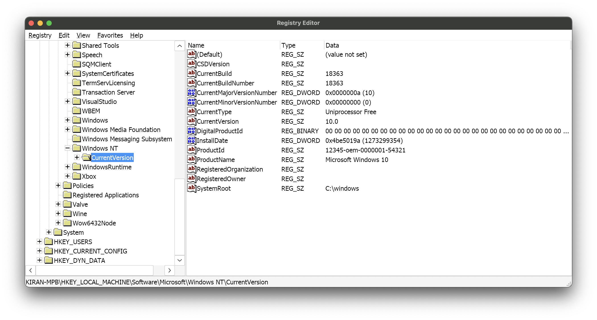
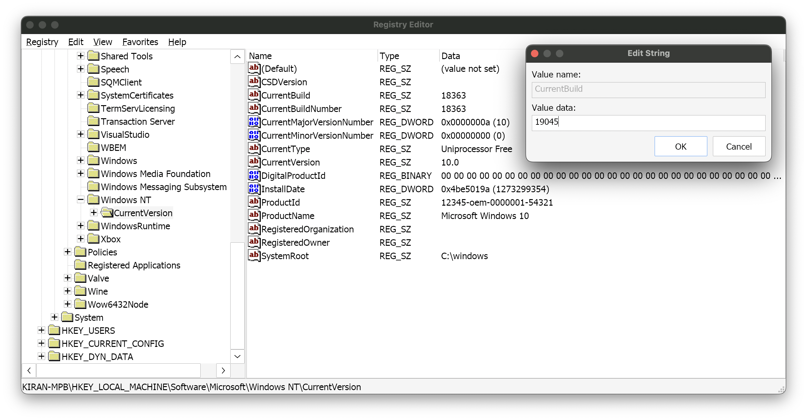
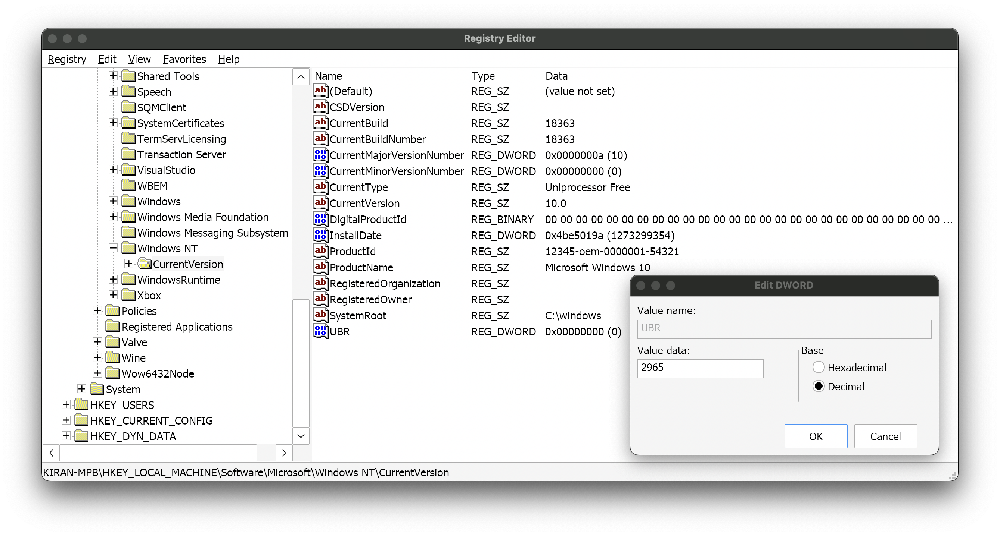

> This is a companion to my article [**How to Run Windows Games and Programs on macOS**](https://blog.lynkos.dev/posts/play-windows-games).
> 
> This article is still a work in progress!
{: .prompt-important }

## Palworld
I've tested with **DXMT v0.61** (Wine 10.13) and GPTk 3.0 Beta 3 (Wine 7.7), and out of the two **DXMT** generally performed better than GPTk. The latter crashed on 2 separate occasions (which was annoying + required restarts) while the former played quite smoothly (no stuttering, v v rare lag) with minimal (fan) noise. This was tested without MetalFX tho. For DXMT, disable NVEXT (aka set `DXMT_ENABLE_NVEXT=0`). If enabled, in-world game in Palworld doesn't appear (just a black screen and overlaid HUD, etc.).

This is if you want to convert/transfer a dedicated server to single-player (while keeping the same data, i.e. pals, items, character, etc.).[^palworld]

1. Create a conda environment with Python 3.9 or higher and `palworld-save-tools`

	```sh
	conda create -n "palenv" python=3.12 palworld-save-tools
	```
	{: .nolineno }

2. Activate new conda environment

	```sh
	conda activate palenv
	```
	{: .nolineno }

3. Navigate to your server save, usually found in `$HOME/Games/drive_c/users/crossover/AppData/Local/Pal/Saved/SaveGames/YOUR_STEAM_ID/####`{: .filepath} (`####` is the save filename, which is a random 32-character string of letters and numbers; `YOUR_STEAM_ID` is your 17-digit [Steam ID](https://www.steamidfinder.com))

	```sh
	cd $HOME/Games/drive_c/users/crossover/AppData/Local/Pal/Saved/SaveGames/YOUR_STEAM_ID/####
	```
	{: .nolineno }

4. Make sure the aforementioned folder contains `Level.sav`{: .filepath} and `Players`{: .filepath} folder with `.sav` data

	```sh
	find -f Level.sav || find ./Players -name "*.sav"
	```
	{: .nolineno }

5. Back up your save folder and store it in a safe place, just in case

6. Convert `Level.sav`{: .filepath} to `.json`

	```sh
	palworld-save-tools --to-json Level.sav
	```
	{: .nolineno }

7. Open the newly created `Level.sav.json`{: .filepath} into your preferred text editor with a find and replace function (I use VSCode)

8. Use <kbd>⌘</kbd> + <kbd>F</kbd> (i.e. <kbd>CMD</kbd> + <kbd>F</kbd>) to locate your server characters name; it'll look similar to this:

	

9. Find where your name is and copy its `player_uid` value

10. Use <kbd>⌘</kbd> + <kbd>F</kbd> (i.e. <kbd>CMD</kbd> + <kbd>F</kbd>) again to find the `player_uid` value you copied earlier and replace it with the following:

	```plaintext
	00000000-0000-0000-0000-000000000001
	```
	{: .nolineno }

11. Save the `.json`

12. Convert the `.json` back to `.sav`

	```sh
	palworld-save-tools --from-json Level.sav.json
	```
	{: .nolineno }

13. Go to `Players`{: .filepath} folder 

	```sh
	cd Players
	```
	{: .nolineno }

14. Convert the `.sav` file that matches the `player_uid` value you copied earlier (`PLAYER_UID_NO_HYPHENS` is the `player_uid` value **without hyphens**) to `.json`

	```sh
	palworld-save-tools --to-json PLAYER_UID_NO_HYPHENS.sav
	```
	{: .nolineno }

15. Open the newly created `.json` file into your preferred text editor with a find and replace function (I use VSCode)

16. Use <kbd>⌘</kbd> + <kbd>F</kbd> (i.e. <kbd>CMD</kbd> + <kbd>F</kbd>) to replace all instances of your `player_uid` value with the following:

	```plaintext
	00000000-0000-0000-0000-000000000001
	```
	{: .nolineno }

17. Save the `.json`

18. Convert the `.json` back to `.sav` (`PLAYER_UID_NO_HYPHENS` is the `player_uid` value **without hyphens**)

	```sh
	palworld-save-tools --from-json PLAYER_UID_NO_HYPHENS.sav.json
	```
	{: .nolineno }

19. Rename the converted file to ensure that the game recognizes this `.sav` as the player's (`PLAYER_UID_NO_HYPHENS` is the `player_uid` value **without hyphens**)

	```sh
	mv PLAYER_UID_NO_HYPHENS.sav 00000000000000000000000000000001.sav
	```
	{: .nolineno }

20. If it isn't there already, put the server save folder into your actual saves folder (i.e. `$WINEPREFIX/drive_c/users/crossover/AppData/Local/Pal/Saved/SaveGames/YOUR_STEAM_ID`{: .filepath} (`YOUR_STEAM_ID` is your 17-digit [Steam ID](https://www.steamidfinder.com))

21. Deactivate your conda environment

	```sh
	conda deactivate
	```
	{: .nolineno }

22. **Optional**: Delete your conda environment

	```sh
	conda env remove -n "palenv" -y && rm -rf "$(conda info --base)/envs/palenv"
	```
	{: .nolineno }

23. **Optional**: If you've tested Palworld and everything runs fine, delete your backup save folder

## The Elder Scrolls V: Skyrim Special Edition
You may encounter some launch issues/bugs with Game Porting Toolkit on Steam Client relating to window size, full-screen, and/or display resolution.

1. Open Windows version of Steam

2. Navigate to Skyrim Special Edition in your library

3. Click settings icon, then <kbd>Properties</kbd>

4. Enter the following in <kbd>Launch Options</kbd> (modify path if needed):

	```plaintext
	"C:\Program Files (x86)\Steam\steamapps\common\Skyrim Special Edition\SkyrimSE.exe" %command%
	```
	{: .nolineno }

5. Close window

6. Open `SkyrimPrefs.ini`{: .filepath}

7. Set these variables in `SkyrimPrefs.ini`{: .filepath}:

	```plaintext
	bBorderless=1
	bFull Screen=0
	iSize H=1080
	iSize W=1920
	```

8. Update `iSize H` and `iSize W` (i.e. integer variables representing `1920`x`1080` resolution) with your display's height and width respectively

9. Save and close `SkyrimPrefs.ini`{: .filepath}

## Schedule I
I've tested with DXMT v0.6 (works well but sometimes -- once you quit the game -- you get a grey screen), **GPTk 3.0 Beta 3** (best option + most stable ime; no crashes or weird glitches/bugs, compared to the others), and DXVK + MoltenVK (works well but I think there's a memory leak somewhere since it crashed. When I checked Activity Monitor, I found out 2 separate wine processes used 404+ GB of memory EACH (i.e. 808+ GB combined), iTerm was taking 404+ GB of memory and increasing to the point where they all paused, which doesn't make sense. There's more than just those 3. Terminal logging/debugging showed messaged `[myk-warn] VK_ERROR_OUT_OF_POOL_MEMORY: VK_ERROR_OUT_OF_POOL_MEMORY: VkDescriptorPool exhausted pool of 6144 VK_DESCRIPTOR_TYPE_UNIFORM BUFFER_DYNAMIC descriptors, Allocating descriptor dynamically.`, so it's presumably a MoltenVK bug).

Enable Retina (high resolution) mode

```sh
wine reg add 'HKEY_CURRENT_USER\Software\Wine\Mac Driver' /v 'RetinaMode' /t REG_SZ /d 'Y' /f
```
{: .nolineno }

Adjust DPI scaling level (to offset/adjust high resolution-mode)

```sh
wine reg add 'HKEY_CURRENT_USER\Control Panel\Desktop' /v 'LogPixels' /t REG_DWORD /d 216 /f
```
{: .nolineno }

Use/enable the following environment variables before running Steam

```plaintext
D3DM_SUPPORT_DXR=1
ROSETTA_ADVERTISE_AVX=1
WINEESYNC=1
WINEDLLOVERRIDES="dinput8=n,b;d3d11,d3d10,d3d12,dxgi=b"
```

## Far Cry 3
**Add to command line arg:**
- Skip intro videos : `-skipintro`
- Max 60 FPS: `-RenderProfile_MaxFPS 60`
- Prevent crashes: `WINE_LARGE_ADDRESS_AWARE=1`
- Performance gain?: `WINECPUMASK=0xff`
- Possible audio fix: `export WINEDLLOVERRIDES="xaudio2_7=n,b"`

```
WINE_LARGE_ADDRESS_AWARE=1 -skipintro -RenderProfile_MaxFPS 60 %command%
```

**Info:**
Use DXMT v0.61. Audio is messed up. With maxed out settings: Super bad FPS (~5 FPS) + laggy during cutscenes / vids. Gameplay FPS (~20 FPS) is kinda better, but it still sucks.

Trying to fix Audio with this:
- Check Audio troubleshooting in [Play Windows Games](2025-03-19-play-windows-games.md)
FC3 (App ID: `220240`) now requires Install `mfc100.dll`, which can be installed with protontricks: `protontricks 220240 mfc100`. Might affect other games with Ubisoft Connect.

### Mods
- Disable server msgs: https://www.nexusmods.com/farcry3/mods/276
- Restore Ubisoft Connect: https://www.nexusmods.com/farcry3/mods/234
- Solo offline co-op: https://www.nexusmods.com/farcry3/mods/262?tab=description

### Enhancements
// todo
Exit all Windows based programs.

Click Start, type regedit in the Search box, and then double-click regedit.exe from the results above. If you are prompted for an administrator password or confirmation,  
type the password or provide confirmation.

Browse to and then click the following registry subkey:

`HKEY_LOCAL_MACHINE\SYSTEM\CurrentControlSet\Control\GraphicsDrivers`
On the Edit menu, click New, and then select the following registry value from the drop-down menu specific to your version of Windows (32 bit, or 64 bit):

    For 32 bit Windows
    Select DWORD (32-bit) value.
    Type TdrDelay as the Name and click Enter.
    Double-click TdrDelay and add 8 for the Value data and click OK.

    For 64 bit Windows
    Select QWORD (64-bit) value.
    Type TdrDelay as the Name and click Enter.
    Double-click TdrDelay and add 8 for the Value data and click OK.

Close the registry editor and then restart your computer for the changes to take effect.

Enable retina mode:
```plaintext
wine reg add 'HKEY_CURRENT_USER\Software\Wine\Mac Driver' /v 'RetinaMode' /t REG_SZ /d 'Y' /f
wine reg add 'HKEY_CURRENT_USER\Control Panel\Desktop' /v 'LogPixels' /t REG_DWORD /d 254 /f # Calc PPI: https://dpi.lv I use 254dpi for my 3024x1512 res monitor.
```

Disable Wine border decoration: `wine reg add 'HKEY_CURRENT_USER\Software\Wine\Mac Driver' /v 'Decorated' /t REG_SZ /d 'N' /f`

Anti-aliased fonts (???).

Modify + lock `GamerProfile.xml` (in `$HOME/Documents/My Games/Far Cry 3`) to adjust game settings
```xml
<GamerProfile>
    <SoundProfile
        MusicEnabled="1"
        MasterVolume="100"
        MicEnabled="1"
        IncomingVoiceEnabled="1"
        Language="English"
    />
    <RenderProfile
        MSAALevel="4"
        AlphaToCoverage="2"
        SSAOLevel="1"
        SDSM="0"
        ResolutionX="3024"
        ResolutionY="1964"
        Quality="custom"
        QualityEditor="editor_ps3"
        Fullscreen="1"
        Borderless="1"
        UseD3D11="1"
        D3D11MultithreadedRendering="1"
        WidescreenLetterbox="0"
        UseWidescreenFOV="1"
        FOVScaleFactor="1"
        EnableSubResolution="0"
        SubResolutionX="960"
        SubResolutionY="540"
        VSync="1"
        RefreshRate="0"
        DisableMip0Loading="0"
        GPUMaxBufferedFrames="3"
        ShowFPS="0"
        Brightness="1"
        Contrast="1"
        GammaRamp="1"
        AllowAsynchShaderLoading="1"
        Bloom="1"
        MaxFPS="60"
        GrassWindMin="0.4"
        GrassWindMax="2"
        DisableParticles="0">
        <CustomQuality>
            <quality
                ResolutionX="2560"
                ResolutionY="1600"
                EnvironmentQuality="high"
                AntiPortalQuality="default"
                PortalQuality="medium"
                PostFxQuality="low"
                TextureQuality="high"
                TextureResolutionQuality="high"
                WaterQuality="high"
                DepthPassQuality="high"
                VegetationQuality="high"
                TerrainQuality="high"
                GeometryQuality="high"
                AmbientQuality="high"
                DeferredAmbientQuality="high"
                ShadowQuality="high"
                EditorQuality=""
                Hdr="1"
                HdrFP32="0"
                ReflectionHdr="1"
                EnableVertexBinding="1"
                id="custom"
            />
        </CustomQuality>
        <Post>
            <quality
                id="high"
                GameDepthOfField="0"
                MotionBlur="1"
                FXAALevel="1"
                CinematicDepthOfField="0"
                SSAOMaxDistance="150"
                CloudShadows="0"
                DepthDownsample="1"
            />
        </Post>
        <Environment>
            <quality
                id="high"
                RainNumSplashesPerSecond="15"
                DisableRain="0"
            />
        </Environment>
        <Texture>
            <quality
                id="high"
                TextureFilteringQuality="0"
            />
        </Texture>
        <Water>
            <quality
                id="high"
                WaterReflectionQuality="4"
                ReflectionTextureSizeX="2048"
                ReflectionTextureSizeY="2048"
                OceanRealReflection="1"
            />
        </Water>
        <Geometry>
            <quality
                id="high"
                LodScale="0.5"
                KillLodScale="0.5"
                ClustersLodScale="1.0"
                RealTreesLodScale="0.7"
            />
        </Geometry>
        <Shadow>
            <quality
                id="high"
                ShadowMapSize="2048"
                SoftShadows="1"
                CascadedShadowMapSize="2048"
                DisableShadow="0"
                DisableShadowGeneration="0"
                DisableShadowGenTerrain="0"
            />
        </Shadow>
        <Terrain>
            <quality
                id="high"
                TerrainLodScale="0.5"
                TerrainDetailViewDistance="512"
            />
        </Terrain>
    </RenderProfile>
    <NetworkProfile
        VoiceChatEnabled="0"
        CustomMapMaxUploadRateInBitsOnline="10240000"
        OnlineEnginePort="9000"
        OnlineServicePort="9001"
        FileTransferHostPort="9002"
        FileTransferClientPort="9003"
        LanHostBroadcastPort="9004"
        LanClientBroadcastPort="9005"
        ScanFreePorts="1"
        ScanPortRange="1000"
        ScanPortStart="9000"
        SessionProvider=""
        MaxUploadInbpsOnline="10240000">
        <Accounts />
    </NetworkProfile>
    <GameProfile
        Hour = "16"
        Minutes = "40"
        Seconds = "0"
        TimeScale = "1"
        WindForce = "80"
        WindDir = "0"
        DelayShadowMovement = "180"
        IgnorePlayer = "0"
        GatherEntitiesForMap = "0"
        ShowAIInMap = "0"
        ShowDiamondsInMap = "0"
        DifficultyLevel = "1"
        Machete = "0"
        UseAimingHelpers = "0"
        HelpCrosshair = "1"
    />
    <ProfileSpecificGameProfile
        Sensitivity="1"
        Invert_x="0"
        Invert_y="0"
        DefaultFlickFireDirection_y="0"
        UseMouseSmooth="1"
        Smoothness="0.2"
        Smoothness_Ironsight="0.2"
        HelpCrosshair="1"
        Gamepad_vibration="1"
        UseRoadSignHilight="1"
        UseSubtitles="1"
        TaggingEnabled="1"
        WikiUpdatedEnabled="1"
        CollectibleUpdatedEnabled="1"
        TutorialUpdatedEnabled="1"
        ObjectiveReminderEnabled="1"
        CraftingTipsEnabled="1"
        DisplayXPEnabled="1"
        DetectionIndicatorEnabled="1"
        HitIndicatorEnabled="1"
        GrenadeIndicatorEnabled="1"
        UseAmbx="0"
        UseGamePad="1"
        GamepadAnswered="1"
        Autosave="1"
        Machete="0"
        IronsightToggleMode="1">
        <FireConfig
            QualitySetting="High"
	/>
    </ProfileSpecificGameProfile>
    <RealTreeProfile
        Quality="High"
    />
    <EngineProfile>
        <PhysicConfig
            QualitySetting="High"
        />
        <QcConfig
            GatherFPS="1"
            GatherAICnt="1"
            GatherDialogs="0"
            IsQcTester="0"
        />
        <InputConfig />
        <ZoneConfig />
    </EngineProfile>
    <UplayProfile
        LockString=""
    />
</GamerProfile>
```
{: file="$HOME/Documents/My Games/Far Cry 3/GamerProfile.xml" }

## The Elder Scrolls IV: Oblivion Remastered
### Warning: System OS is older than Windows 10 20H2
Continue reading this section if you get a popup like this when launching a game

```plaintext
Sorry, your system does not meet the minimum requirements to play TESIV: Oblivion (Remastered). Click OK to proceed the launch, but it could run with issues.

- OS (Your system OS is older than Windows 10 20H2, please consider to upgrade your system)
```

1. Switch architecture

	```sh
	arch -x86_64 /bin/bash
	```
	{: .nolineno }

2. Open `regedit`

	```sh
	WINEPREFIX=$HOME/Games wine regedit
	```
	{: .nolineno }

3. Navigate to `HKEY_LOCAL_MACHINE\Software\Microsoft\Windows NT\CurrentVersion`

	

4. Make sure `ProductName` says `Microsoft Windows 10`
5. Make sure `CurrentVersion` says `10.0`
6. Double-click `CurrentBuild` to change its value
7. Under `Value data:`, enter `19045`, then click <kbd>OK</kbd>

	

8. Double-click `CurrentBuildNumber` to change its value
9. Under `Value data:`, enter `19045`, then click <kbd>OK</kbd>
10. Right-click anywhere that isn't a key (i.e. right-click anywhere in the white space) and navigate to <kbd>New</kbd>

	

11. Click <kbd>String Value</kbd>
12. Input `ReleaseId`, then press <kbd>Enter</kbd> to save its name

	> To rename a key, right-click it and click <kbd>Rename</kbd>
	{: .prompt-tip }

13. Double-click `ReleaseId` key to set its value
14. Under `Value data:`, enter `22H2`, then click <kbd>OK</kbd>
15. Right-click and navigate to <kbd>New</kbd>

	

16. Click <kbd>String Value</kbd>
17. Input `DisplayVersion`, then press <kbd>Enter</kbd> to save its name
18. Double-click `DisplayVersion` key to set its value
19. Under `Value data:`, enter `22H2`, then click <kbd>OK</kbd>
20. Right-click and navigate to <kbd>New</kbd>
21. Click <kbd>DWORD Value</kbd>
22. Input `UBR`, then press <kbd>Enter</kbd> to save its name
23. Double-click `UBR` key to set its value

	

24. Select  <kbd>Decimal</kbd> under `Base`
25. Under `Value data:`, enter `2965`, then click <kbd>OK</kbd>
26. Close `regedit`

The popup should no longer appear since we're spoofing the OS version to `21H2` (i.e. its minimum requirement).

### Crashing during initial shader compilation
Upon first startup, there's a really common bug where the game will crash during initial shader compilation. This can be pretty annoying, but there are some tweaks you can make, depending on your hardware.

1. Quit Steam once Oblivion Remastered crashes

2. Clear its D3DMetal shader cache

	```sh
	rm -r $(getconf DARWIN_USER_CACHE_DIR)/d3dm/OblivionRemastered-Win64-Shipping.exe/shaders.cache
	```
	{: .nolineno }

3. Restart your computer

4. Delete your `Engine.ini` file, if you modified it

5. Relaunch Steam with raytracing disabled

	```sh
	WINEPREFIX=$HOME/Games WINEDEBUG=-all WINEDLLOVERRIDES="d3d11,dxgi=n,b" MTL_HUD_ENABLED=0 WINE_LARGE_ADDRESS_AWARE=1 D3DM_SUPPORT_DXR=0 WINEESYNC=1 wine "C:\Program Files (x86)\Steam\steam.exe"
	```
	{: .nolineno }

6. Navigate to Oblivion: Remastered

7. Add the following to the launch options

	```plaintext
	%command% -safemode -noshaders -windowed -batchmode -nographics
	```

8. Close launch options and launch game

### Miscellaneous
Edit `Engine.ini` to disable Lumen/Nanite (i.e. hardware-accelerated ray tracing)

```ini
[SystemSettings]
r.Lumen.DiffuseIndirect.Allow=0
r.Nanite.MaxPixelsPerEdge=0
```
 {: .nolineno }

## Ghost of Tsushima
> **IMPORTANT**: As of macOS Sequoia 15.4+, Apple added support for F16C and BMI instructions in Rosetta 2. As such, this patch may no longer be necessary (for those with this update). Before running the original (i.e. non-patched) version, include `ROSETTA_ADVERTISE_AVX=1` in the launch parameters to activate the instructions.
{: .prompt-warning }

Error when launching the game via Steam that says:
> This game requires a CPU that supports F16C instructions.

1. Download [patch for 1053.7.809.1937 game version](https://community.pcgamingwiki.com/files/file/3122-ghost-of-tsushima-f16c-instructions-fix) to the directory containing `GhostOfTsushima.exe`{: .filepath} (e.g. `~/Games/drive_c/Program Files (x86)/Steam/steamapps/common/Ghost of Tsushima DIRECTOR'S CUT`{: .filepath})

2. Rename the original `GhostOfTsushima.exe`{: .filepath} file to something else (e.g. `GhostOfTsushima_original.exe`{: .filepath})

3. Rename the recently downloaded patch to `GhostOfTsushima.exe`{: .filepath}

## References
[^palworld]: [How to convert a dedicated server save into a singleplayer save (Steam save)](https://www.reddit.com/r/Palworld/comments/1acv6rb/how_to_convert_a_dedicated_server_save_into_a)